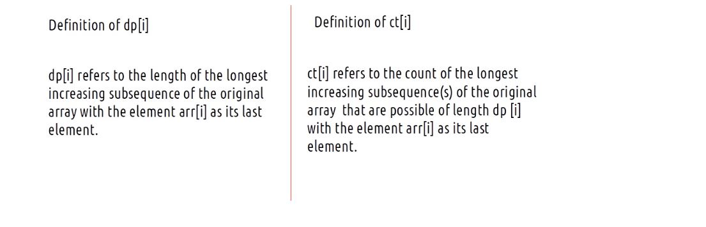

- [youtube channel to checkout for leetcode prob](#youtube-channel-to-checkout-for-leetcode-prob)
- [IMP DataStructure to know for writing programs during interviews](#imp-datastructure-to-know-for-writing-programs-during-interviews)
  - [ArrayDeque](#arraydeque)
- [Linked List](#linked-list)
  - [to detect cycle/loop in linked list](#to-detect-cycleloop-in-linked-list)
  - [circular linked list applications](#circular-linked-list-applications)
  - [to detect loop and find first node of the loop (FLOYD cycle detetction algorithm)](#to-detect-loop-and-find-first-node-of-the-loop-floyd-cycle-detetction-algorithm)
    - [FLOYD cycle detetction algorithm](#floyd-cycle-detetction-algorithm)
  - [to find intersection of two linked list](#to-find-intersection-of-two-linked-list)
    - [using 2 pointer technique](#using-2-pointer-technique)
    - [Method 3(Using difference of node counts)](#method-3using-difference-of-node-counts)
  - [to delete nth node from the end of the linked list](#to-delete-nth-node-from-the-end-of-the-linked-list)
  - [reverse linked list recursive sol O(n) time and O(n) space complexity due to](#reverse-linked-list-recursive-sol-on-time-and-on-space-complexity-due-to)
  - [using 2 pointers we are reversing each node link to prev step by step](#using-2-pointers-we-are-reversing-each-node-link-to-prev-step-by-step)
  - [remove all matching nodes from linked list O(n)](#remove-all-matching-nodes-from-linked-list-on)
  - [Odd Even Linked List](#odd-even-linked-list)
  - [to check for palindrome](#to-check-for-palindrome)
  - [Merge Two Sorted Lists](#merge-two-sorted-lists)
  - [two sum problem](#two-sum-problem)
  - [flattening of a multilevel linked list](#flattening-of-a-multilevel-linked-list)
    - [using recursion (DFS)](#using-recursion-dfs)
    - [using stack ( not good in terms of time and space complexity)](#using-stack--not-good-in-terms-of-time-and-space-complexity)
  - [Copy List with Random Pointer](#copy-list-with-random-pointer)
    - [using extra space hashing](#using-extra-space-hashing)
    - [optimal](#optimal)
  - [rotate a linked list by k places](#rotate-a-linked-list-by-k-places)
    - [improved version from discuss comments](#improved-version-from-discuss-comments)
- [stack and queues](#stack-and-queues)
  - [implement a circular queue](#implement-a-circular-queue)
  - [implementation with better isFull and isEmpty check](#implementation-with-better-isfull-and-isempty-check)
  - [application of queue with BFS](#application-of-queue-with-bfs)
    - [template 1](#template-1)
    - [template 2](#template-2)
  - [first read about graph and connect component of a graph](#first-read-about-graph-and-connect-component-of-a-graph)
    - [return no of island (a variable of connected component problem)](#return-no-of-island-a-variable-of-connected-component-problem)
      - [using BFS](#using-bfs)
      - [using DFS (flood filling technique)](#using-dfs-flood-filling-technique)
    - [open the lock (imp problem) (REVISE)](#open-the-lock-imp-problem-revise)
      - [using BFS and single queue time complexity around 300 ms](#using-bfs-and-single-queue-time-complexity-around-300-ms)
    - [using bidirectional search](#using-bidirectional-search)
    - [optimal solution time complexity less than 15 ms](#optimal-solution-time-complexity-less-than-15-ms)
    - [Perfect Squares( sol using BFS, DP TODO, Math Solution)](#perfect-squares-sol-using-bfs-dp-todo-math-solution)
      - [using BFS and queue time complexity (n \* sqrt(n))](#using-bfs-and-queue-time-complexity-n--sqrtn)
      - [Mathematical solution (Most optimal time complexity)](#mathematical-solution-most-optimal-time-complexity)
    - [min stack problem](#min-stack-problem)
  - [using extra space time complexity O(1) for all operation and space complexity O(n)](#using-extra-space-time-complexity-o1-for-all-operation-and-space-complexity-on)
      - [without extra space TC O(1) SC(1)](#without-extra-space-tc-o1-sc1)
      - [using a stack of Nodes having both val and min for each node](#using-a-stack-of-nodes-having-both-val-and-min-for-each-node)
      - [using a linked list node only slight diff from above solution](#using-a-linked-list-node-only-slight-diff-from-above-solution)
    - [valid paranthese](#valid-paranthese)
      - [my submission ok but not as good as above](#my-submission-ok-but-not-as-good-as-above)
- [binary search O(log(n)](#binary-search-ologn)
  - [template 1](#template-1-1)
    - [iterative sol](#iterative-sol)
    - [sqaure root of x using binary search](#sqaure-root-of-x-using-binary-search)
    - [checkout below also](#checkout-below-also)
    - [here below part is extra to calculate the fractional part up to p point](#here-below-part-is-extra-to-calculate-the-fractional-part-up-to-p-point)
  - [search in a rotated sorted array](#search-in-a-rotated-sorted-array)
  - [template 2](#template-2-1)
    - [first bad version problem](#first-bad-version-problem)
      - [iterative](#iterative)
      - [recursive](#recursive)
    - [find peak element](#find-peak-element)
    - [Find Minimum in Rotated Sorted Array](#find-minimum-in-rotated-sorted-array)
      - [recursive approach find pivot next element of pivot is min element in array](#recursive-approach-find-pivot-next-element-of-pivot-is-min-element-in-array)
      - [iterative approach](#iterative-approach)
  - [template 3](#template-3)
    - [Search for a Range](#search-for-a-range)
      - [gfg sol](#gfg-sol)
      - [sol with template 3 instructions](#sol-with-template-3-instructions)
      - [sol with single binary search (Easy and clean)](#sol-with-single-binary-search-easy-and-clean)
    - [implement pow(x,n)](#implement-powxn)
    - [Find Smallest Letter Greater Than Target](#find-smallest-letter-greater-than-target)
    - [Find Minimum in Rotated Sorted Array with duplicates](#find-minimum-in-rotated-sorted-array-with-duplicates)
      - [iterative approach](#iterative-approach-1)
      - [recursive approach](#recursive-approach)
- [Arrays & String](#arrays--string)
  - [find pivot index](#find-pivot-index)
  - [largest no atleast twice the size of every other no](#largest-no-atleast-twice-the-size-of-every-other-no)
    - [simple sol using two passes](#simple-sol-using-two-passes)
    - [using only single pass optimized](#using-only-single-pass-optimized)
  - [plus one](#plus-one)
  - [spiral traverse of matrix](#spiral-traverse-of-matrix)
  - [pascal triange](#pascal-triange)
  - [pascal triange II](#pascal-triange-ii)
    - [iterative sol](#iterative-sol-1)
    - [recursive sol (TLE but with memoization it is ok)](#recursive-sol-tle-but-with-memoization-it-is-ok)
  - [Add Binary](#add-binary)
  - [Implement strStr()](#implement-strstr)
    - [sliding window my sol with TC O(m \* (m - n)) SC O(n)](#sliding-window-my-sol-with-tc-om--m---n-sc-on)
    - [normal TC O(m \* n) SC O(1)](#normal-tc-om--n-sc-o1)
  - [to check KMP optimze sol TC O(m + n) SC O(n)](#to-check-kmp-optimze-sol-tc-om--n-sc-on)
  - [longest common prefix](#longest-common-prefix)
  - [Longest Palindromic Substring](#longest-palindromic-substring)
    - [Inuition](#inuition)
  - [2-pointer technique](#2-pointer-technique)
    - [Array Partition](#array-partition)
    - [two sum II (sorted array)](#two-sum-ii-sorted-array)
      - [O(n) sol using two pointers](#on-sol-using-two-pointers)
      - [O(n log n) sol using binary search](#on-log-n-sol-using-binary-search)
    - [Minimum Size Subarray Sum (revise)](#minimum-size-subarray-sum-revise)
      - [using 2 pointer/ sliding window O(log(n))](#using-2-pointer-sliding-window-ologn)
      - [sol using outer loop and binary search TC O(n log n) TODO](#sol-using-outer-loop-and-binary-search-tc-on-log-n-todo)
    - [min window substring TODO](#min-window-substring-todo)
  - [rotate array TC O(n) in place SC O(1)](#rotate-array-tc-on-in-place-sc-o1)
    - [reverse words in a string REVISIT](#reverse-words-in-a-string-revisit)
      - [using stack](#using-stack)
      - [two pointer revers algo | in place](#two-pointer-revers-algo--in-place)
    - [move zeros](#move-zeros)
      - [simple approach O(n) inplace](#simple-approach-on-inplace)
      - [2 pointer optimized O(n) inplace](#2-pointer-optimized-on-inplace)
- [hash tables](#hash-tables)
  - [design hashset](#design-hashset)
    - [arraylist implementation](#arraylist-implementation)
    - [BST implementation](#bst-implementation)
  - [hashmap implementation](#hashmap-implementation)
    - [using linked list](#using-linked-list)
  - [single number prob](#single-number-prob)
  - [intersection of 2 arrays](#intersection-of-2-arrays)
    - [using hash set TC O(m + n) SC(m + n)](#using-hash-set-tc-om--n-scm--n)
    - [using sorting and 2 pointer TC O(n logn)](#using-sorting-and-2-pointer-tc-on-logn)
    - [using sorting and binary search Time complexity: O(nlogn)](#using-sorting-and-binary-search-time-complexity-onlogn)
  - [happy number problem](#happy-number-problem)
    - [loop detection using hashset TC log(n) SC log(n)](#loop-detection-using-hashset-tc-logn-sc-logn)
    - [using floyd's loop detection algo TC log(n) SC O(1) better approach than hashset](#using-floyds-loop-detection-algo-tc-logn-sc-o1-better-approach-than-hashset)
    - [math sol](#math-sol)
  - [two sum (non sorted) return indices](#two-sum-non-sorted-return-indices)
    - [using extra space hashmap TC O(n) SC O(n)](#using-extra-space-hashmap-tc-on-sc-on)
    - [using sorting and 2 pointer technique TC n logn SC is n( 3n to be exact)](#using-sorting-and-2-pointer-technique-tc-n-logn-sc-is-n-3n-to-be-exact)
  - [isomorphic sol](#isomorphic-sol)
    - [using 2 array trick from discuss](#using-2-array-trick-from-discuss)
    - [sol using 2 hashmap approach is similar but not very readable](#sol-using-2-hashmap-approach-is-similar-but-not-very-readable)
    - [transformation trick](#transformation-trick)
    - [using a single map](#using-a-single-map)
  - [minimum index sum of two lists](#minimum-index-sum-of-two-lists)
    - [using a hashmap](#using-a-hashmap)
  - [first unique character in string](#first-unique-character-in-string)
    - [single pass sol using array of size 26 lower case alphabets (better approach since only one loop)](#single-pass-sol-using-array-of-size-26-lower-case-alphabets-better-approach-since-only-one-loop)
    - [using hashmap with 2 pass](#using-hashmap-with-2-pass)
  - [intersection of 2 arrays II](#intersection-of-2-arrays-ii)
    - [using hashmap TC O(M + N) SC O(M)](#using-hashmap-tc-om--n-sc-om)
    - [using sorting and 2 pointer technique](#using-sorting-and-2-pointer-technique)
  - [contains Duplicate II](#contains-duplicate-ii)
    - [using hashmap](#using-hashmap)
    - [using hashset](#using-hashset)
  - [group anagrams](#group-anagrams)
    - [using sorting key](#using-sorting-key)
    - [from discus](#from-discus)
  - [valid Sudoku](#valid-sudoku)
    - [using hashset/hashmap approach and using %, / for block traversal in matrix (5ms leetcode)](#using-hashsethashmap-approach-and-using---for-block-traversal-in-matrix-5ms-leetcode)
      - [logic explanation](#logic-explanation)
      - [only we used boolean array here instead of hashset to improve space complexity 3ms on leetcode](#only-we-used-boolean-array-here-instead-of-hashset-to-improve-space-complexity-3ms-on-leetcode)
    - [sol using choice of key in hashmap](#sol-using-choice-of-key-in-hashmap)
    - [GFG clean sol using the same approach](#gfg-clean-sol-using-the-same-approach)
- [tree](#tree)
  - [Binary Tree](#binary-tree)
    - [isSymmetric tree prob](#issymmetric-tree-prob)
      - [bottom up recursive sol](#bottom-up-recursive-sol)
      - [iterative solution](#iterative-solution)
  - [is Valid BST](#is-valid-bst)
    - [intuitive sol with upper and lower limits](#intuitive-sol-with-upper-and-lower-limits)
    - [inorder traversal sol](#inorder-traversal-sol)
      - [recursive sol](#recursive-sol)
      - [iterative sol IMP REVISIT](#iterative-sol-imp-revisit)
    - [inorder successor/predecessor in BST](#inorder-successorpredecessor-in-bst)
      - [successor using intution method 1](#successor-using-intution-method-1)
      - [predecessor using intution method 1](#predecessor-using-intution-method-1)
      - [successor using inorder traversa](#successor-using-inorder-traversa)
      - [predecessor of a node in BST using inorder traversal](#predecessor-of-a-node-in-bst-using-inorder-traversal)
    - [BSTIterator inorder](#bstiterator-inorder)
      - [using stack](#using-stack-1)
    - [search in BST iterative and recursive](#search-in-bst-iterative-and-recursive)
      - [iterative](#iterative-1)
      - [recursive](#recursive-1)
    - [deletion in BST](#deletion-in-bst)
    - [kth largest element in a stream](#kth-largest-element-in-a-stream)
    - [kth smallest element in a stream](#kth-smallest-element-in-a-stream)
    - [kth smallest/largest element in a BST](#kth-smallestlargest-element-in-a-bst)
    - [find median of integer stream (TODO)](#find-median-of-integer-stream-todo)
    - [inorder/preorder using morris traversal(TODO)](#inorderpreorder-using-morris-traversaltodo)
    - [Lowest Common Ancestor of a Binary Search Tree](#lowest-common-ancestor-of-a-binary-search-tree)
      - [using recursion](#using-recursion)
      - [iterative sol](#iterative-sol-2)
    - [contains duplicate III](#contains-duplicate-iii)
    - [is binary tree balanced](#is-binary-tree-balanced)
      - [non optimal sol TC O(n^2)](#non-optimal-sol-tc-on2)
      - [optimal sol TC O(n) SC O(n)](#optimal-sol-tc-on-sc-on)
    - [convert sorten int array to BST TC O(n) SC(n) for recursion](#convert-sorten-int-array-to-bst-tc-on-scn-for-recursion)
  - [n-ary tree](#n-ary-tree)
    - [preorder traversal of 3-ary tree](#preorder-traversal-of-3-ary-tree)
      - [recursive sol TC O(n) [SC (n) to check]](#recursive-sol-tc-on-sc-n-to-check)
      - [iterative sol TC O(n) SC(n)](#iterative-sol-tc-on-scn)
    - [postoreder traversal of n-ary tree](#postoreder-traversal-of-n-ary-tree)
      - [recursive sol](#recursive-sol-1)
      - [iterative sol TC o(n) SC(n)](#iterative-sol-tc-on-scn-1)
    - [level order traversal of n-ary tree](#level-order-traversal-of-n-ary-tree)
    - [Maximum Depth of N-ary Tree](#maximum-depth-of-n-ary-tree)
      - [bottom up recursive sol](#bottom-up-recursive-sol-1)
      - [top down recursive sol](#top-down-recursive-sol)
      - [iterative sol](#iterative-sol-3)
  - [trie](#trie)
    - [application of trie](#application-of-trie)
    - [comparison with balanced tree and hashmap (very IMP)](#comparison-with-balanced-tree-and-hashmap-very-imp)
    - [Add and Search Word - Data structure design (IMP)](#add-and-search-word---data-structure-design-imp)
    - [LC 667 map sum pairs](#lc-667-map-sum-pairs)
      - [brute force](#brute-force)
      - [trie solution(optimal)](#trie-solutionoptimal)
    - [replace words](#replace-words)
    - [TODO design search autocomplete system (IMP) Hard](#todo-design-search-autocomplete-system-imp-hard)
    - [word search ||](#word-search-)
      - [using DFS (though correct but not optimal Time limit exceeds)](#using-dfs-though-correct-but-not-optimal-time-limit-exceeds)
    - [Maximum XOR of Two Numbers in an Array](#maximum-xor-of-two-numbers-in-an-array)
      - [brtute force is O(n^2) with 2 loops](#brtute-force-is-on2-with-2-loops)
      - [using trie](#using-trie)
- [sliding window](#sliding-window)
  - [Longest Substring with K Distinct Characters](#longest-substring-with-k-distinct-characters)
    - [SOL : trick is to use hashmap with char and their freq to keep k unique char and keep expanding and shrinking window till map is size is k exactly](#sol--trick-is-to-use-hashmap-with-char-and-their-freq-to-keep-k-unique-char-and-keep-expanding-and-shrinking-window-till-map-is-size-is-k-exactly)
- [sorting](#sorting)
  - [merge sort TC O(nlogn) SC(n)](#merge-sort-tc-onlogn-scn)
    - [Applications of Merge Sort:](#applications-of-merge-sort)
  - [quick sort](#quick-sort)
    - [using end index as the pivot](#using-end-index-as-the-pivot)
      - [Time taken by QuickSort, in general, can be written as following.](#time-taken-by-quicksort-in-general-can-be-written-as-following)
    - [if we use middle element as pivot then partition algo is bit different](#if-we-use-middle-element-as-pivot-then-partition-algo-is-bit-different)
    - [QuickSort Tail Call Optimization (Reducing worst case space to Log n )](#quicksort-tail-call-optimization-reducing-worst-case-space-to-log-n-)
  - [quick sort vs merge sort](#quick-sort-vs-merge-sort)
  - [importance of stability of sorting](#importance-of-stability-of-sorting)
  - [heap sort (TODO)](#heap-sort-todo)
- [my calendar II](#my-calendar-ii)
    - [Inuition Algo brute force sol TC O(n^2) SC O(n)](#inuition-algo-brute-force-sol-tc-on2-sc-on)
    - [boundary Count Intuition Algo](#boundary-count-intuition-algo)
      - [TC n\* (4logn + n) = O(n^2) SC O(n)](#tc-n-4logn--n--on2-sc-on)
- [bitwise operator](#bitwise-operator)
- [recursion](#recursion)
  - [time complexity calculation with recursion and memoization](#time-complexity-calculation-with-recursion-and-memoization)
  - [tail recursion](#tail-recursion)
  - [search in a 2 d matrix](#search-in-a-2-d-matrix)
  - [backtracking and pruning](#backtracking-and-pruning)
    - [N queen problem](#n-queen-problem)
      - [Explanation](#explanation)
    - [leetcode 489 : robot room cleaner](#leetcode-489--robot-room-cleaner)
    - [sudoku solver](#sudoku-solver)
    - [combinations](#combinations)
    - [22. Generate Parentheses](#22-generate-parentheses)
    - [largest area in histogram](#largest-area-in-histogram)
    - [permutations](#permutations)
      - [using boolean array to improve TC(easy to understand & explain)](#using-boolean-array-to-improve-tceasy-to-understand--explain)
    - [Letter Combinations of a Phone Number](#letter-combinations-of-a-phone-number)
    - [The Skyline Problem](#the-skyline-problem)
      - [improvements by using treemap](#improvements-by-using-treemap)
- [patterns](#patterns)
  - [2 pointer](#2-pointer)
    - [2 sum BST (daily challange)](#2-sum-bst-daily-challange)
      - [using inorder traversal of BST and 2 pointer](#using-inorder-traversal-of-bst-and-2-pointer)
      - [optimization here we traverse the BST 2 times so TC O(2n) however we can use BST property to do this in single traversal](#optimization-here-we-traverse-the-bst-2-times-so-tc-o2n-however-we-can-use-bst-property-to-do-this-in-single-traversal)
- [graph](#graph)
  - [BSF traversal](#bsf-traversal)
    - [why TC is O( v + E) for BFS and DFS and not O(V\*E)](#why-tc-is-o-v--e-for-bfs-and-dfs-and-not-ove)
  - [DFS traversal](#dfs-traversal)
  - [no of provices prob](#no-of-provices-prob)
    - [sol by converting adjacency matrix to list first](#sol-by-converting-adjacency-matrix-to-list-first)
    - [sol with adjacency matrix](#sol-with-adjacency-matrix)
  - [flood fill](#flood-fill)
  - [rotten oranges](#rotten-oranges)
  - [detect cycle in undirected graph](#detect-cycle-in-undirected-graph)
  - [Distance of nearest cell having 1](#distance-of-nearest-cell-having-1)
  - [Replace O's with X's](#replace-os-with-xs)
  - [no of distinct islands](#no-of-distinct-islands)
  - [bipartite graph](#bipartite-graph)
    - [BFS sol](#bfs-sol)
    - [DFS sol](#dfs-sol)
  - [detect cycle in directed graph](#detect-cycle-in-directed-graph)
  - [Eventual Safe States( variable of cycle deteacted in directed graph)](#eventual-safe-states-variable-of-cycle-deteacted-in-directed-graph)
  - [topological sort DAG(directed acyclic graph) IMP](#topological-sort-dagdirected-acyclic-graph-imp)
    - [using BFS (kahn's algorithm)](#using-bfs-kahns-algorithm)
      - [cycle detected using kahn's algo i.e topo sort](#cycle-detected-using-kahns-algo-ie-topo-sort)
  - [Prerequisite Tasks](#prerequisite-tasks)
    - [Intution](#intution)
    - [IMP pattern to remember](#imp-pattern-to-remember)
  - [Course Schedule](#course-schedule)
  - [G-25. Find Eventual Safe States - BFS - Topological Sort](#g-25-find-eventual-safe-states---bfs---topological-sort)
  - [G-26 Alien Dictionary (leetcode premium) try it's variable on leetcode](#g-26-alien-dictionary-leetcode-premium-try-its-variable-on-leetcode)
    - [Problem and Intution](#problem-and-intution)
    - [what if correct order is not possible](#what-if-correct-order-is-not-possible)
    - [variation of alien dictionary prob (953. Verifying an Alien Dictionary)](#variation-of-alien-dictionary-prob-953-verifying-an-alien-dictionary)
  - [Shortest path in Directed Acyclic Graph](#shortest-path-in-directed-acyclic-graph)
    - [Intution](#intution-1)
  - [Word Ladder I (HARD)](#word-ladder-i-hard)
    - [Intuition](#intuition)
  - [Word Ladder II (HARD)](#word-ladder-ii-hard)
  - [dijkastra shortest path algo](#dijkastra-shortest-path-algo)
    - [Intution](#intution-2)
    - [important observation](#important-observation)
      - [why can not be applied to graph having -ve weights](#why-can-not-be-applied-to-graph-having--ve-weights)
      - [why priority queue min heap is better than using queue](#why-priority-queue-min-heap-is-better-than-using-queue)
      - [whether set will be better choice than priority queue](#whether-set-will-be-better-choice-than-priority-queue)
      - [why TC is O(E log V) and not as per O(V + E) for bfs traversal](#why-tc-is-oe-log-v-and-not-as-per-ov--e-for-bfs-traversal)
    - [using priority queue](#using-priority-queue)
  - [Shortest Distance in a Binary Maze](#shortest-distance-in-a-binary-maze)
    - [Inutition](#inutition)
    - [why to not to use priority queue here](#why-to-not-to-use-priority-queue-here)
    - [complexity](#complexity)
  - [Path With Minimum Effort](#path-with-minimum-effort)
  - [Cheapest Flights Within K Stops](#cheapest-flights-within-k-stops)
  - [Minimum Multiplications to reach End](#minimum-multiplications-to-reach-end)
  - [Number of Ways to Arrive at Destination](#number-of-ways-to-arrive-at-destination)
    - [Intution](#intution-3)
  - [bellman ford algorithm ( use it for -ve weights or cycle where dijkstra does not work else use Dijkstra since TC is better in Dijkstra)](#bellman-ford-algorithm--use-it-for--ve-weights-or-cycle-where-dijkstra-does-not-work-else-use-dijkstra-since-tc-is-better-in-dijkstra)
    - [Algorithm](#algorithm)
    - [why n-1 iteration](#why-n-1-iteration)
    - [how to detect negative cycle](#how-to-detect-negative-cycle)
  - [Floyd Warshal Algorithm( diff from dijkstra / bellman ford) - multi source shortest path algorithm - helps to detect -ve cycle as well](#floyd-warshal-algorithm-diff-from-dijkstra--bellman-ford---multi-source-shortest-path-algorithm---helps-to-detect--ve-cycle-as-well)
  - [mininum spanning tree (MST)](#mininum-spanning-tree-mst)
    - [prim's algorithm to find MST](#prims-algorithm-to-find-mst)
      - [Intuition](#intuition-1)
    - [kruskal algorithm to find MST ( disjoint set pre requisite so study that first)](#kruskal-algorithm-to-find-mst--disjoint-set-pre-requisite-so-study-that-first)
      - [Intuition](#intuition-2)
  - [disjoint set very IMP [REVISE]](#disjoint-set-very-imp-revise)
    - [Problem - why the need of disjoin set DS](#problem---why-the-need-of-disjoin-set-ds)
    - [disjoin data structure](#disjoin-data-structure)
    - [algorithm for union by rank (u, v)](#algorithm-for-union-by-rank-u-v)
    - [Time and space complexity](#time-and-space-complexity)
    - [why connect smaller component to larger one and not the other way round](#why-connect-smaller-component-to-larger-one-and-not-the-other-way-round)
  - [Number of Provinces - Disjoint Set](#number-of-provinces---disjoint-set)
    - [Intuition](#intuition-3)
  - [Number of Operations to Make Network Connected - DSU](#number-of-operations-to-make-network-connected---dsu)
    - [Intuition](#intuition-4)
  - [Accounts Merge - DSU (HARD)](#accounts-merge---dsu-hard)
    - [Intuition](#intuition-5)
    - [Complexity](#complexity-1)
  - [no of island II (DSU) online queries](#no-of-island-ii-dsu-online-queries)
    - [Intuition](#intuition-6)
    - [complexity](#complexity-2)
  - [making a large island (HARD)](#making-a-large-island-hard)
    - [Intuition](#intuition-7)
    - [Approach](#approach)
    - [Complexity](#complexity-3)
  - [maximum store removal Most Stones Removed with Same Row or Column](#maximum-store-removal-most-stones-removed-with-same-row-or-column)
  - [Inuituion](#inuituion)
  - [Strongly Connected Components(SCC) - Kosaraju's Algorithm](#strongly-connected-componentsscc---kosarajus-algorithm)
    - [Inuition](#inuition-1)
    - [Kosaraju's Algorithm](#kosarajus-algorithm)
    - [Complexity](#complexity-4)
  - [Bridges in Graph - Using Tarjan's Algorithm of time in and low time (HARD)](#bridges-in-graph---using-tarjans-algorithm-of-time-in-and-low-time-hard)
    - [Inuituion](#inuituion-1)
  - [articulation point in graph](#articulation-point-in-graph)
    - [interesting quesion (edge case)](#interesting-quesion-edge-case)
  - [778. Swim in Rising Water (HARD)](#778-swim-in-rising-water-hard)
    - [using Dijkstra](#using-dijkstra)
      - [Intuition](#intuition-8)
    - [using DS union find(TODO)](#using-ds-union-findtodo)
- [Dynamic programming](#dynamic-programming)
  - [recursion prerequisite](#recursion-prerequisite)
  - [memoization](#memoization)
  - [tabulation](#tabulation)
  - [to identifying DP problems VERY IMP](#to-identifying-dp-problems-very-imp)
  - [general rule for solving dp problems](#general-rule-for-solving-dp-problems)
  - [to conver memoization to tabulation sol](#to-conver-memoization-to-tabulation-sol)
  - [why not follow greedy approach](#why-not-follow-greedy-approach)
  - [Geek/frog Jump](#geekfrog-jump)
    - [using memoization](#using-memoization)
    - [using tabulation](#using-tabulation)
      - [further space optimization](#further-space-optimization)
  - [House robber(max sum of non-adjacent elements)](#house-robbermax-sum-of-non-adjacent-elements)
    - [using memoization](#using-memoization-1)
    - [using tabulation with space optimization](#using-tabulation-with-space-optimization)
  - [House robber II](#house-robber-ii)
  - [Ninja's Training | MUST WATCH for 2D CONCEPTS (IMP)](#ninjas-training--must-watch-for-2d-concepts-imp)
    - [memoization](#memoization-1)
    - [tabulation](#tabulation-1)
  - [Grid Unique Paths | Learn Everything about DP on Grids | ALL TECHNIQUES](#grid-unique-paths--learn-everything-about-dp-on-grids--all-techniques)
  - [normal rec sol TC is exponential](#normal-rec-sol-tc-is-exponential)
    - [memoization](#memoization-2)
    - [tabulation](#tabulation-2)
      - [space optimization](#space-optimization)
  - [Minimum Path Sum](#minimum-path-sum)
    - [using memoization](#using-memoization-2)
    - [using tabulation with space optimization](#using-tabulation-with-space-optimization-1)
  - [Minimum/Maximum Falling Path Sum | Variable Starting and Ending Points | DP on Grids](#minimummaximum-falling-path-sum--variable-starting-and-ending-points--dp-on-grids)
  - [using memoization](#using-memoization-3)
    - [using tabulation with space optimization](#using-tabulation-with-space-optimization-2)
  - [Subset Sum Equals to Target | Identify DP on Subsequences and Ways to Solve them](#subset-sum-equals-to-target--identify-dp-on-subsequences-and-ways-to-solve-them)
    - [using memoization](#using-memoization-4)
    - [using tabulation with space optimization](#using-tabulation-with-space-optimization-3)
  - [DP 15 can partition](#dp-15-can-partition)
    - [Intution](#intution-4)
  - [Partition A Set Into Two Subsets With Minimum Absolute Sum Difference | DP on Subsequences](#partition-a-set-into-two-subsets-with-minimum-absolute-sum-difference--dp-on-subsequences)
    - [optimization](#optimization)
  - [Count Subsets with Sum K (DP – 17)](#count-subsets-with-sum-k-dp--17)
    - [Intuition](#intuition-9)
    - [using tabulation](#using-tabulation-1)
  - [Count Partitions With Given Difference | Dp on Subsequences](#count-partitions-with-given-difference--dp-on-subsequences)
    - [Intuition](#intuition-10)
  - [DP 19. 0/1 Knapsack | Recursion to Single Array Space Optimised Approach | DP on Subsequences](#dp-19-01-knapsack--recursion-to-single-array-space-optimised-approach--dp-on-subsequences)
    - [using memoization](#using-memoization-5)
    - [using tabulation with space optimization to 2 rows](#using-tabulation-with-space-optimization-to-2-rows)
      - [further space optimization using only single row](#further-space-optimization-using-only-single-row)
  - [min coin/coin change IMP](#min-coincoin-change-imp)
    - [why does greedy fails](#why-does-greedy-fails)
    - [multiple use / infinite supply case](#multiple-use--infinite-supply-case)
    - [using memoization](#using-memoization-6)
    - [tabulation with space optmization](#tabulation-with-space-optmization)
  - [target sum 2 IMP](#target-sum-2-imp)
    - [important observation in this prob](#important-observation-in-this-prob)
    - [using memoization](#using-memoization-7)
    - [using partition into 2 subsets with given diff](#using-partition-into-2-subsets-with-given-diff)
  - [coin change 2](#coin-change-2)
    - [using memoization](#using-memoization-8)
    - [using tabulation with space optimization](#using-tabulation-with-space-optimization-4)
  - [unbounded knapsack](#unbounded-knapsack)
    - [using memoiation](#using-memoiation)
    - [using tabulation and 1D array space optimization](#using-tabulation-and-1d-array-space-optimization)
  - [rod cutting](#rod-cutting)
  - [using memoization](#using-memoization-9)
    - [intuition](#intuition-11)
    - [using tabulation with 1D space optimization](#using-tabulation-with-1d-space-optimization)
  - [Dp 25. Longest Common Subsequence | Top Down | Bottom-Up | Space Optimised | DP on Strings](#dp-25-longest-common-subsequence--top-down--bottom-up--space-optimised--dp-on-strings)
    - [Intuition](#intuition-12)
    - [using memoization](#using-memoization-10)
    - [using tabulation](#using-tabulation-2)
  - [longest common substring](#longest-common-substring)
    - [Intuition](#intuition-13)
  - [longest palindromic subsequence](#longest-palindromic-subsequence)
    - [Intuition](#intuition-14)
  - [min insertion to make a string palindromic(LC HARD)](#min-insertion-to-make-a-string-palindromiclc-hard)
    - [Intuition](#intuition-15)
    - [without LPS|LCS method](#without-lpslcs-method)
    - [Approach](#approach-1)
    - [Complexity](#complexity-5)
    - [Code](#code)
  - [Minimum Insertions/Deletions to Convert String | (DP- 30)](#minimum-insertionsdeletions-to-convert-string--dp--30)
    - [Intuition](#intuition-16)
  - [DP 31. Shortest Common Supersequence | DP on Strings | LC HARD](#dp-31-shortest-common-supersequence--dp-on-strings--lc-hard)
    - [Intuition](#intuition-17)
  - [Distinct Subsequences | 1D Array Optimisation Technique LC HARD](#distinct-subsequences--1d-array-optimisation-technique-lc-hard)
    - [using memoization](#using-memoization-11)
    - [using tabulation](#using-tabulation-3)
    - [1D space optimization](#1d-space-optimization)
  - [Edit Distance | (DP-33) LC HARD](#edit-distance--dp-33-lc-hard)
    - [Intuition](#intuition-18)
    - [using memoization](#using-memoization-12)
    - [using tabulation](#using-tabulation-4)
      - [2 row space optimization](#2-row-space-optimization)
  - [44. Wildcard Matching LC HARD](#44-wildcard-matching-lc-hard)
  - [using memoization](#using-memoization-13)
    - [tabulation with space optimization](#tabulation-with-space-optimization)
  - [buy and sell stock](#buy-and-sell-stock)
    - [using memoization TLE (self sol)](#using-memoization-tle-self-sol)
    - [good sol](#good-sol)
  - [can buy and sell stock || (many times buying/selling)](#can-buy-and-sell-stock--many-times-buyingselling)
    - [using memoization](#using-memoization-14)
    - [using tabulation](#using-tabulation-5)
    - [space optimization](#space-optimization-1)
  - [Best Time to Buy and Sell Stock III](#best-time-to-buy-and-sell-stock-iii)
    - [using memoization](#using-memoization-15)
    - [using tabulation](#using-tabulation-6)
    - [n\*5 sol with 2d array](#n5-sol-with-2d-array)
  - [Best Time to Buy and Sell Stock IV IMP](#best-time-to-buy-and-sell-stock-iv-imp)
  - [Best Time to Buy and Sell Stock with Cooldown](#best-time-to-buy-and-sell-stock-with-cooldown)
    - [using memoization](#using-memoization-16)
    - [using tabulation](#using-tabulation-7)
    - [skip inner loop and optimize the sol](#skip-inner-loop-and-optimize-the-sol)
      - [further space optmize](#further-space-optmize)
  - [300. Longest Increasing Subsequence](#300-longest-increasing-subsequence)
    - [using memoization and coardinate shifts](#using-memoization-and-coardinate-shifts)
    - [using tabulation](#using-tabulation-8)
    - [other Approach with benefit of printing LIS as well](#other-approach-with-benefit-of-printing-lis-as-well)
    - [to print the LIS just use another trace array to store prev index](#to-print-the-lis-just-use-another-trace-array-to-store-prev-index)
  - [Largest Divisible Subset(variation of LIS)](#largest-divisible-subsetvariation-of-lis)
  - [1048. Longest String Chain](#1048-longest-string-chain)
  - [Longest Bitonic subsequence(var of LIS)](#longest-bitonic-subsequencevar-of-lis)
    - [Intuition](#intuition-19)
  - [Number of Longest Increasing Subsequences|(DP-47)](#number-of-longest-increasing-subsequencesdp-47)
    - [Intuition](#intuition-20)
  - [Matrix Chain Multiplication (partition DP) HARD LC](#matrix-chain-multiplication-partition-dp-hard-lc)
    - [using memoization](#using-memoization-17)
    - [using tabulation](#using-tabulation-9)
  - [Minimum Cost to Cut a Stick](#minimum-cost-to-cut-a-stick)
    - [using recursion](#using-recursion-1)
    - [tabulation](#tabulation-3)
  - [burst ballons LC HARD (partition DP)](#burst-ballons-lc-hard-partition-dp)
    - [refer this for easy explanation](#refer-this-for-easy-explanation)
    - [Intution](#intution-5)
    - [using memoization](#using-memoization-18)
  - [Evaluate Boolean Expression to True | Partition DP](#evaluate-boolean-expression-to-true--partition-dp)
  - [Palindrome Partitioning - II | Front Partition | IMP](#palindrome-partitioning---ii--front-partition--imp)
    - [using memoization](#using-memoization-19)
    - [using tabulation](#using-tabulation-10)
  - [Partition Array for Maximum Sum|(DP-54) | Front Partition | IMP](#partition-array-for-maximum-sumdp-54--front-partition--imp)
    - [using memoization](#using-memoization-20)
    - [using tabulation](#using-tabulation-11)
  - [Maximal Rectangle LC HARD - using histogram prob](#maximal-rectangle-lc-hard---using-histogram-prob)
- [greedy Algorithms](#greedy-algorithms)
  - [N meetings in a room](#n-meetings-in-a-room)
    - [Intuition](#intuition-21)
  - [Minimum number of Coins (greedy) uniform and const set of denomination in desc order](#minimum-number-of-coins-greedy-uniform-and-const-set-of-denomination-in-desc-order)
  - [assign cookies leetcode easy](#assign-cookies-leetcode-easy)
  - [Lemonade Change](#lemonade-change)
  - [jump game](#jump-game)
    - [my DP memoization sol](#my-dp-memoization-sol)
    - [simple greedy sol](#simple-greedy-sol)
  - [jump game ||](#jump-game-)
    - [using memoization](#using-memoization-21)
    - [using tabulation](#using-tabulation-12)
    - [greedy approach with TC O(n)](#greedy-approach-with-tc-on)
      - [intuition](#intuition-22)
      - [if sol is not always possible then](#if-sol-is-not-always-possible-then)
  - [Minimum number of platforms required for a railway (IMP) greedy overlapping intervals](#minimum-number-of-platforms-required-for-a-railway-imp-greedy-overlapping-intervals)
    - [Inuituion](#inuituion-2)
    - [Time and Space complexity](#time-and-space-complexity-1)
  - [Job Sequencing Problem greedy IMP](#job-sequencing-problem-greedy-imp)
    - [Intuition](#intuition-23)

goal of these notes is to identify patterns and then map it to problems
keep revisting these problems and algo's to keep it fresh in the memory until you no longer needs to revisit again

# youtube channel to checkout for leetcode prob

- tech dose (https://www.youtube.com/watch?v=K0NgGYEAkA4)
- takeuforward by raj vikrmaditya
- neetcode
- tushar roy

# IMP DataStructure to know for writing programs during interviews

## ArrayDeque

- Array Double Ended Queue or Array Deck
- The ArrayDeque in Java provides a way to apply resizable-array in addition to the implementation of the Deque interface.
- Array deques have no capacity restrictions and they grow as necessary to support usage.
  They are not thread-safe
- ArrayDeque class is likely to be faster than Stack when used as a stack and faster than LinkedList when used as a queue
- null elements not allowed
- https://docs.oracle.com/javase/7/docs/api/java/util/Deque.html

# Linked List

## to detect cycle/loop in linked list

package DS_ALGO_PROG.linked_list;

// Definition for singly-linked list.
class ListNode {
int val;
ListNode next;

    ListNode(int x) {
        val = x;
        next = null;
    }

}

public class DetectCycle {
public boolean hasCycle(ListNode head) {
// if list has one or less nodes then no cycle can form
if (head == null || head.next == null) {
return false;
}
// at this point minimum 2 nodes are there
var ptr1 = head;
var ptr2 = head.next;

        // keep on speeding ptr with diff speed unless they point to same node or till
        // fast pointer reaches the end of list in case of no cycle
        while (ptr2 != null && ptr2.next != null && ptr1 != ptr2) {
            ptr1 = ptr1.next;
            ptr2 = ptr2.next.next;
        }
        // check if both ptr refers to same node then cycle is there else not
        return ptr1 == ptr2;

    }

}

## circular linked list applications

/\*\*

- Advantages of Circular Linked Lists: 1) Any node can be a starting point. We
- can traverse the whole list by starting from any point. We just need to stop
- when the first visited node is visited again.
-
- 2.  Useful for implementation of queue. Unlike this implementation, we don’t
- need to maintain two pointers for front and rear if we use circular linked
- list. We can maintain a pointer to the last inserted node and front can
- always be obtained as next of last.
-
- 3.  Circular lists are useful in applications to repeatedly go around the
- list. For example, when multiple applications are running on a PC, it is
- common for the operating system to put the running applications on a list and
- then to cycle through them, giving each of them a slice of time to execute,
- and then making them wait while the CPU is given to another application. It
- is convenient for the operating system to use a circular list so that when it
- reaches the end of the list it can cycle around to the front of the list.
-
- 4.  Circular Doubly Linked Lists are used for implementation of advanced data
- structures like Fibonacci Heap.
  \*/

// Insertion - same cases for deletion
// A node can be added in three ways:

// Insertion in an empty list
// Insertion at the beginning of the list
// Insertion at the end of the list
// Insertion in between the nodes

## to detect loop and find first node of the loop (FLOYD cycle detetction algorithm)

/\*\*

- Definition for singly-linked list. class ListNode { int val; ListNode next;
- ListNode(int x) { val = x; next = null; } }
  \*/

### FLOYD cycle detetction algorithm

/\*\*

- https://www.geeksforgeeks.org/find-first-node-of-loop-in-a-linked-list/ many
- ways to detect loop and first node of the loop like hashset can keep track of
- visited node and floyd algo and other way is to point next of visited node to
- a temp node and this way time comp is O(n) but linked list is destroyed
  \*/

public class FLoydCycleDetection {
public ListNode detectCycle(ListNode head) {
if (head == null || head.next == null) {
return null;
}

        var ptr1 = head;
        var ptr2 = head;

        while (ptr1 != null && ptr2 != null && ptr2.next != null) {
            ptr1 = ptr1.next;
            ptr2 = ptr2.next.next;

            if (ptr1 == ptr2) {
                var slow = head;
                // distance of first loop node from head and the first meeting point from the
                // first node will always be same since as per the algo m+k=(x-2y)l i.e int
                // multiple of l length of loop i.e
                // so now when slow takes m step from head node and ptr2 will take the same step
                // from meeting point k i.e m steps
                // now at this time ptr2 has completed m+k steps in loop and that means it has
                // covered full circle 1 time or many times and now is at the head of the loop.
                // and on the other hand slow has also reached head of the loop and both pointer
                // again met at that point so
                while (slow != ptr2) {
                    slow = slow.next;
                    ptr2 = ptr2.next;
                }
                return slow;
            }
        }
        return null;

    }

}

## to find intersection of two linked list

### using 2 pointer technique

// https://www.geeksforgeeks.org/write-a-function-to-get-the-intersection-point-of-two-linked-lists/
// // 2 pointer technique
// Using Two pointers :

// Initialize two pointers ptr1 and ptr2 at the head1 and head2.
// Traverse through the lists,one node at a time.
// When ptr1 reaches the end of a list, then redirect it to the head2.
// similarly when ptr2 reaches the end of a list, redirect it the head1.
// Once both of them go through reassigning, they will be equidistant from
// the collision point
// If at any node ptr1 meets ptr2, then it is the intersection node.
// After second iteration if there is no intersection node it returns NULL.

### Method 3(Using difference of node counts)

// Get count of the nodes in the first list, let count be c1.
// Get count of the nodes in the second list, let count be c2.
// Get the difference of counts d = abs(c1 – c2)
// Now traverse the bigger list from the first node till d nodes so that from
// here onwards both the lists have equal no of nodes
// Then we can traverse both the lists in parallel till we come across a common
// node. (Note that getting a common node is done by comparing the address of
// the nodes)

public class Solution {
public ListNode getIntersectionNode(ListNode headA, ListNode headB) {

        if (headA == null || headB == null)
            return null;

        var ptr1 = headA;
        var ptr2 = headB;

        while (ptr1 != ptr2) {
            ptr1 = ptr1.next;
            ptr2 = ptr2.next;

            if (ptr1 == ptr2) {
                return ptr1;
            }
            if (ptr1 == null)
                ptr1 = headB;
            if (ptr2 == null)
                ptr2 = headA;

        }
        if (ptr1 == ptr2)
            return ptr1;
        else
            return null;

    }

}

## to delete nth node from the end of the linked list

    // https://www.geeksforgeeks.org/delete-nth-node-from-the-end-of-the-given-linked-list/
    public ListNode removeNthFromEnd(ListNode head, int n) {

        var ptr1 = head;
        var ptr2 = head;

        for (int i = 0; i < n; i++) {
            if (ptr1.next == null) {
                if (i == n - 1)
                    head = head.next;
                return head;
            }
            ptr1 = ptr1.next;
        }
        while (ptr1.next != null) {
            ptr1 = ptr1.next;
            ptr2 = ptr2.next;
        }
        if (ptr2.next != null)
            ptr2.next = ptr2.next.next;

        return head;
    }

## reverse linked list recursive sol O(n) time and O(n) space complexity due to

    // n stack calls
    ListNode reverse(ListNode head) {
        if (head == null || head.next == null)
            return head;

        ListNode newHead = reverse(head.next);
        ListNode headnext = head.next;
        headnext.next = head;
        head.next = null;

        return newHead;
    }

    // mine still O(n) but not as good as others
    public ListNode reverseList(ListNode head) {
        if (head == null || head.next == null)
            return head;
        var h = head;
        var curr = head;
        var ptr = head.next;

        while (ptr != null) {
            var temp = ptr.next;
            ptr.next = h;
            curr.next = temp;

            h = ptr;
            ptr = curr.next;
        }
        return h;
    }

## using 2 pointers we are reversing each node link to prev step by step

    public ListNode reverseList(ListNode head) {
        /* iterative solution */
        ListNode newHead = null;
        while (head != null) {
            ListNode next = head.next;
            head.next = newHead;
            newHead = head;
            head = next;
        }
        return newHead;
    }

## remove all matching nodes from linked list O(n)

    /**
     * Definition for singly-linked list. public class ListNode { int val; ListNode
     * next; ListNode() {} ListNode(int val) { this.val = val; } ListNode(int val,
     * ListNode next) { this.val = val; this.next = next; } }
     */
    class Solution {
        public ListNode removeElements(ListNode head, int val) {

            while (head != null && head.val == val) {
                head = head.next;
            }
            if (head == null)
                return head;

            var newHead = head;

            while (head.next != null) {
                if (head.next.val == val)
                    head.next = head.next.next;
                else
                    head = head.next;
            }

            return newHead;

        }

    }

## Odd Even Linked List

    /**
     * Definition for singly-linked list. public class ListNode { int val; ListNode
     * next; ListNode() {} ListNode(int val) { this.val = val; } ListNode(int val,
     * ListNode next) { this.val = val; this.next = next; } }
     */
    class Solution {
        public ListNode oddEvenList(ListNode head) {
            if (head == null || head.next == null || head.next.next == null)
                return head;

            var o = head;
            var e = head.next;
            var temp = head.next;
            while (o.next != null && e.next != null) {
                o.next = e.next;
                o = o.next;
                e.next = o.next;
                e = e.next;
            }
            o.next = temp;
            return head;
        }
    }

## to check for palindrome

    // 1. use stack method
    // 2.break the linked list in half and reverse the second half and compare it
    // with first and take care of odd case time complexity O(n) space complexity
    // O(1)
    // 3.another way is to use recursion with 2 pointers left and right, trick is point left to head in recursive method so that when we reach last node we have access to first node and comparsion can be done

```
    /**
     * Definition for singly-linked list. public class ListNode { int val; ListNode
     * next; ListNode() {} ListNode(int val) { this.val = val; } ListNode(int val,
     * ListNode next) { this.val = val; this.next = next; } }
     */

    class Solution {
        public boolean isPalindrome(ListNode head) {
            if (head == null)
                return false;

            if (head.next == null)
                return true;
            var slow = head;
            var fast = head;
            while (fast != null && fast.next != null) {
                slow = slow.next;
                fast = fast.next.next;
            }
            var temp = reverse(slow);
            var curr = head;
            while (temp != null) {
                if (temp.val != curr.val)
                    return false;

                curr = curr.next;
                temp = temp.next;
            }
            return temp == null;
        }

        ListNode reverse(ListNode head) {
            ListNode prev = null;
            // if(head==null || head.next==null)
            // return head;

            while (head != null) {
                var next = head.next;
                head.next = prev;
                prev = head;
                head = next;

            }
            return prev;

        }
    }
```

## Merge Two Sorted Lists

```
/\*\*

- Definition for singly-linked list.
- public class ListNode {
-     int val;
-     ListNode next;
-     ListNode() {}
-     ListNode(int val) { this.val = val; }
-     ListNode(int val, ListNode next) { this.val = val; this.next = next; }
- }
  \*/
  class Solution {
    public ListNode mergeTwoLists(ListNode list1, ListNode list2) {
        ListNode dummy= new ListNode(-1);
        ListNode newList=dummy;
        while(list1!=null && list2!=null){
            if(list1.val<=list2.val)
                {
                    newList.next=list1;
                    list1=list1.next;
                }
            else
                {
                    newList.next=list2;
                    list2=list2.next;
                }
            newList=newList.next;
        }
    if(list1!=null){
      newList.next=list1;
    }
    if(list2!=null){
          newList.next=list2;
    }
        return dummy.next;
    }
  }
```

## two sum problem

You are given two non-empty linked lists representing two non-negative integers. The digits are stored in reverse order, and each of their nodes contains a single digit. Add the two numbers and return the sum as a linked list.

You may assume the two numbers do not contain any leading zero, except the number 0 itself.
Constraints:

The number of nodes in each linked list is in the range [1, 100].
0 <= Node.val <= 9
It is guaranteed that the list represents a number that does not have leading zeros.

```
/\*\*

- Definition for singly-linked list.
- public class ListNode {
-     int val;
-     ListNode next;
-     ListNode() {}
-     ListNode(int val) { this.val = val; }
-     ListNode(int val, ListNode next) { this.val = val; this.next = next; }
- }
  \*/
  class Solution {
  public ListNode addTwoNumbers(ListNode l1, ListNode l2) {
    var h1=l1;
    var h2=l2;
    ListNode p1=null;
    ListNode p2=null;
    int c=0;
    int carry=0;
  while(l1!=null || l2!=null){

              var sum = SumLinkedList(l1!=null?l1.val:0,l2!=null?l2.val:0,carry);
              if(l1!=null)
              {   l1.val=sum%10;
                  p1=l1;
                  l1=l1.next;
                  c++;
              }
              if(l2!=null)
              {   l2.val=sum%10;
                  p2=l2;
                  l2=l2.next;
                  c--;
              }
              carry=sum/10;
          }

          if(c>=0 && carry>0)
              p1.next=new ListNode(carry);
          else if(c<0 && carry>0)
              p2.next=new ListNode(carry);

          return c>=0?h1:h2;
      }

      int SumLinkedList(int a, int b, int carry){
          return (a+b+carry);
      }

}
```

## flattening of a multilevel linked list

- using recursion
- using stack
- this problem is similar to conversion of tree to linkedlist

https://www.geeksforgeeks.org/flatten-a-multi-level-linked-list-set-2-depth-wise/

### using recursion (DFS)

```
/_
// Definition for a Node.
class Node {
public int val;
public Node prev;
public Node next;
public Node child;
};
_/

class Solution {
    static Node last;
    public Node flatten(Node head) {
        if(head==null)
            return null;
        last=head;
        var next=head.next;

        if(head.child!=null){
            head.next=flatten(head.child);
            if(head.next!=null)
                head.next.prev=head;
            head.child=null;
        }
        if(next!=null){
            var prev=last;
            prev.next=flatten(next);
            if(prev.next!=null)
                prev.next.prev=prev;
        }
        return head;
    }

}
```

### using stack ( not good in terms of time and space complexity)

```
    /*

// Definition for a Node.
class Node {
public int val;
public Node prev;
public Node next;
public Node child;
};
\*/

class Solution {

    public Node flatten(Node head) {

        if(head==null)
            return null;

        Stack<Node> stack= new Stack<>();
        Node pre=null;
        stack.push(head);

        while(!stack.isEmpty()){

           var temp = stack.pop();

            if(temp.next!=null)
               stack.push(temp.next);

            if(temp.child!=null)
               stack.push(temp.child);

            if(pre!=null){
                pre.next=temp;
                temp.prev=pre;
                pre.child=null;
            }

            pre=temp;
        }
        return head;
    }

}
```

## Copy List with Random Pointer

### using extra space hashing

https://www.geeksforgeeks.org/clone-linked-list-next-arbit-pointer-set-2/
Time complexity : O(n)
Auxiliary space : O(n)

### optimal

https://www.geeksforgeeks.org/clone-linked-list-next-random-pointer-o1-space/

Time Complexity: O(n)
Auxiliary Space: O(1)

```
/\*
// Definition for a Node.
class Node {
int val;
Node next;
Node random;

    public Node(int val) {
        this.val = val;
        this.next = null;
        this.random = null;
    }

}
\*/

class Solution {
public Node copyRandomList(Node head) {

        if(head==null)
            return null;
        var orig=head;

        //interweaving part
        while(orig!=null){
            var next=orig.next;
            orig.next= new Node(orig.val);
            orig=orig.next;
            orig.next=next;
            orig=orig.next;
        }
        //reinit pointers to interweaved list
          orig=head;

        //assign random pointers of clone with correct node
        while(orig!=null){

            if(orig.next!=null)
                orig.next.random=orig.random!=null?orig.random.next:orig.random;
        // no NPE since orig.next will be clone list last node always
            orig=orig.next.next;
        }

        //separating the list
         var copy=head.next;

         orig=head;
         var clone=copy;

        while(orig!=null){
            var temp=clone.next;
            orig.next=temp;
            clone.next=temp!=null?temp.next:temp;
            orig=orig.next;
            clone=clone.next;
        }
        return copy;
        }

}
```

## rotate a linked list by k places

time complexity o(n) i.e 2n to be exact
space complexity O(1)

- if list is empty or has only 1 element or if list is to
- if list has more than one node then get the length of the list
- since for a list of n nodes, n rotation will have no effect and since k can be greater than n so we can simply avoid full cycle rotation i.e multiple of n from k and then value of remainder will decide how many rotation we actually have to perform.
- now at this step we have k rotations to perform so first we will find the pivot node and it's previous node , pivot node is nothing but our new head node of rotated list and from value of k and n node we know that new head node will be n-k places away from the current head node so we will reach to that node and make it our new head node of the list

```
- Definition for singly-linked list.
- public class ListNode {
-     int val;
-     ListNode next;
-     ListNode() {}
-     ListNode(int val) { this.val = val; }
-     ListNode(int val, ListNode next) { this.val = val; this.next = next; }
- }


class Solution {
public ListNode rotateRight(ListNode head, int k) {

        if(head==null || head.next==null || k==0)
            return head;

        int length=0;
        var curr=head;
        while(curr!=null){
            length++;
            curr=curr.next;
        }

        k=k%length;
        if(k==0)
            return head;

        curr=head;
        ListNode pre=null;
        int pivotIndex = length-k;
        int i=0;

        while(i < pivotIndex ){
            pre=curr;
            curr=curr.next;
            i++;
        }

        pre.next=null;

var newHead=curr;
while(curr!=null && curr.next!=null){
curr=curr.next;
}
curr.next=head;
return newHead;
}
}

```

### improved version from discuss comments

```
best Google Coding Style.....

  public ListNode rotateRight(ListNode head, int k) {
    if (head == null || head.next == null || k == 0)
      return head;

    int length = 1;
    ListNode tail = head;
    for (; tail.next != null; tail = tail.next)
      ++length;
    tail.next = head; // circle the list

    final int t = length - k % length;
    for (int i = 0; i < t; ++i)
      tail = tail.next;
    ListNode newHead = tail.next;
    tail.next = null;

    return newHead;
  }
}
```

# stack and queues

## implement a circular queue

```

class MyCircularQueue {
int size;
int head;
int tail;
int[] data;

    public MyCircularQueue(int k) {
        this.head=-1;
        this.tail=-1;
        this.size=k;
        this.data = new int[k];
    }

    public boolean enQueue(int value) {
        if(isFull())
            return false;
        if(head==-1)
            head=(head + 1) % size;

        tail=(tail + 1) % size;
        data[tail]=value;
        return true;
    }

    public boolean deQueue() {
        if(isEmpty())
            return false;
        if(head==tail)
        {
            head=-1;
            tail=-1;
        }
        else
            head=(head + 1) % size;
        return true;
    }

    public int Front() {
        if(isEmpty())
            return -1;
        else return data[head];
    }

    public int Rear() {
        if(isEmpty())
            return -1;
        else return data[tail];
    }

    public boolean isEmpty() {
        if(this.head==-1)
            return true;
        else return false;
    }

    public boolean isFull() {
        if((head==0 && tail==size-1) || (tail==head-1))
            return true;
        else return false;
    }

}

/\*\*

- Your MyCircularQueue object will be instantiated and called as such:
- MyCircularQueue obj = new MyCircularQueue(k);
- boolean param_1 = obj.enQueue(value);
- boolean param_2 = obj.deQueue();
- int param_3 = obj.Front();
- int param_4 = obj.Rear();
- boolean param_5 = obj.isEmpty();
- boolean param_6 = obj.isFull();
  \*/

```

## implementation with better isFull and isEmpty check

```

class MyCircularQueue {
int size,head,tail;
int[] data;

    public MyCircularQueue(int k) {
        this.head=-1;
        this.tail=-1;
        this.data = new int[k];
    }

    public boolean enQueue(int value) {
        if(isFull())
            return false;
        if(head==-1)
            head=(head + 1) % data.length;

        tail=(tail + 1) % data.length;
        data[tail]=value;
        size++;
        return true;
    }

    public boolean deQueue() {
        if(isEmpty())
            return false;
        if(head==tail)
        {
            head=-1;
            tail=-1;
        }
        else
            head=(head + 1) % data.length;
        size--;
        return true;
    }

    public int Front() {
        if(isEmpty())
            return -1;
        else return data[head];
    }

    public int Rear() {
        if(isEmpty())
            return -1;
        else return data[tail];
    }

    public boolean isEmpty() {
        return size==0;
    }

    public boolean isFull() {
        return size==data.length;
    }

}

/\*\*

- Your MyCircularQueue object will be instantiated and called as such:
- MyCircularQueue obj = new MyCircularQueue(k);
- boolean param_1 = obj.enQueue(value);
- boolean param_2 = obj.deQueue();
- int param_3 = obj.Front();
- int param_4 = obj.Rear();
- boolean param_5 = obj.isEmpty();
- boolean param_6 = obj.isFull();
  \*/

```

## application of queue with BFS

https://leetcode.com/explore/learn/card/queue-stack/231/practical-application-queue/1372/

### template 1

```
/**
 * Return the length of the shortest path between root and target node.
 */
int BFS(Node root, Node target) {
    Queue<Node> queue;  // store all nodes which are waiting to be processed
    int step = 0;       // number of steps neeeded from root to current node
    // initialize
    add root to queue;
    // BFS
    while (queue is not empty) {
        // iterate the nodes which are already in the queue
        int size = queue.size();
        for (int i = 0; i < size; ++i) {
            Node cur = the first node in queue;
            return step if cur is target;
            for (Node next : the neighbors of cur) {
                add next to queue;
            }
            remove the first node from queue;
        }
        step = step + 1;
    }
    return -1;          // there is no path from root to target
}

```

- As shown in the code, in each round, the nodes in the queue are the nodes which are waiting to be processed.
- After each outer while loop, we are one step farther from the root node. The variable step indicates the distance from the root node and the current node we are visiting.

### template 2

Sometimes, it is important to make sure that we never visit a node twice. Otherwise, we might get stuck in an infinite loop, e.g. in graph with cycle. If so, we can add a hash set to the code above to solve this problem. Here is the pseudocode after modification:

```
/**
 * Return the length of the shortest path between root and target node.
 */
int BFS(Node root, Node target) {
    Queue<Node> queue;  // store all nodes which are waiting to be processed
    Set<Node> visited;  // store all the nodes that we've visited
    int step = 0;       // number of steps neeeded from root to current node
    // initialize
    add root to queue;
    add root to visited;
    // BFS
    while (queue is not empty) {
        // iterate the nodes which are already in the queue
        int size = queue.size();
        for (int i = 0; i < size; ++i) {
            Node cur = the first node in queue;
            return step if cur is target;
            for (Node next : the neighbors of cur) {
                if (next is not in visited) {
                    add next to queue;
                    add next to visited;
                }
            }
            remove the first node from queue;
        }
        step = step + 1;
    }
    return -1;          // there is no path from root to target
}
```

## first read about graph and connect component of a graph

A connected component of an undirected graph is a subgraph in which every two vertices are connected to each other by a path(s), and which is connected to no other vertices outside the subgraph.

### return no of island (a variable of connected component problem)

#### using BFS

if m = n then
Time complexity O(n^2) for main for loops and for worst case all 1's BFS traversal will be O(n^2) then for checking 8 neighbors of each node in BFS 8 so total TC = O(n^2) + O(n^2) \* 8
space complexity O(n^2) for extra visited flag 2d array + O(n^2) for queue worst case where whole matrix is an island with all 1's

```

class Solution {
static class Cell{
int row,column;
Cell(int row,int column){
this.row=row;
this.column=column;
}
}

      boolean isSafe(char[][] grid,int i, int j,boolean[][] visited){
            return ((i>=0 && i<grid.length) && (j>=0 && j< grid[0].length) && !visited[i][j] && grid[i][j]=='1');
        }
    /*since adjacent nodes connected horizontly or vertically has be considered and not diagonoly in which case it would 8 neighboring nodes instead of 4 here.*/
      void BFS(char[][] grid,int i, int j,boolean[][] visited){
          //since adjacent nodes connected horizontly or vertically has be considered and not diagonoly in which case it would 8 neighboring nodes instead of 4 here.
          int[] row = {-1,0,0,1};
          int[] column = {0,-1,1,0};

          Queue<Cell> q=new LinkedList<>();
          q.add(new Cell(i,j));
          visited[i][j] = true;

          while(!q.isEmpty()){
              int r=q.peek().row;
              int c=q.peek().column;
              q.remove();

              for(int k=0;k<4;k++)
              {
                  if(isSafe(grid,r+row[k],c+column[k],visited)){
                          visited[r+row[k]][c+column[k]]=true;
                          q.add(new Cell(r+row[k],c+column[k]));
                  }
              }
           }
        }

    public int numIslands(char[][] grid) {
        int m=grid.length;
        int n=grid[0].length;
        boolean[][] visited = new boolean[m][n];
        int count=0;
        for(int i=0; i<m;i++){
            for(int j=0;j<n;j++){

                if(grid[i][j]=='1' && !visited[i][j]){
                    BFS(grid,i,j,visited);
                    count++;
                }
            }
        }
        return count;
    }

}

```

- all 8 neighbor nodes in matrix could be taken as below and then using a for loop of 1 to 8 for r + rDir[i] and c + cDir

```
            // int[] rDir = {-1, 1, 0, 0, -1, 1, -1, 1};
            // int[] cDir = {0, 0, -1, 1, -1, 1, 1, -1};
```

- or it can be taken as

```
                for(int i = -1; i <= 1; i++){
                    for(int j = -1; j <= 1; j++){
                        int nrow = pair.row + i;
                        int ncol = pair.col + j;
                    }
                }
```

#### using DFS (flood filling technique)

in this method instead of taking extra visited flag array to keep track of visited node we flood the nodes i.e visited cell

```

class Solution {
    private int n;
    private int m;

    public int numIslands(char[][] grid) {
        int count = 0;
        n = grid.length;
        if (n == 0) return 0;
        m = grid[0].length;
        for (int i = 0; i < n; i++){
            for (int j = 0; j < m; j++)
                if (grid[i][j] == '1') {
                    DFSMarking(grid, i, j);
                    ++count;
                    }
            }
        return count;
    }

private void DFSMarking(char[][] grid, int i, int j) {
    if (i < 0 || j < 0 || i >= n || j >= m || grid[i][j] != '1') return;
    grid[i][j] = '0';
    DFSMarking(grid, i + 1, j);
    DFSMarking(grid, i - 1, j);
    DFSMarking(grid, i, j + 1);
    DFSMarking(grid, i, j - 1);
    }
}
```

### open the lock (imp problem) (REVISE)

#### using BFS and single queue time complexity around 300 ms

```
class Solution {

    public int openLock(String[] deadends, String target) {


        int[] pow10 = {1, 10, 100, 1000};
        int[] visit = new int[10000]; // 0: not visited, 1: visited through forward direction, -1: visited through backward direction, 2: deadends
        for(String dead: deadends) {
            visit[Integer.parseInt(dead)] = 2;
        }
        int src = 0, dest = Integer.parseInt(target), steps = 0, dir = 1;
        if(visit[src] == 2 || visit[dest] == 2) return -1;
        if(src == dest) return 0;
        Queue<Integer> forward = new LinkedList<>(), backward = new LinkedList<>();
        forward.add(src);
        visit[src] = 1;
        backward.add(dest);
        visit[dest] = -1;
        while(!forward.isEmpty() && !backward.isEmpty()) {
            if(forward.size() > backward.size()) {
                Queue<Integer> tmp = forward; forward = backward; backward = tmp;
                dir = -dir;
            }
            steps++;
            int size = forward.size();
            while(size-- > 0) {
                int cur = forward.poll();
                for(int p: pow10) {
                    int d = (cur / p) % 10;
                    for(int i = -1; i <= 1; i += 2) {
                        int z = d + i;
                        z = z == -1 ? 9 : (z == 10 ? 0 : z);
                        int next = cur + (z - d) * p;
                        if(visit[next] == -dir) return steps;
                        if(visit[next] == 0) {
                            forward.add(next);
                            visit[next] = dir;
                        }
                    }
                }
            }
        }
        return -1;
    }

}
```

### using bidirectional search

using bi direction approach we can reduce the time complexity considerably refer link below to know more
https://www.geeksforgeeks.org/bidirectional-search/

### optimal solution time complexity less than 15 ms

- since it is given that locks no will digit only we can parse the locks combination to int like '0000' -> 0 and '1234' -> 1234

- we use 2 queues to keep track of visited nodes in forward dir i.e from source to destination and in backward direction i.e from dest to source.

- that way we reduce the problem in 2 subgraphs and hence reduce the complexity from b^d to b^d/2+b^d/2 where b is branch/depth levels of graph and and d is the distance between source and destination

```

class Solution {
public int openLock(String[] deadends, String target) {

        int[] pow10 = {1, 10, 100, 1000};
        int[] visit = new int[10000]; // 0: not visited, 1: visited through forward direction, -1: visited through backward direction, 2: deadends
        for(String dead: deadends) {
            visit[Integer.parseInt(dead)] = 2;
        }
        int src = 0, dest = Integer.parseInt(target), steps = 0, dir = 1;
        if(visit[src] == 2 || visit[dest] == 2) return -1;
        if(src == dest) return 0;
        Queue<Integer> forward = new LinkedList<>(), backward = new LinkedList<>();
        forward.add(src);
        visit[src] = 1;
        backward.add(dest);
        visit[dest] = -1;
        while(!forward.isEmpty() && !backward.isEmpty()) {
            if(forward.size() > backward.size()) {
                Queue<Integer> tmp = forward; forward = backward; backward = tmp;
                dir = -dir;
            }
            steps++;
            int size = forward.size();
            while(size-- > 0) {
                int cur = forward.poll();
                for(int p: pow10) {
                    int d = (cur / p) % 10;
                    for(int i = -1; i <= 1; i += 2) {
                        int z = d + i;
                        z = z == -1 ? 9 : (z == 10 ? 0 : z);
                        int next = cur + (z - d) * p;
                        if(visit[next] == -dir) return steps;
                        if(visit[next] == 0) {
                            forward.add(next);
                            visit[next] = dir;
                        }
                    }
                }
            }
        }
        return -1;
    }

}

```

### Perfect Squares( sol using BFS, DP TODO, Math Solution)

https://www.geeksforgeeks.org/minimum-number-of-squares-whose-sum-equals-to-given-number-n/

Given an integer n, return the least number of perfect square numbers that sum to n.

A perfect square is an integer that is the square of an integer; in other words, it is the product of some integer with itself. For example, 1, 4, 9, and 16 are perfect squares while 3 and 11 are not.

#### using BFS and queue time complexity (n \* sqrt(n))

this method is better than recursive exponential approach and max n number will be pushed to queue and for each n at max sqrt(n) comparison will be made so time complexity is n \* sqrt(n)

- it is difficult to see this problem as graph traversal prob but if you look carefully then this problem breaks down in to graph rooted at the number itself, now this root can sqrt(n) choices/branches to follow and then the remainder (r = n - (i\*i)) of each choice becomes a node itself which again will have sqrt(r) choices and so on
  now we can use BFS with queue to solve this prob

```

class Solution {
public int numSquares(int n) {
    if(n==1)
        return 1;
    Queue<Integer> q= new LinkedList<>();
    q.add(n);
    Set<Integer> vis = new HashSet<>();
    int steps=0;
    while(!q.isEmpty()){
            int size=q.size();
            steps++;
            while(size-- > 0){
                int node=q.poll();
                for(int i = 1; (i*i) <= node; i++){
                    int rem = node - ( i * i);
                    if( rem == 0)
                        return steps;
            if(!vis.contains(rem)){
                q.add(rem);
                vis.add(rem);
                }
            }
        }
    }
    return -1;
    }
}

```

#### Mathematical solution (Most optimal time complexity)

The solution is based on Lagrange’s Four Square Theorem.
According to the theorem, there can be atmost 4 solutions to the problem, i.e. 1, 2, 3, 4

Case 1:

Ans = 1 => This can happen iff the number is a square number.
n = {a2 : a ∈ W}
Example : 1, 4, 9, etc.

Case 2:

Ans = 2 => This is possible if the number is the sum of 2 square numbers.

n = {a2 + b2 : a, b ∈ W}
Example : 2, 5, 18, etc.

Case 3:

Ans = 3 => This can happen if the number is not of the form 4k(8m + 7).

For more information on this : https://en.wikipedia.org/wiki/Legendre%27s_three-square_theorem

n = {a2 + b2 + c2 : a, b, c ∈ W} ⟷ n ≢ {4k(8m + 7) : k, m ∈ W }
Example : 6, 11, 12 etc.

Case 4:

Ans = 4 => This can happen if the number is of the form 4k(8m + 7).

n = {a2 + b2 + c2 + d2 : a, b, c, d ∈ W} ⟷ n ≡ {4k(8m + 7) : k, m ∈ W }
Example : 7, 15, 23 etc.

```

class Solution {

    static boolean isSquare(int n){
        int sqrtN=(int)Math.sqrt(n);
        return (sqrtN * sqrtN) == n;
    }
    public int numSquares(int n) {
        //case 1 is n is a square no then simply return 1
        if(isSquare(n))
            return 1;

        /* case 2 if n can be represented sum of 2 square no i.e if n - ( i * i) should be a square no any value of i starting from 1 to sqrt of n */
        for(int i = 1; i < (int) Math.sqrt(n); i++){
            if(isSquare(n - ( i * i)))
                return 2;
        }
        // case 4 if no is of the form 4a(8k+7)

        while(n%4==0){
            n>>=2;
        }
        if(n%8==7)
            return 4;
        //if not any of the above case then it is case 3
        return 3;
    }

}

```

### min stack problem

https://www.geeksforgeeks.org/design-a-stack-that-supports-getmin-in-o1-time-and-o1-extra-space/

## using extra space time complexity O(1) for all operation and space complexity O(n)

```

class MinStack {
Stack<Integer> actual;
Stack<Integer> aux;

    public MinStack() {
        this.actual=new Stack<>();
        this.aux=new Stack<>();
    }

    public void push(int val) {
        actual.push(val);
        if(aux.isEmpty())
            aux.push(val);
        else if(val<=aux.peek())
            aux.push(val);
    }

    public void pop() {
        int top = actual.pop();
        if(!aux.isEmpty() && top==aux.peek())
            aux.pop();
    }

    public int top() {
       return actual.peek();
    }

    public int getMin() {
        return aux.peek();
    }

}

```

#### without extra space TC O(1) SC(1)

this sol would not work if -2^31 <= val <= 2^31 - 1

```

class MinStack {
Stack<Integer> s;
int min;

    public MinStack() {
        this.s=new Stack<>();
    }

    public void push(int val) {
      if(s.isEmpty()){
        min=val;
        s.push(val);
      }
      else if(val<min){
          s.push(2 * val - min);
          min=val;
      }
      else
        s.push(val);
    }

    public void pop() {
     int top=s.pop();
     if(top < min)
         min= 2 * min - top;
    }

    public int top() {
       return s.peek();
    }

    public int getMin() {
        return min;
    }

}

```

#### using a stack of Nodes having both val and min for each node

```

class MinStack {
private Stack<Node> s;

    MinStack(){
        this.s=new Stack<Node>();
    }
    public void push(int x) {

      if(s.isEmpty()){
          s.push(new Node(x,x));
      }else if(x < s.peek().min){
          s.push(new Node(x,x));
      }else
          s.push(new Node(x,s.peek().min));
    }

    public void pop() {
        s.pop();
    }

    public int top() {
        return s.peek().val;
    }

    public int getMin() {
        return s.peek().min;
    }

    private class Node {
        int val;
        int min;

        private Node(int val, int min) {
            this.val = val;
            this.min = min;
        }
    }

}

```

#### using a linked list node only slight diff from above solution

this solution can be used to get max element also instead of min we will keep track max element

```

class MinStack {
private Node head;

    public void push(int x) {
        if (head == null)
            head = new Node(x, x, null);
        else
            head = new Node(x, Math.min(x, head.min), head);
    }

    public void pop() {
        head = head.next;
    }

    public int top() {
        return head.val;
    }

    public int getMin() {
        return head.min;
    }

    private class Node {
        int val;
        int min;
        Node next;

        private Node(int val, int min, Node next) {
            this.val = val;
            this.min = min;
            this.next = next;
        }
    }

}

```

### valid paranthese

best sol TC O(n) SC O(n) 1ms beats 99% on leetcode

```

class Solution {
public boolean isValid(String s) {

        Stack<Character> stack = new Stack<>();
        for (char c : s.toCharArray()) {

            if (c == '(') {
                stack.push(')');
            }
            else if () {
                stack.push(']');
            }
            else if (c == '{') {
                stack.push('}');
            }
            else if (stack.isEmpty() || c != stack.pop())){
                return false;
            }
        }
        return stack.isEmpty();
    }

}

```

#### my submission ok but not as good as above

```

class Solution {
Stack<Character> st= new Stack<>();
public boolean isValid(String s) {

        for(int i=0;i<s.length();i++){
            char c = s.charAt(i);

            switch(c){
                case '}':
                    if(checkValid('{')){
                        st.pop();
                        continue;
                    }
                    else
                        return false;

                case ']':
                    if(checkValid('[')){
                        st.pop();
                        continue;
                    }
                    else
                        return false;

                case ')':
                    if(checkValid('(')){
                        st.pop();
                        continue;
                    }
                    else
                        return false;
            }
           st.push(c);
        }
        return st.isEmpty();
    }

public boolean checkValid(char c) {
return (st.isEmpty() || !st.peek().equals(c)) ? false : true;
}

}

```

# binary search O(log(n)

there are 3 templates for binary search

## template 1

- Template 1 is used to search for an element or condition which can be determined by accessing a single index in the array check below link for more info (https://leetcode.com/explore/learn/card/binary-search/125/template-i/938/)

### iterative sol

```

class Solution {
public int search(int[] nums, int target) {
int beg = 0,end = nums.length - 1;

        while(beg <= end){
            int mid = beg + (end - beg)/2;
            if(nums[mid]== target)
                return mid;
            else if(nums[mid] < target){
                    beg=mid + 1;
            }else{
                    end=mid - 1;
            }
        }
        return -1;
    }

}

```

`int mid = (low + high)/2;`

But if we calculate the middle index like this means our code is not 100% correct, it contains bugs.
That is, it fails for larger values of int variables low and high. Specifically, it fails if the sum of low and high is greater than the maximum positive int value(231 – 1 )
The sum overflows to a negative value and the value stays negative when divided by 2.
In java, it throws ArrayIndexOutOfBoundException.
so always get middle like
`int mid = low + (high – low)/2;` i.e 3 + 5-3/2 = 4

### sqaure root of x using binary search

```

class Solution {
public int mySqrt(int x) {
if(x==0 || x==1)
return x;
int l=1, r=x/2;
int sqrtX=-1;

        while(l <= r){
           int mid = l + (r - l)/2;
            if(mid == x/mid)
                return mid;
            if(mid < x/mid){
                l = mid + 1;
                sqrtX = mid;
            }
            else
                r= mid - 1;
        }
        return sqrtX;
    }

}

```

### checkout below also

https://www.geeksforgeeks.org/find-square-root-number-upto-given-precision-using-binary-search/?ref=lbp

### here below part is extra to calculate the fractional part up to p point

```

// For computing the fractional part
// of square root upto given precision
double increment = 0.1;
for (int i = 0; i < precision; i++) {
while (ans \* ans <= number) {
ans += increment;
}

         // loop terminates when ans * ans > number
         ans = ans - increment;
         increment = increment / 10;
     }
     return (float)ans;

```

## search in a rotated sorted array

https://www.geeksforgeeks.org/search-an-element-in-a-sorted-and-pivoted-array/
trick to solve such prob is to draw a 2d line graph with index and no now you will see line going upwards and then downwards at pivot and then upwards again

now based on this graph you can deduce your binary search conditions

- first check if mid element itself is the target if return it
- then check if low till mid elements are sorted in array if so then further check if target lies inside the bound of low and mid of array is so then Binary search for low ,mid-1 else targets lies outside bounds and search for right half
- now if low till mid is not sorted then that means in between we have a pivot but mid to high will be sorted so check if element is inside the bounds of mid to high if so element is in right half else left half

```
class Solution {
    public int search(int[] nums, int target) {
       return bSearch(nums,0,nums.length-1,target);

    }
    int bSearch(int[] nums,int l, int h, int target){
        if(l > h)
            return -1;
        int mid = l + (h - l)/2;
        if(nums[mid] == target)
            return mid;
        if(nums[l] <= nums[mid] ){
            if(target >= nums[l] && target <= nums[mid] )
                return bSearch(nums,l, mid-1,target);
            return bSearch(nums,mid + 1, h, target);
        }
        if(target >= nums[mid] && target <= nums[h])
            return bSearch(nums,mid+1,h,target);
        return bSearch(nums,l,mid-1,target);
    }
}
```

## template 2

- Template #2 is an advanced form of Binary Search. It is used to search for an element or condition which requires accessing the current index and its immediate right neighbor's index in the array.
- (https://leetcode.com/explore/learn/card/binary-search/126/template-ii/937/)

- An advanced way to implement Binary Search.
- Search Condition needs to access the element's immediate right neighbor
- Use the element's right neighbor to determine if the condition is met and decide whether to go left or right
- Guarantees Search Space is at least 2 in size at each step
- Post-processing required. Loop/Recursion ends when you have 1 element left. Need to assess if the remaining element meets the condition.

```
Initial Condition: left = 0,
right = length
Termination: left == right
Searching Left: right = mid
Searching Right: left = mid+1
```

### first bad version problem

- https://leetcode.com/explore/learn/card/binary-search/126/template-ii/947/
- my sol as per the template 2 correct but not optimal

```
/* The isBadVersion API is defined in the parent class VersionControl.
      boolean isBadVersion(int version); */

public class Solution extends VersionControl {
    public int firstBadVersion(int n) {
        int left = 0, right = n;
        while(left < right){
            int mid = left + (right - left)/2;
            if(!isBadVersion(mid) && isBadVersion(mid + 1))
                return mid + 1;
            else if(isBadVersion(mid))
                right = mid;
            else
                left = mid + 1;
        }
     return -1;
    }
}
```

#### iterative

- discuss better sol in TC
- The only scenario left is where isBadVersion(mid) -> true isBadVersion(mid)⇒true. This tells us that mid may or may not be the first bad version, but we can tell for sure that all versions after midmid can be discarded. Therefore we set right = midright=mid as the new search space of interval [left,mid][left,mid] (inclusive).

```
/* The isBadVersion API is defined in the parent class VersionControl.
      boolean isBadVersion(int version); */

public class Solution extends VersionControl {
    public int firstBadVersion(int n) {
        int left = 1, right = n;
        while(left < right){
            int mid = left + (right - left)/2;
            if(isBadVersion(mid)){
                right = mid;
            }else
                left = mid + 1;
        }
     return left;
    }
}
```

#### recursive

TC O(log(n)) SC O(log(n)) for call stack
at each step search space is reduced to half and call stack also redcued to half

```
/* The isBadVersion API is defined in the parent class VersionControl.
      boolean isBadVersion(int version); */

public class Solution extends VersionControl {
    public int firstBadVersion(int n) {
     return recSearch(1,n);
    }
    int recSearch(int l, int r){
       if(l == r)
           return l;
       int mid = l +  (r - l)/2;
        if(isBadVersion(mid))
           return recSearch(l , mid);
        else
           return recSearch(mid + 1, r);
    }
}
```

### find peak element

- https://leetcode.com/explore/learn/card/binary-search/126/template-ii/948/

```
class Solution {
    public int findPeakElement(int[] nums) {
        int l = 0, r = nums.length - 1;
        while(l < r){
            int mid = l + (r - l)/2;
            if(nums[mid] > nums[mid + 1])
                r = mid;
            else
                l = mid + 1;
        }
        return l;
    }
}
```

- lc sol https://leetcode.com/problems/find-peak-element/solution/

### Find Minimum in Rotated Sorted Array

#### recursive approach find pivot next element of pivot is min element in array

```
class Solution {
    public int findMin(int[] nums) {
        int l = 0, r = nums.length - 1;
        if(r == 0)
            return nums[l];
        int pivot = findPivot(nums, l, r);
        if(pivot == nums.length - 1)
            return nums[0];
        return nums[pivot + 1];
        }
    //recrusive find of pivot
    // try iterative find of pivot also
    int findPivot(int[] nums,int l ,int r){
        if(r < l)
            return -1;
        if(l == r)
            return l;
        int mid = l + (r - l)/2;
        if(mid < r && nums[mid] > nums[mid + 1])
            return mid;
        else if(mid > l && nums[mid] < nums[mid - 1])
            return mid - 1;
        else if(nums[l] < nums[mid])
            return findPivot(nums,mid + 1, r);
        else
            return findPivot(nums, l, mid -1);
    }
}
```

#### iterative approach

- https://leetcode.com/problems/find-minimum-in-rotated-sorted-array/solution/

- if first element is less than last then return first element as there are effectively no rotations, if mid element is less than right element then left half inclusive of mid has min else right half

```
class Solution {
    public int findMin(int[] nums) {
        int l = 0, r = nums.length - 1;
        if(nums[l] < nums[r])
            return nums[l];

        while(l < r){
            int mid = l + (r - l)/2;
            if(nums[mid] < nums[r])
                r = mid;
            else
                l = mid + 1;
        }
        return nums[l];
    }
}
```

## template 3

- https://leetcode.com/explore/learn/card/binary-search/135/template-iii/936/
- Search Condition needs to access element's immediate left and right neighbors
- Use element's neighbors to determine if condition is met and decide whether to go left or right
- Gurantees Search Space is at least 3 in size at each step
- Post-processing required. Loop/Recursion ends when you have 2 elements left. Need to assess if the remaining elements meet the condition.

### Search for a Range

Given an array of integers nums sorted in non-decreasing order, find the starting and ending position of a given target value.

If target is not found in the array, return [-1, -1].

#### gfg sol

- https://www.geeksforgeeks.org/find-first-and-last-positions-of-an-element-in-a-sorted-array/
- the solution is to use 2 binary searches one for finding first index of matching element and other one for finding the last index of element
  in the code further improvements are done by checking the value of first index if it is -1 then it means element is not in array so simply return [-1,-1] also pass the found first index as lower bound for second binary search

```
class Solution {
    public int[] searchRange(int[] nums, int target) {
        int l = 0, r = nums.length - 1;
        int[] res = {-1, -1};

        if(nums.length == 0 )
            return res;

        // find starting postion
        while( l <= r){
            int mid = l + (r - l)/2;
            if(nums[mid] == target){
                res[0] = mid;
                r = mid - 1;
            }
            else if(nums[mid] < target)
                l= mid + 1;
            else
                r= mid - 1;
        }
        if(res[0] == -1){
            res[1] = -1;
            return res;
        }

        // find last position
        l = res[0]; r = nums.length - 1;
        while(l <= r){
            int mid = l + (r - l)/2;
             if(nums[mid] == target){
                res[1] = mid;
                l = mid + 1;
            }
            else if(nums[mid] < target)
                l= mid + 1;
            else
                r= mid - 1;
        }
        return res;


    }
}
```

- https://leetcode.com/explore/learn/card/binary-search/135/template-iii/944/discuss/2039143/clean-and-easy-to-understand-Binary-search-iterative-with-improvements-or-0-ms-beats-100

#### sol with template 3 instructions

```
class Solution {
    public int[] searchRange(int[] nums, int target) {
        int l = 0, r = nums.length - 1;
        int[] res = {-1, -1};

        if(nums.length == 0 )
            return res;

        // find starting postion
        while( l + 1 < r){
            int mid = l + (r - l)/2;
            if(nums[mid] == target){
                //res[0] = mid;
                r = mid;
            }
            else if(nums[mid] < target)
                l = mid;
            else
                r = mid;
        }
        if(nums[l] == target)
            res[0] = l;
        else if(nums[r] == target)
            res[0] = r;
        else{
            res[0] = res[1] = -1;
            return res;
        }

        // find last position
        l = res[0]; r = nums.length - 1;
        while(l + 1 < r){
            int mid = l + (r - l)/2;
             if(nums[mid] == target){
                l = mid;
            }
            else if(nums[mid] < target)
                l = mid;
            else
                r = mid;
        }

        if(nums[r] == target)
            res[1] = r;
        else if(nums[l] == target)
            res[1] = l;
        else
            res[1] = -1;

        return res;


    }
}
```

#### sol with single binary search (Easy and clean)

here once we find the target element with normal binary search, we use while loops to get first and last index of the target element

```
class Solution {
    public int[] searchRange(int[] nums, int target) {
        int[] res = new int[2];
        Arrays.fill(res, -1);
        if (nums == null || nums.length == 0) return res;
        int left = 0, right = nums.length;
        while(left < right) {
            int mid = left + (right-left) / 2;
            if (nums[mid] == target) {
                int temp = mid;
                while(mid >= left && nums[mid] == target)   mid--;
                res[0] = mid+1;
                mid = temp;
                while(mid < right && nums[mid] == target) mid++;
                res[1] = mid-1;
                return res;
            } else if (target < nums[mid]) {
                right = mid;
            } else {
                left = mid+1;
            }
        }
        return res;
    }
}
```

### implement pow(x,n)

https://leetcode.com/explore/learn/card/binary-search/137/conclusion/982/discuss/19544/5-different-choices-when-talk-with-interviewers

```
 class Solution {
    public double myPow(double x, int n) {

        if(n == 0)
            return 1;

        if( x == 0.0)
            return 0;

        double temp = myPow(x, n/2);
        if(n % 2 == 0)
            return temp * temp;
        else if( n > 0)
                return x * temp * temp;
        else
            return (temp * temp)/x;

    }
}
```

sol with new test cases added of leetcode (2.00000, Integer.MIN) and (-1.00000, Integer.MIN)

```
class Solution {
    public double myPow(double x, int n) {
       if(n == Integer.MIN_VALUE)
                n += 2;
        if(n > 0)
            return helper(x, n);
        else
            return 1/helper(x, -n);

    }

    double helper(double x, int n){
         if(n == 0)
            return 1;
        return (n % 2 == 0) ? myPow(x*x, n/2) : x * myPow(x*x, n/2);
    }
}

for those struggling to understand the overflow case why we need to add n += 2 in case Integer.MIN_VALUE

Integer.MIN_VALUE = - Integer.MIN_VALUE due to overflow i.e min -> -2^31 max 2^31 - 1 so -min = 2^31 which overflows resulting in min
second if you add only +1 then it changes from even to odd case so another case will fail (-1.00000 , min)
so adding +2 saves us from overflow
```

### Find Smallest Letter Greater Than Target

https://leetcode.com/explore/learn/card/binary-search/137/conclusion/977/

```
class Solution {
    public char nextGreatestLetter(char[] letters, char target) {
        int l = 0, r = letters.length;
        while( l < r){
            int mid = l + (r - l)/2;
            if(letters[mid] <= target)
                l = mid + 1;
            else
                r = mid;
        }
        return letters[l % letters.length];
    }
}
```

### Find Minimum in Rotated Sorted Array with duplicates

https://leetcode.com/explore/learn/card/binary-search/144/more-practices/1031/

#### iterative approach

```
class Solution {
    public int findMin(int[] nums) {
        int l = 0, r = nums.length - 1;
        if(nums[l] < nums[r])
            return nums[l];

     while(l < r){
         int mid = l + (r - l)/2;
         if(nums[mid] > nums[r])
             l = mid + 1;
         else if(nums[mid] < nums[r])
             r = mid;
         else
             r--;
     }
    return nums[l];
    }
}
```

#### recursive approach

```
class Solution {
    public int findMin(int[] num) {
       return findMin(num, 0, num.length-1);
    }
    public int findMin(int[] num, int left, int right){
    //base case arr length is 1
    if(right==left){
        return num[left];
    }
    // base case arr length is 2
    if(right == left + 1){
        return Math.min(num[left], num[right]);
    }
    // 3 3 1 3 3 3

    int middle = (right-left)/2 + left;
    // already sorted
    if(num[right] > num[left]){
        return num[left];
    //right shift one
    }else if(num[right] == num[left]){
        return findMin(num, left+1, right);
    //go right
    }else if(num[middle] >= num[left]){
        return findMin(num, middle, right);
    //go left
    }else{
        return findMin(num, left, middle);
    }
    }
}
```

# Arrays & String

- Dynamic arrays are called arraylist in java and vector in c++
- arrays are contigious memory locations that is how random access is possible using index postion
- Arrays are sorted using Arrays.sort() and arraylist can be sorted using Collections.sort()
- TODO check which algo quicksort or mergesort is used by Collections.sort or Arrays.sort in java

## find pivot index

```
class Solution {
    public int pivotIndex(int[] nums) {
        int sum = 0, leftsum = 0;
        for (int x: nums) sum += x;
        for (int i = 0; i < nums.length; ++i) {
            if (leftsum == sum - leftsum - nums[i]) return i;
            leftsum += nums[i];
        }
        return -1;
    }
}

```

## largest no atleast twice the size of every other no

### simple sol using two passes

- first get the max element index in one loop
- then another loop to check every other element should be less than nums[max]/2
- don't forget to skip max element itself in second loop

```
class Solution {
    public int dominantIndex(int[] nums) {
        if(nums.length == 1)
            return 0;
        int max=0;
        for(int i = 1;i < nums.length; i++){
            if(nums[max] < nums[i])
                max = i;
        }
        for(int i = 0; i< nums.length; i++){
            if(i !=max && nums[i] * 2 > nums[max])
                return -1;
        }
        return max;
    }
}
```

### using only single pass optimized

- approach is to calcular largest and second largest in the array
- then the prob simply reduces to check the second largest in the end
- sol also handles negative values and overflow errors

```
class Solution {
    public int dominantIndex(int[] nums) {
        int maxIndex = Integer.MIN_VALUE, sLargest = Integer.MIN_VALUE, largest = Integer.MIN_VALUE;

        for(int i = 0;i < nums.length; i++){
            if(largest < nums[i]){
                sLargest = largest;
                largest = nums[i];
                maxIndex = i;
            }else if(sLargest < nums[i]){
                sLargest = nums[i];
            }
        }

        return nums[maxIndex]/2 >= sLargest ? maxIndex : -1 ;
    }
}
```

## plus one

https://leetcode.com/explore/learn/card/array-and-string/201/introduction-to-array/1148
worst case(all 9's in array) time complexity is O(n)

```
class Solution {
    public int[] plusOne(int[] digits) {
        int len = digits.length;
        int r = len - 1;

        while(r >= 0)
        {   if(digits[r] < 9){
                digits[r]++;
                return digits;
            }
            digits[r] = 0;
            r--;
        }

        int[] res= new int[len + 1];
        res[0] = 1;
        return res;
    }
}
```

## spiral traverse of matrix

https://leetcode.com/explore/learn/card/array-and-string/202/introduction-to-2d-array/1168
https://www.geeksforgeeks.org/print-a-given-matrix-in-spiral-form/

- his is a very simple and easy to understand solution. I traverse right and increment rowBegin, then traverse down and decrement colEnd, then I traverse left and decrement rowEnd, and finally I traverse up and increment colBegin.

- The only tricky part is that when I traverse left or up I have to check whether the row or col still exists to prevent duplicates

```
class Solution {
    public List<Integer> spiralOrder(int[][] matrix) {
        int row = matrix.length, col= matrix[0].length, i;
        List<Integer> res = new ArrayList<>();
        int left = 0, right = col - 1, up = 0, down = row - 1;

        while(left <= right && up <= down){
            for( i = left; i <= right ; i++)
                res.add(matrix[up][i]);
            up++;
            for( i = up; i <= down; i++)
                res.add(matrix[i][right]);
            right--;
            //check if row exits since up++ happended;
            if(up < down){
            for( i = right; i >= left; i--)
                res.add(matrix[down][i]);
            down--;
            }
            //check if column exits since r-- happened
            if(left < right){
            for( i = down; i >= up; i--)
                res.add(matrix[i][left]);
            left++;
            }
        }
        return res;
    }
}
```

## pascal triange

- https://leetcode.com/explore/learn/card/array-and-string/202/introduction-to-2d-array/1170

- https://www.geeksforgeeks.org/print-a-given-matrix-in-spiral-form/

```
class Solution {
    public List<List<Integer>> generate(int numRows) {
        List<List<Integer>> outer = new ArrayList<>();
        List<Integer> inner= new ArrayList<>();
        inner.add(1);
        outer.add(inner);


        for(int i = 1; i < numRows; i++)
        {   List<Integer> temp = new ArrayList<>();
            List<Integer> prev = outer.get(i - 1);
            for(int j = 0; j <= i; j++){
                int sum = (j == 0 ) ? prev.get(j) : j == prev.size() ? prev.get(j - 1) : prev.get(j) + prev.get(j - 1);
                temp.add(sum);
                }
         outer.add(temp);

        }
      return outer;
    }
}
```

## pascal triange II

- using pattern O(rowindex) exta space TC O(n^2)
- https://leetcode.com/explore/learn/card/array-and-string/204/conclusion/1171/

### iterative sol

```
public List<Integer> getRow(int rowIndex) {
      Integer[] result =  new Integer[rowIndex + 1];
      Arrays.fill(result, 0);
      result[0] = 1;
      for(int i = 1; i < rowIndex + 1; i++)
        for(int j = i; j >= 1; j--)
          result[j] += result[j - 1];
      return Arrays.asList(result);
    }
```

### recursive sol (TLE but with memoization it is ok)

```
class Solution {
    public List<Integer> getRow(int rowIndex) {
        var res = new ArrayList<Integer>();
        for(int j = 0; j <= rowIndex; j++)
           res.add(pascal(rowIndex, j));
     return res;
    }

    int pascal(int i, int j){
        if(i == j || j == 0)
            return 1;
        return pascal(i - 1, j - 1) + pascal(i - 1, j);
    }
}
```

above sol is not good since duplicate calculations are done recursively to avoid that use memoization and with TLE is avoided

```
class Solution {
    Map<String,Integer> cache = new HashMap<>();

    public List<Integer> getRow(int rowIndex) {
        var res = new ArrayList<Integer>();
        for(int j = 0; j <= rowIndex; j++)
           res.add(pascal(rowIndex, j));
        return res;
    }

    int pascal(int i, int j){
        if(i == j || j == 0)
            return 1;
        String key = Integer.toString(i) + Integer.toString(j);
        if(cache.containsKey(key))
            return cache.get(key);
        int res = pascal(i - 1, j - 1) + pascal(i - 1, j);
        cache.put(key,res);
        return res;
    }
}
```

```
- using binomial coefficient
- TC O(n) O(rowIndex) extra space
class Solution {
    public List<Integer> getRow(int n) {
        List<Integer> list = new LinkedList<>();
        long nCk = 1;
        for (int k = 0; k <= n; k++) {
            list.add((int) nCk);
            nCk = nCk * (n - k) / (k + 1);
        }

        return list;
    }
}
```

## Add Binary

https://leetcode.com/explore/learn/card/array-and-string/203/introduction-to-string/1160/

```
class Solution {
    public String addBinary(String a, String b) {
        int i = a.length() - 1 , j = b.length() - 1, sum = 0;
        StringBuilder sb = new StringBuilder();

        while(i >= 0 || j >= 0){
            sum =  sum / 2;  ;
            sum += i >= 0 ? a.charAt(i--) - '0' : 0;
            sum += j >= 0 ? b.charAt(j--) - '0' : 0;
            sb.insert(0,sum % 2 == 0 ? 0 : 1);
        }
        if(sum/2 != 0)
            sb.insert(0,1);
        return sb.toString();
    }
}
```

## Implement strStr()

https://leetcode.com/explore/learn/card/array-and-string/203/introduction-to-string/1161

https://www.geeksforgeeks.org/check-string-substring-another/

### sliding window my sol with TC O(m \* (m - n)) SC O(n)

```
class Solution {
    public int strStr(String haystack, String needle) {
        int subLen = needle.length(), strLen = haystack.length();

        if(subLen == 0)
            return 0;
        if(subLen > strLen)
            return -1;

        int str = 0, end = 0;
        StringBuilder subStrBuilder = new StringBuilder();
        subStrBuilder.append(needle);
        StringBuilder sb = new StringBuilder();
        while(end < strLen){
            sb.append(haystack.charAt(end));
            if(end - str + 1 < subLen)
               end++;
            else if(end - str + 1 == subLen){
               if(sb.compareTo(subStrBuilder) == 0)
                   return str;
               sb.deleteCharAt(0);
               str++;
               end++;
            }
        }
        return -1;
    }
}
```

### normal TC O(m \* n) SC O(1)

```
public int strStr(String haystack, String needle) {
  for (int i = 0; ; i++) {
    for (int j = 0; ; j++) {
      if (j == needle.length()) return i;
      if (i + j == haystack.length()) return -1;
      if (needle.charAt(j) != haystack.charAt(i + j)) break;
    }
  }
}
```

## to check KMP optimze sol TC O(m + n) SC O(n)

- Knuth morris patt algo for pattern searching( check neetcode and techdose you tube channel)
- // on line no 2062 we are doing prevLPS + 1 instead of lps[PrevLPS] + 1 since prevLPS will always be the value of longest prefix equal to suffix for covered string

```
class Solution {
    public int strStr(String haystack, String needle) {
        int subLen = needle.length(), strLen = haystack.length();

        if(subLen == 0)
            return 0;
        if(subLen > strLen)
            return -1;
        int[] lps = new int[subLen];
        int i = 1, prevLPS = 0;
        lps[prevLPS] = 0;

        while(i < subLen){
            if(needle.charAt(i) == needle.charAt(prevLPS)){
               lps[i] = prevLPS + 1;
               i++;
               prevLPS++;
            }else if(prevLPS == 0){
                lps[i] = 0;
                i++;
            }else{
                prevLPS = lps[prevLPS - 1];
            }
        }

        int strIndex = 0, subIndex = 0;
        while(strIndex < strLen){
            if(haystack.charAt(strIndex) == needle.charAt(subIndex)){
                strIndex++;
                subIndex++;
            }else if(subIndex == 0)
                strIndex++;
             else
                subIndex = lps[subIndex - 1];

            if(subIndex == subLen)
                return strIndex - subLen;
        }
        return -1;
    }
}
```

## longest common prefix

```
class Solution {
    public String longestCommonPrefix(String[] strs) {
        String prefix = strs[0];
        for(int i = 1;i < strs.length; i++){
            while(strs[i].indexOf(prefix) != 0)
                prefix = prefix.substring(0, prefix.length() - 1);
            if((prefix.isEmpty())
                break;
        }
        return prefix;
    }
}
```

## Longest Palindromic Substring

- https://leetcode.com/problems/longest-palindromic-substring/description/
- key point to note here is why even and odd is needed i.e one expand aroung one letter and the other around two letter because center of even string will be both middle characters so we need to check both cases

### Inuition

keep checking for 1 and 2 letter string palindrom and Expand around it's center and keep track of longest substr

```
class Solution {
    public String longestPalindrome(String s) {
        if(s == null || s.length() <= 1 ) return s;
        var len = s.length();
        var longestSubStr = "";
        var longestLen = 0;
        for(var i = 0; i < len ; i++){
            var odd = expandAroundCenter(s, i, i);
            if(odd.length() > longestSubStr.length()){
                longestSubStr = odd;
            }
            var even = expandAroundCenter(s, i, i + 1);
            if(even.length() > longestSubStr.length()){
                longestSubStr = even;
            }
        }
        return longestSubStr;
    }

   private String expandAroundCenter(String str, int left, int right){
        while(left >= 0 && right < str.length() && str.charAt(left) == str.charAt(right)){
            left--;
            right++;
        }
        return str.substring(left + 1,right);
    }
}
```

## 2-pointer technique

### Array Partition

max of min(a,b) will be when array is sorted then simply pair the adjacent elements in pair

```
class Solution {
    public int arrayPairSum(int[] nums) {
        Arrays.sort(nums);
        int sum = 0;
        for(int i = 0; i < nums.length; i += 2)
            sum += nums[i];
        return sum;
    }
}
```

### two sum II (sorted array)

- https://leetcode.com/explore/learn/card/array-and-string/205/array-two-pointer-technique/1153/

#### O(n) sol using two pointers

```
class Solution {
    public int[] twoSum(int[] numbers, int target) {
        int str = 0, end = numbers.length - 1;

        while(str < end){
            int sum = numbers[str] + numbers[end];
            if( sum == target)
                return new int[]{str + 1 , end + 1};
            else if(sum < target)
                str++;
            else
                end--;
        }
        return new int[]{-1 , -1};
    }
}
```

#### O(n log n) sol using binary search

TC is O(n/2 log n) to be exact

you are doing binary search O(log n) operation at max n/2 times since you are moving pointer i,j at each step

```
class Solution {
    private int binarySearch(int arr[] , int t , int l , int h ){
        while(l<h){
            int mid  = (l+h)/2;
            if(arr[mid]>t){
                h = mid;
            }else if(arr[mid]<t){
                l = mid+1;
            }else if(arr[mid]==t){
                return mid;

            }
        }
        return l;
    }
    public int[] twoSum(int[] nums, int target) {
      int i =0;
    int j = nums.length-1;
       while(i<j){
          if(nums[i]+nums[j]==target){
              return new int[]{i+1 , j+1};
          } else if(nums[i]+nums[j]>target){
              j = binarySearch(nums,target -(int)nums[i]  , i+1 , j-1);
          }else{
               i= binarySearch(nums,target  -(int)nums[j]  , i+1 , j-1);
          }
       }
       return new int[]{-1 , -1};

        }


    }
```

### Minimum Size Subarray Sum (revise)

- https://leetcode.com/explore/learn/card/array-and-string/205/array-two-pointer-technique/1299/

#### using 2 pointer/ sliding window O(log(n))

- https://www.youtube.com/watch?v=K0NgGYEAkA4
- this sol actually uses sliding window via 2 pointers

```
	class Solution {
    public int minSubArrayLen(int target, int[] nums) {
        int str = 0, end = 0, sum = 0, minlen = Integer.MAX_VALUE;
        for(;end < nums.length; end++){
            sum += nums[end];
            while(sum >= target){
                minlen = Math.min(minlen, end - str + 1);
                sum -= nums[str++];
            }
        }
        return minlen == Integer.MAX_VALUE ? 0 : minlen;
    }
}
```

#### sol using outer loop and binary search TC O(n log n) TODO

### min window substring TODO

- https://leetcode.com/problems/minimum-window-substring/discuss/26808/Here-is-a-10-line-template-that-can-solve-most-'substring'-problems

## rotate array TC O(n) in place SC O(1)

- algo is to divide the array in half using k i.e 0, n-k-1 and n-k, n
- then reverse each half
- then reverse the whole array

```
class Solution {
    public void rotate(int[] nums, int k) {
        int len = nums.length;
        if(k % len == 0)
            return;
        k = k % len;
        reverse(nums,0, len - k - 1);
        reverse(nums, len - k, len - 1);
        reverse(nums, 0, len - 1);
    }

    void reverse(int[] nums, int s, int e){
        while(s < e){
            int temp = nums[s];
            nums[s++] = nums[e];
            nums[e--] = temp;
        }
    }
}
```

### reverse words in a string REVISIT

many ways to solve it like using split method of regex to break words in string array and processing in reverse and 2 ways shown below

- https://leetcode.com/problems/reverse-words-in-a-string-iii/solution/

#### using stack

- using stack TC O(n) SC O(k + l)
  k is no of words in string to store in stack
  l is length of biggest word in string to store in stringbuilder

```
class Solution {
    public String reverseWords(String s) {
        int len = s.length(), i = 0;
        Stack<String> stk = new Stack<>();
        while(i < len){
            StringBuilder sb = new StringBuilder();
            while(i < len && s.charAt(i) != ' '){
                sb.append(s.charAt(i));
                i++;
            }
            if(!sb.isEmpty()){
                stk.push(sb.toString());
            }
            i++;
        }
       StringBuilder res = new StringBuilder();
       while(!stk.isEmpty()){
           res.append(stk.pop());
           res.append(" ");
       }
        return res.toString().trim();
    }
}
```

#### two pointer revers algo | in place

- in place SC O(1) TC O(n)
- reverse whole string
- then reverse each word and take care of spaces

```
class Solution {
    public String reverseWords(String s) {
        int len = s.length();
        char[] str = s.toCharArray();
        reverse(str, 0, len - 1);
        reverseWords(str, len);
        return cleanSpaces(str, len);
    }
    void reverse(char[] str, int start, int end){
        while(start < end){
            char temp = str[start];
            str[start++] = str[end];
            str[end--] = temp;
        }
    }

    void reverseWords(char[] str, int end){
        int i = 0, j = 0;
        while(i < end){
            while(i < j || i < end && str[i] == ' ') i++;
            while(j < i || j < end && str[j] != ' ') j++;
            reverse(str, i, j - 1);
        }
    }
    String cleanSpaces(char[] str,int len){
        int i = 0, j = 0;
        while(i < len){
            while(i < len && str[i] == ' ') i++;
            while(i < len && str[i] != ' ') str[j++] = str[i++];
            while(i < len && str[i] == ' ') i++;
            if(i < len) str[j++] = ' ';
        }
        return new String(str).substring(0 , j);
    }
}
```

### move zeros

https://leetcode.com/explore/learn/card/array-and-string/204/conclusion/1174/

#### simple approach O(n) inplace

```
public void moveZeroes(int[] nums) {
    if (nums == null || nums.length == 0) return;

    int insertPos = 0;
    for (int num: nums) {
        if (num != 0) nums[insertPos++] = num;
    }

    while (insertPos < nums.length) {
        nums[insertPos++] = 0;
    }
}
```

this sol is not good for the case 0,0,0,0,0,0,1
since n-1 unessary writes will happen in while loop
so below sol is better in reducing total no of operations for such cases however in normal case with few 0 it might not be best since we incurr write cost due to swapping

#### 2 pointer optimized O(n) inplace

```
class Solution {
    public void moveZeroes(int[] nums) {
        int j = 0;
        for(int i = 0; i < nums.length; i++){
            if(nums[i] != 0){
                swap(nums, i , j++);
            }
        }
    }
       void swap(int[] nums, int i, int k){
            int temp = nums[i];
            nums[i] = nums[k];
            nums[k] = temp;
        }
}
```

# hash tables

## design hashset

- https://leetcode.com/explore/learn/card/hash-table/182/practical-applications/1139/discuss/170092/can-you-guys-think-before-doing

- https://aaronice.gitbook.io/lintcode/hash-table/design-hashset

### arraylist implementation

```
class MyHashSet {
    int MAX_LEN = 100000;
    List<Integer>[] bucket;

    public MyHashSet() {
        this.bucket = new ArrayList[MAX_LEN];
    }

    public void add(int key) {
        int index = hash(key);
        if(getPos(key, index) < 0){
            if(bucket[index] == null){
                bucket[index] = new ArrayList<Integer>();
            }
            bucket[index].add(key);
        }
    }

    public void remove(int key) {
        int index = hash(key);
        int eleIndex = getPos(key, index);
        if(eleIndex >= 0)
            bucket[index].remove(eleIndex);
    }

    public boolean contains(int key) {
        int index = hash(key);
        return getPos(key, index) < 0 ? false: true;
    }

    private int getPos(int key, int index){
        List<Integer> temp =  bucket[index];
        if(temp == null)
            return -1;
        for(int i = 0; i < temp.size(); i++ ){
            if(key == temp.get(i))
                return i;
        }
        return -1;
    }

    private int hash(int key){
        return key % MAX_LEN;
    }
}

/**
 * Your MyHashSet object will be instantiated and called as such:
 * MyHashSet obj = new MyHashSet();
 * obj.add(key);
 * obj.remove(key);
 * boolean param_3 = obj.contains(key);
 */
```

### BST implementation

```
class MyHashSet {

  /** Initialize your data structure here. */
  private Bucket[] bucketArray;
  private int keyRange;
  public MyHashSet() {
    this.keyRange = 769;
    this.bucketArray = new Bucket[this.keyRange];
    for (int i = 0; i < this.keyRange; i++) {
      this.bucketArray[i] = new Bucket();
    }
  }

  protected int _hash(int key) {
    return key % this.keyRange;
  }

  public void add(int key) {
    int bucketIndex = this._hash(key);
    this.bucketArray[bucketIndex].insert(key);
  }

  public void remove(int key) {
    int bucketIndex = this._hash(key);
    this.bucketArray[bucketIndex].delete(key);
  }

  /** Returns true if this set contains the specified element */
  public boolean contains(int key) {
    int bucketIndex = this._hash(key);
    return this.bucketArray[bucketIndex].exists(key);
  }
}


class Bucket {
  private BSTree tree;

  public Bucket() {
    tree = new BSTree();
  }

  public void insert(Integer key) {
    this.tree.root = this.tree.insertToBST(this.tree.root, key);
  }

  public void delete(Integer key) {
    this.tree.root = this.tree.deleteFromBST(this.tree.root, key);
  }

  public boolean exists(Integer key) {
    TreeNode node = this.tree.searchBST(this.tree.root, key);
    return node != null;
  }
}


class BSTree {
  TreeNode root = null;

  public TreeNode searchBST(TreeNode root, int val) {
    if (root == null || val == root.val) {
      return root;
    }
    return root.val > val ? searchBST(root.left, val) : searchBST(root.right, val);
  }

  public TreeNode insertToBST(TreeNode root, int val) {
    if (root == null) {
      return new TreeNode(val);
    }

    if (root.val < val) {
      root.right = insertToBST(root.right, val);
    }
    else if (root.val > val) {
      root.left = insertToBST(root.left, val);
    }
    else {
      return root;
    }
    return root;
  }

  public TreeNode deleteFromBST(TreeNode root, int key) {
    if (root == null) {
      return null;
    }
    if (root.val < key) {
      root.right = deleteFromBST(root.right, key);
    }
    else if (root.val > key) {
      root.left = deleteFromBST(root.left, key);
    }
    else {
      if (root.left == null && root.right == null) {
        root = null;
      }
      else if (root.right != null) {
        root.val = successor(root);
        root.right = deleteFromBST(root.right, root.val);
      }
      else {
        root.val = predecessor(root);
        root.left = deleteFromBST(root.left, root.val);
      }
    }
    return root;
  }

  private int successor(TreeNode root) {
    root = root.right;
    while (root.left != null) {
      root = root.left;
    }
    return root.val;
  }

  private int predecessor(TreeNode root) {
    root = root.left;
    while (root.right != null) {
      root = root.right;
    }
    return root.val;
  }
}


class TreeNode {
  int val;
  TreeNode left;
  TreeNode right;

  public TreeNode(int x) {
    val = x;
  }
}

/**
 * Your MyHashSet object will be instantiated and called as such:
 * MyHashSet obj = new MyHashSet();
 * obj.add(key);
 * obj.remove(key);
 * boolean param_3 = obj.contains(key);
 */
```

## hashmap implementation

### using linked list

```
 class MyHashMap {
    class ListNode{
        int val, key;
        ListNode next;

        ListNode(int k, int v){
            this.key=k;
            this.val=v;
        }
    }

    ListNode[] main;

    public MyHashMap() {
        main = new ListNode[100000];
    }

    public void put(int key, int value) {
        int index = indexHash(key);
        if(main[index] == null){
            main[index] = new ListNode(-1, -1);
        }
        ListNode prev = find(main[index], key);
        if(prev.next==null){
            prev.next = new ListNode(key, value);
        }else{
            prev.next.val = value;
        }
    }

    public int get(int key) {
        int index = indexHash(key);

        if(main[index] == null){
            return -1;
        }
        ListNode node = find(main[index], key);
        return node.next==null?-1:node.next.val;
    }

    public void remove(int key) {
            int index = indexHash(key);
            if (main[index] == null) return;

            ListNode prev = find(main[index], key);
            if (prev.next == null) return;
            prev.next = prev.next.next;
    }

    ListNode find(ListNode bucket, int key){
        ListNode node = bucket, prev=null;
        while(node!=null && node.key!=key){
            prev = node;
            node = node.next;
        }

        return prev;
    }

    int indexHash(int key){
        return (key) % main.length;
    }
}

/**
 * Your MyHashMap object will be instantiated and called as such:
 * MyHashMap obj = new MyHashMap();
 * obj.put(key,value);
 * int param_2 = obj.get(key);
 * obj.remove(key);
 */
```

## single number prob

- using xor, set, map , sum of elements
- https://leetcode.com/explore/learn/card/hash-table/183/combination-with-other-algorithms/1176/discuss/1771720/C%2B%2B-EASY-SOLUTIONS-(SORTING-XOR-MAPS-(OR-FREQUENCY-ARRAY))/1404899

## intersection of 2 arrays

- https://leetcode.com/problems/intersection-of-two-arrays/solution/
- https://leetcode.com/problems/intersection-of-two-arrays/discuss/81969/Three-Java-Solutions

### using hash set TC O(m + n) SC(m + n)

```
class Solution {
    public int[] intersection(int[] nums1, int[] nums2) {
     Set<Integer> set1 = new HashSet<>();
     Set<Integer> set2 =  new HashSet<>();
     for(Integer n : nums1) set1.add(n);
     for(Integer n : nums2) set2.add(n);

     if(set1.size() < set2.size())
            return findIntersection(set1, set2);
        else
            return findIntersection(set2, set1);
    }
    int[] findIntersection(Set<Integer> set1, Set<Integer> set2){
        int[] res = new int[set1.size()];
        int i = 0;
        for(Integer n : set1)
            if(set2.contains(n))
                res[i++] = n;
        return Arrays.copyOf(res,i);
    }
}
```

- optimized with fewer checks TC and SC still the same

```
public class Solution {
    public int[] intersection(int[] nums1, int[] nums2) {
        Set<Integer> set = new HashSet<>();
        Set<Integer> intersect = new HashSet<>();
        for (int i = 0; i < nums1.length; i++) {
            set.add(nums1[i]);
        }
        for (int i = 0; i < nums2.length; i++) {
            if (set.contains(nums2[i])) {
                intersect.add(nums2[i]);
            }
        }
        int[] result = new int[intersect.size()];
        int i = 0;
        for (Integer num : intersect) {
            result[i++] = num;
        }
        return result;
    }
}
```

### using sorting and 2 pointer TC O(n logn)

```
public class Solution {
    public int[] intersection(int[] nums1, int[] nums2) {
        Set<Integer> set = new HashSet<>();
        Arrays.sort(nums1);
        Arrays.sort(nums2);
        int i = 0;
        int j = 0;
        while (i < nums1.length && j < nums2.length) {
            if (nums1[i] < nums2[j]) {
                i++;
            } else if (nums1[i] > nums2[j]) {
                j++;
            } else {
                set.add(nums1[i]);
                i++;
                j++;
            }
        }
        int[] result = new int[set.size()];
        int k = 0;
        for (Integer num : set) {
            result[k++] = num;
        }
        return result;
    }
}
```

### using sorting and binary search Time complexity: O(nlogn)

```
public class Solution {
    public int[] intersection(int[] nums1, int[] nums2) {
        Set<Integer> set = new HashSet<>();
        Arrays.sort(nums2);
        for (Integer num : nums1) {
            if (binarySearch(nums2, num)) {
                set.add(num);
            }
        }
        int i = 0;
        int[] result = new int[set.size()];
        for (Integer num : set) {
            result[i++] = num;
        }
        return result;
    }

    public boolean binarySearch(int[] nums, int target) {
        int low = 0;
        int high = nums.length - 1;
        while (low <= high) {
            int mid = low + (high - low) / 2;
            if (nums[mid] == target) {
                return true;
            }
            if (nums[mid] > target) {
                high = mid - 1;
            } else {
                low = mid + 1;
            }
        }
        return false;
    }
}
```

## happy number problem

- https://leetcode.com/explore/learn/card/hash-table/183/combination-with-other-algorithms/1131

here the idea of different sol is to detect loop or check if n has become 1 at any stage so this problem can be related to detecting loops in linked list and so we can use here floyd's loop detection algorithn with 2 pointer or use a hashset to detect the loop simply by checking if n already exists in set

### loop detection using hashset TC log(n) SC log(n)

time complexity here mostly due to getNext() and as per the explanation of leetcode sol it is log(n)

```
class Solution {
    public boolean isHappy(int n) {
    Set<Integer> seen = new HashSet<>();
        while(n != 1 && !seen.contains(n)){
            seen.add(n);
            n = getNext(n);
        }
        return n == 1;
    }
    int getNext(int n){
        int sum = 0;
        while(n != 0){
            int temp = n % 10;
            sum += temp * temp;
            n = n/10;
        }
        return sum;
    }
}
```

### using floyd's loop detection algo TC log(n) SC O(1) better approach than hashset

19 -> 82 -> 68 -> 100 -> 1

```
class Solution {
    public boolean isHappy(int n) {
        int slow = n;
        int fast = getNext(n);

        while(fast != 1 && fast != slow)
            {
                fast = getNext(getNext(fast));
                slow = getNext(slow);
            }
        return fast == 1;
        }

    int getNext(int n){
        int sum = 0;
        while(n != 0){
            int temp = n % 10;
            sum += temp * temp;
            n = n/10;
        }
        return sum;
    }
}
```

### math sol

- n will decrease to seed point, which is in 1 to 9. Only 1 and 7 will be the valid seed.

```
public boolean isHappy(int n) {
        if(n == 1 || n == 7) return true;
        else if(n < 10) return false;
        int m = 0;
        while(n != 0){
            int tail = n % 10;
            m += tail * tail;
            n = n/10;
        }
        return isHappy(m);
    }
```

## two sum (non sorted) return indices

- here extra space is needed to keep track of indices and return that's why hashmap or 2d array is needed
- sliding window will not work here

- sliding window can't work on unsorted array for example consider the case [3,2,3] target is 6 now sliding window size is 2, now sliding window will fail here reasons are given below sliding window works on the problem where consecutive elements are concerned, since array is unsorted, we are not sure if consecutive elements will always sum up to target it might happen that non consecutive elements i.e elements not part of window sum up to target and that is what happens with [3,2,3] now if the array is sorted then array will be [2,3,3] now as you can see sum of consecutive elements will be moving in upwards direction always as we move the window hence we can continue moving the window till the sum is less than target and we know for sure that consecutive elements will sum up to target else target does not exist.

### using extra space hashmap TC O(n) SC O(n)

```
class Solution {
    public int[] twoSum(int[] nums, int target) {
        Map<Integer,Integer> map = new HashMap<>();

        for(int i = 0; i < nums.length; i++){
            if(map.containsKey(target - nums[i])){
                return new int[] {map.get(target - nums[i]),  i };
            }
          map.put(nums[i], i);
        }
        return new int[] {-1,  -1 };
    }
}
```

### using sorting and 2 pointer technique TC n logn SC is n( 3n to be exact)

time complexity of soring nlogn in case or merge/heap sort and and then single traversal to check sum
so TC is n + nlogn = nlogn
and SC is 2n for 2d array and sorting also uses n so it's 3n i.e n

```
class Solution {
    public int[] twoSum(int[] nums, int target) {

        int[][] orig = new int[nums.length][2];
        for(int i = 0; i < nums.length; i++)
        {   orig[i][0] = nums[i];
            orig[i][1] = i;
        }

        Arrays.sort(orig, Comparator.comparingInt(o -> o[0]));
        int str = 0, end = nums.length - 1;
        while(str < end){
            int sum = orig[str][0] + orig[end][0];
            if(sum == target)
                return new int[] {orig[str][1], orig[end][1]};
            else if(sum > target)
                end--;
            else
                str++;
        }
        return null;
    }
}
```

## isomorphic sol

### using 2 array trick from discuss

```
class Solution {
  public boolean isIsomorphic (String s, String t) {
        int[] m1 = new int[256];
        int[] m2 = new int[256];
        int n = s.length();
        for (int i = 0; i < n; i++) {
            if (m1[s.charAt(i)] != m2[t.charAt(i)]) return false;
            m1[s.charAt(i)] = i + 1;
            m2[t.charAt(i)] = i + 1;
        }
        return true;
    }
}
```

### sol using 2 hashmap approach is similar but not very readable

```
class Solution {
    public boolean isIsomorphic(String s, String t) {
        Map<Character,Character> mapping_s_t = new LinkedHashMap<>();
        Map<Character,Character> mapping_t_s = new LinkedHashMap<>();
        for(int i = 0; i < s.length(); i++){
            char sval = s.charAt(i);
            char tval = t.charAt(i);
            if(!mapping_s_t.containsKey(sval) && !mapping_t_s.containsKey(tval)){
                mapping_s_t.put(sval, tval);
                mapping_t_s.put(tval, sval);
            }else if((mapping_s_t.containsKey(sval) && mapping_s_t.get(sval) != tval) ||
                      (mapping_t_s.containsKey(tval)  && mapping_t_s.get(tval) != sval))
                return false;
        }

      return true;
    }
}
```

### transformation trick

- by transforming the char to it's index in both string and store in array or string builder with a delimeter " " or ,
- https://leetcode.com/problems/isomorphic-strings/solution/

```
class Solution {
    private String transformString(String s) {
        Map<Character, Integer> indexMapping = new HashMap<>();
        StringBuilder builder = new StringBuilder();

        for (int i = 0; i < s.length(); ++i) {
            char c1 = s.charAt(i);

            if (!indexMapping.containsKey(c1)) {
                indexMapping.put(c1, i);
            }

            builder.append(Integer.toString(indexMapping.get(c1)));
            builder.append(" ");
        }
        return builder.toString();
    }

    public boolean isIsomorphic(String s, String t) {
        return transformString(s).equals(transformString(t));
    }
}
```

### using a single map

```
class Solution {
    public boolean isIsomorphic(String s, String t) {
      Map<Character, Character> map = new HashMap<>();
        if(s.length() != t.length()){
        return false;
    }

    for(int i =0; i<s.length();i++){
        if((map.containsKey(s.charAt(i)) && t.charAt(i) != map.get(s.charAt(i)))){
            return false;
        }
        if(!map.containsKey(s.charAt(i))) {
            if(!map.values().contains(t.charAt(i))){
             map.put(s.charAt(i),t.charAt(i));
            }
            else{
                 return false;
            }
        }
    }
        return true;
    }
}
```

## minimum index sum of two lists

- https://leetcode.com/problems/minimum-index-sum-of-two-lists/solution/

### using a hashmap

- hash map linear TC approach TC (m + n) SC (m * x) hashmap size grows upto m*x where x refers to average string length.
- j <= sum is for early termination of the loop. It might be helpful to the speed.

```
public class Solution {
    public String[] findRestaurant(String[] list1, String[] list2) {
        Map<String, Integer> map = new HashMap<>();
        List<String> res = new ArrayList<>();
        int minSum = Integer.MAX_VALUE;
        for(int i = 0;i< list1.length; i++)
            map.put(list1[i],i);
        for(int j = 0;j < list2.length && j <= minSum; j++){
            if(map.containsKey(list2[j])){
                int sum = j + map.get(list2[j]);
                if(sum < minSum){
                    minSum = sum;
                    res.clear();
                    res.add(list2[j]);
                }else if(sum == minSum){
                    res.add(list2[j]);
                }
            }
        }
        return res.toArray(new String[res.size()]);
    }
}
```

- here the trick is iterate the list1 and list2 store i + j as key and list of matching restaurant as values in map

TC O(m*n*x) SC(m\*x)
m length of list1 n length of list 2

```
public class Solution {
    public String[] findRestaurant(String[] list1, String[] list2) {
        HashMap < Integer, List < String >> map = new HashMap < > ();
        for (int i = 0; i < list1.length; i++) {
            for (int j = 0; j < list2.length; j++) {
                if (list1[i].equals(list2[j])) {
                    if (!map.containsKey(i + j))
                        map.put(i + j, new ArrayList < String > ());
                    map.get(i + j).add(list1[i]);
                }
            }
        }
        int min_index_sum = Integer.MAX_VALUE;
        for (int key: map.keySet())
            min_index_sum = Math.min(min_index_sum, key);
        String[] res = new String[map.get(min_index_sum).size()];
        return map.get(min_index_sum).toArray(res);
    }
}
```

## first unique character in string

### single pass sol using array of size 26 lower case alphabets (better approach since only one loop)

- Here i am using only a single loop on the array which can range up to 10^5 elements as per the problem
  and i am achieving this by storing the index of each character in 0th column of my 2d array and now i can easily find out if the current character is encounter more than one by comparing 1st column value which shows the frequency of the each char in the string and once i find a duplicate character i set firstIndex i.e 0th column value to -1 so that these elements can be ignored during my second loop of 26 elements, yes there is second loop but since it looping up to a constant no it is consider constant O(26) ~ O(1)
  And after the loop finishes, finally now we have an 2 array of each encounter char with their first occurrence position in the array and the freq
  now since we need to find first non repeating character, we will need to find minimum index non repeating character from the array.

TC O(N) SC O(1) since O(26) is constant

```
class Solution {
    public int firstUniqChar(String s) {
        int[][] arr = new int[26][2];

        for(int i = 0; i < s.length(); i++){
            int index = s.charAt(i) - 'a';
            if(arr[index][1] > 0)
                arr[index][0] = -1;
            else{
                arr[index][0] = i + 1;
                arr[index][1] = arr[index][1] + 1;
            }
        }
        int minIndex = Integer.MAX_VALUE;
        for(int i = 0; i < arr.length; i++)
            if(arr[i][0] > 0 && minIndex > arr[i][0])
                minIndex = arr[i][0];

        return minIndex != Integer.MAX_VALUE ? minIndex - 1 : -1;
    }
}
```

### using hashmap with 2 pass

TC O(N) SC O(1) since O(26) is constant

```
class Solution {
    public int firstUniqChar(String s) {
        Map<Character, Integer> seen = new LinkedHashMap<>();
        for(int i = 0; i < s.length(); i++){
            char c = s.charAt(i);
            if(seen.containsKey(c))
                seen.put(c,seen.get(c) + 1);
            else
                seen.put(c, 1);
        }

        for(int i = 0; i < s.length(); i++){
            if(seen.get(s.charAt(i)) == 1)
                return i;
        }
        return -1;
    }
}
```

## intersection of 2 arrays II

- https://leetcode.com/explore/learn/card/hash-table/184/comparison-with-other-data-structures/1178

- https://leetcode.com/explore/learn/card/hash-table/184/comparison-with-other-data-structures/1178/discuss/1468295/Python-2-approaches-and-3-Follow-up-Questions-Clean-and-Concise

### using hashmap TC O(M + N) SC O(M)

```
class Solution {
    public int[] intersect(int[] nums1, int[] nums2) {
        // count freq of nums1
        HashMap<Integer, Integer> map = new HashMap();
        for (int num : nums1) {
            map.put(num, map.getOrDefault(num, 0) + 1);
        }
        // collect result
        ArrayList<Integer> result = new ArrayList();
        for (int num: nums2) {
            if (map.containsKey(num)){
                result.add(num);
                map.put(num, map.get(num) - 1);
                map.remove(num, 0);
            }
        }
       // convert
       int[] r = new int[result.size()];
       for(int i = 0; i < result.size(); i++) {
           r[i] = result.get(i);
       }
       return r;
    }
}
```

### using sorting and 2 pointer technique

TC nlog(n) + n so O(nlogn) SC O(n) if merge sort is used for sorting

```
class Solution {
    public int[] intersect(int[] nums1, int[] nums2) {
        Arrays.sort(nums1);
        Arrays.sort(nums2);
        List<Integer> res = new ArrayList<>();
        int len = nums1.length > nums2.length ? nums2.length : nums1.length;
        int left = 0, right = 0;
        while(left < nums1.length && right < nums2.length){
            if(nums1[left] < nums2[right])
                left++;
            else if (nums1[left] > nums2[right])
                right++;
            else{
                res.add(nums1[left]);
                left++;
                right++;
            }
        }
        return res.stream().mapToInt(i -> i).toArray();
    }
}
```

## contains Duplicate II

- https://leetcode.com/explore/learn/card/hash-table/184/comparison-with-other-data-structures/1121

### using hashmap

TC O(n) SC O(n)

```
class Solution {
    public boolean containsNearbyDuplicate(int[] nums, int k) {
     if(nums.length == 1)
         return false;
     Map<Integer,Integer> map = new HashMap<>();
     for(int i = 0; i < nums.length; i++){
        Integer duplicateIndex = map.put(nums[i], i);
        if( duplicateIndex != null && i - duplicateIndex <= k)
            return true;
     }
        return false;
    }
}
```

### using hashset

TC O(n) SC O(n)

```
public boolean containsNearbyDuplicate(int[] nums, int k) {
        Set<Integer> set = new HashSet<Integer>();
        for(int i = 0; i < nums.length; i++){
            if(i > k) set.remove(nums[i-k-1]);
            if(!set.add(nums[i])) return true;
        }
        return false;
 }
```

## group anagrams

### using sorting key

TC O (mlogm) \* O(n) SC O(n)

```
class Solution {
    public List<List<String>> groupAnagrams(String[] strs) {
        Map<String, List<String>> map = new HashMap<>();
     for(String str: strs){
         char[] tempCharArr = str.toCharArray();
         Arrays.sort(tempCharArr);
         String s = new String(tempCharArr);
         if(map.containsKey(s)){
             map.get(s).add(str);
         }else{
             List<String> temp = new ArrayList<>();
             temp.add(str);
             map.put(s, temp);
         }
     }
     return new ArrayList<>(map.values());
    }
}
```

### from discus

TC O(n \* m) SC O(n)

```
class Solution {
    public List<List<String>> groupAnagrams(String[] strs) {
        Map<String, List<String>> groups = new HashMap<>();

        for (String str: strs) {
            char[] freqArr = new char[26];
            for (int i = 0; i < str.length(); i++) {
                freqArr[str.charAt(i) - 'a']++;
            }
            String key = new String(freqArr);
            if (groups.containsKey(key)) {
                groups.get(key).add(str);
            } else {
                List<String> newGroup = new ArrayList<>();
                newGroup.add(str);
                groups.put(key, newGroup);
            }
        }

        return new ArrayList<>(groups.values());
    }

}
```

## valid Sudoku

- https://leetcode.com/explore/learn/card/hash-table/185/hash_table_design_the_key/1126/

### using hashset/hashmap approach and using %, / for block traversal in matrix (5ms leetcode)

here to improve space complexity we can make use of boolean array instead of hashmap also as shown in after the first section

- https://leetcode.com/explore/learn/card/hash-table/185/hash_table_design_the_key/1126/discuss/15450/Shared-my-concise-Java-code
- TC O(n^2) SC (3n)

```
class Solution {
    public boolean isValidSudoku(char[][] board) {
        for(int i = 0; i < 9; i++){
            Set<Character> row = new HashSet<>();
            Set<Character> col = new HashSet<>();
            Set<Character> box = new HashSet<>();
            for(int j = 0; j < 9; j++){
                if(board[i][j] != '.' && !row.add(board[i][j]))
                   return false;
                if(board[j][i] != '.' && !col.add(board[j][i]))
                   return false;
                int m = (3 * (i / 3)) + j / 3;
                int n = (3 * (i % 3)) + j % 3;
                if(board[m][n] != '.' && !box.add(board[m][n]))
                   return false;
            }
        }
           return true;
    }
}
```

#### logic explanation

Great solution!. Just trying to explain how to think about % and /. These two operators can be helpful for matrix traversal problems.

For a block traversal, it goes the following way.

0,0, 0,1, 0,2; < --- 3 Horizontal Steps followed by 1 Vertical step to next level.

1,0, 1,1, 1,2; < --- 3 Horizontal Steps followed by 1 Vertical step to next level.

2,0, 2,1, 2,2; < --- 3 Horizontal Steps.

And so on...
But, the j iterates from 0 to 9.

But we need to stop after 3 horizontal steps, and go down 1 step vertical.

Use % for horizontal traversal. Because % increments by 1 for each j : 0%3 = 0 , 1%3 = 1, 2%3 = 2, and resets back. So this covers horizontal traversal for each block by 3 steps.

Use / for vertical traversal. Because / increments by 1 after every 3 j: 0/3 = 0; 1/3 = 0; 2/3 =0; 3/3 = 1.

So far, for a given block, you can traverse the whole block using just j.

But because j is just 0 to 9, it will stay only first block. But to increment block, use i. To move horizontally to next block, use % again : ColIndex = 3 \* i%3 (Multiply by 3 so that the next block is after 3 columns. Ie 0,0 is start of first block, second block is 0,3 (not 0,1);

Similarly, to move to next block vertically, use / and multiply by 3 as explained above. Hope this helps.

#### only we used boolean array here instead of hashset to improve space complexity 3ms on leetcode

```
class Solution {
    public boolean isValidSudoku(char[][] board) {
        for(int i = 0; i < 9; i++){

            boolean[] row =  new boolean[9];
            boolean[] col =  new boolean[9];
            boolean[] box =  new boolean[9];
            for(int j = 0; j < 9; j++){
                if(board[i][j] == '.')
                {}
                else if(row[board[i][j] - '1'])
                    return false;
                else
                    row[board[i][j] - '1'] = true;

                if(board[j][i] == '.')
                {}
                else if(col[board[j][i] - '1'])
                    return false;
                else
                    col[board[j][i] - '1'] = true;

                int m = (3 * (i / 3)) + j / 3;
                int n = (3 * (i % 3)) + j % 3;
                 if(board[m][n] == '.')
                {}
                else if(box[board[m][n] - '1'])
                    return false;
                else
                    box[board[m][n] - '1'] = true;

            }
        }
           return true;
    }
}
```

### sol using choice of key in hashmap

Collect the set of things we see, encoded as strings. For example:

'4' in row 7 is encoded as "(4)7".
'4' in column 7 is encoded as "7(4)".
'4' in the top-right block is encoded as "0(4)2".
Scream false if we ever fail to add something because it was already added (i.e., seen before).


- here if you analyse top right block will always have 0(value)2 as the values similarly top left will always have 0(value)0 so when same value appears in block we will know

```
class Solution {
    public boolean isValidSudoku(char[][] board) {
        Set<String> seen = new HashSet<>();
        for(int i = 0; i < 9; i++){
            for(int j = 0; j < 9; j++){
                if(board[i][j] != '.'){
                    String key = "(" + board[i][j] + ")";
                    if(!seen.add(key + i) || !seen.add(j + key) || !seen.add(i/3 + key + j/3))
                        return false;
                }
            }
        }
           return true;
    }
}
```

### GFG clean sol using the same approach

- https://www.geeksforgeeks.org/check-if-given-sudoku-board-configuration-is-valid-or-not/?ref=lbp

# tree

## Binary Tree

- BFS vs DFS travesal of binary tree
- https://www.geeksforgeeks.org/bfs-vs-dfs-binary-tree/?ref=lbp
  A Tree is typically traversed in two ways:

- Breadth First Traversal (Or Level Order Traversal) (using queue)
- Depth First Traversals (using stack)
  - Inorder Traversal (Left-Root-Right) must know iterative method which can be used to solve other BST prob
  - Preorder Traversal (Root-Left-Right)
  - Postorder Traversal (Left-Right-Root)

Why do we care?

- There are many tree questions that can be solved using any of the above four traversals. Examples of such questions are size, maximum, minimum, print left view, etc.

Is there any difference in terms of Time Complexity?

- All four traversals require O(n) time as they visit every node exactly once.

Is there any difference in terms of Extra Space?

- There is difference in terms of extra space required.

- Extra Space required for Level Order Traversal is O(w) where w is maximum width of Binary Tree. In level order traversal, queue one by one stores nodes of different level.
- Extra Space required for Depth First Traversals is O(h) where h is maximum height of Binary Tree. In Depth First Traversals, stack (or function call stack) stores all ancestors of a node.

### isSymmetric tree prob

#### bottom up recursive sol

TC O(n) SC O(n)

```
class Solution {

    public boolean isSymmetric(TreeNode root) {
    return root == null || isMirror(root.left, root.right);
    }
    boolean isMirror(TreeNode left, TreeNode right){
        if(left == null && right == null) return true;
        if(left == null || right == null) return false;
        if(left.val != right.val) return false;
        return isMirror(left.left, right.right) && isMirror(left.right, right.left);
    }
}
```

#### iterative solution

- main logic is we can use queue and put right and left children of two nodes in opposite order i.e
  ```
     q.offer(left.left);
     q.offer(right.right);
     q.offer(left.right);
     q.offer(right.left);
  ```

TC O(n) SC(n)

```
class Solution {

    public boolean isSymmetric(TreeNode root) {
        if(root == null)
         return true;
        Queue<TreeNode> q = new LinkedList<>();
        q.offer(root.left);
        q.offer(root.right);
        while(!q.isEmpty()){
            TreeNode left = q.poll();
            TreeNode right = q.poll();
            if(left == null && right == null)
                continue;

            if((left == null && right != null) || (left != null && right == null))
                return false;

            if(left.val != right.val)
                return false;

                q.offer(left.left);
                q.offer(right.right);
                q.offer(left.right);
                q.offer(right.left);
         }
        return true;
    }
}
```

## is Valid BST

- https://leetcode.com/problems/validate-binary-search-tree/
- https://www.geeksforgeeks.org/a-program-to-check-if-a-binary-tree-is-bst-or-not/

### intuitive sol with upper and lower limits

- trick is to use upper and lower limits for each node, check if max value in left subtree is smaller than the node and min value in right subtree greater than the node.

```
class Solution {
    public boolean isValidBST(TreeNode root) {

        return BSTHelper(root,null,null);
    }
   boolean BSTHelper(TreeNode root,Integer l, Integer r){
        if(root == null)
            return true;
        if(l != null && root.val <= l)
            return false;
        if(r != null && root.val >= r)
            return false;
        return BSTHelper(root.left,l ,root.val) && BSTHelper(root.right, root.val, r);
    }
}
```

### inorder traversal sol

- another approach is to inorder traversal and keep track of prev node and check if prev node data < node data as inorder traversal yeilds sorted data in BST

#### recursive sol

```
/**
 * Definition for a binary tree node.
 * public class TreeNode {
 *     int val;
 *     TreeNode left;
 *     TreeNode right;
 *     TreeNode() {}
 *     TreeNode(int val) { this.val = val; }
 *     TreeNode(int val, TreeNode left, TreeNode right) {
 *         this.val = val;
 *         this.left = left;
 *         this.right = right;
 *     }
 * }
 */
class Solution {
    Integer prev;
    public boolean isValidBST(TreeNode root) {
      prev = null;
    return  inOrder(root);
    }
    boolean inOrder(TreeNode root){
        if(root == null)
            return true;
        if(!inOrder(root.left))
            return false;

        if(prev != null && prev >= root.val)
            return false;
        prev = root.val;

     return inOrder(root.right);
    }
}
```

#### iterative sol IMP REVISIT

```
 public boolean isValidBST(TreeNode root) {
        Integer prev = null;
        Deque<TreeNode> stack = new ArrayDeque<>();
        while(root != null || !stack.isEmpty()){
            while(root != null){
                stack.push(root);
                root = root.left;
            }
            root = stack.pop();
            if(prev != null && prev >= root.val)
                return false;
            prev = root.val;
            root = root.right;
        }
        return true;
    }
```

### inorder successor/predecessor in BST

    - https://www.geeksforgeeks.org/inorder-predecessor-successor-given-key-bst/?ref=lbp
    - https://www.techiedelight.com/find-inorder-successor-given-key-bst/
    - https://www.geeksforgeeks.org/inorder-successor-in-binary-search-tree/

#### successor using intution method 1

TC O(h) or O(logn) h is height of tree, n is the no of nodes in tree SC due to call stack O(h)

```
    /**
     * if key is found and If its right subtree is not null The successor will be
     * the left most child of right subtree or right child itself.
     * If right subtree of node is NULL, then succ is one of the ancestors. Do the following.
     * Travel up using the parent pointer until you see a node which is left child of its parent.
     * The parent of such a node is the succ.
     * to find the ancestors do this if key is smaller then root then set root as succ(makes sense since root can be succ for it's left subtree ) and recurse for left subtree
     *
     **/
    public static TreeNode inorderSuccessor(TreeNode root, TreeNode succ, int key) {
        if (root == null)
            return succ;
        if (root.data == key) {
            if (root.right != null) {
                return leftmost(root.right);
            }
        } else if (key > root.data) {
            return inorderSuccessor(root.right, succ, key);
        } else {
            succ = root;
            return inorderSuccessor(root.left, succ, key);
        }
        return succ;
    }

    public static TreeNode leftmost(TreeNode node) {
        while (node.left != null)
            node = node.left;
        return node;
    }
```

#### predecessor using intution method 1

```
 /**
     * if key is found and If its left subtree is not null The successor will be
     * the right most child of right subtree or left child itself.
     * If left subtree of node is NULL, then succ is one of the ancestors. Do the following.
     * Travel up using the parent pointer until you see a node which is right child of its parent.
     * The parent of such a node is the pred.
     * to find the ancestors do this if key is greater then root then set root as pred and recurse for right subtree
     *
     **/
   public static TreeNode inorderPredecessor(TreeNode root, TreeNode pred, int key) {
        if (root == null)
            return pred;
        if (root.data == key) {
            if (root.left != null) {
                return rightmost(root.left);
            }
        } else if (key > root.data) {
            pred = root;
            return inorderSuccessor(root.right, pred, key);
        } else {
            return inorderSuccessor(root.left, pred, key);
        }
        return pred;
    }

    public static TreeNode rightmost(TreeNode node) {
        while (node.right != null)
            node = node.right;
        return node;
    }
```

#### successor using inorder traversa

- i can see that by traversing in order sorted sequence is produced so while traversing i can check the first node greter than the key is our succ
- this iterative inorder template is very useful for handling BST prob

```
 public TreeNode inorderSuccessor(TreeNode root, int key) {
        Deque<TreeNode> stack = new ArrayDeque<>();
        while(root != null || !stack.isEmpty()){
            while(root != null){
                stack.push(root);
                root = root.left;
            }
            root = stack.pop();
            if(root.data == key)
                return root;
            root = root.right;
        }
        return null;
    }
```

#### predecessor of a node in BST using inorder traversal

```
 public TreeNode inorderPredecessor(TreeNode root, int key) {
        Deque<TreeNode> stack = new ArrayDeque<>();
        TreeNode pred;
        while(root != null || !stack.isEmpty()){
            while(root != null){
                stack.push(root);
                root = root.left;
            }
            root = stack.pop();
            if(root.data == key)
                return pred;
            pred = root;
            root = root.right;
        }
        return null;
    }
```

### BSTIterator inorder

- https://leetcode.com/explore/learn/card/introduction-to-data-structure-binary-search-tree/140/introduction-to-a-bst/1008/

#### using stack

```
public class BSTIterator {
    private Stack<TreeNode> stack = new Stack<TreeNode>();

    public BSTIterator(TreeNode root) {
        pushAll(root);
    }

    /** @return whether we have a next smallest number */
    public boolean hasNext() {
        return !stack.isEmpty();
    }

    /** @return the next smallest number */
    public int next() {
        TreeNode tmpNode = stack.pop();
        pushAll(tmpNode.right);
        return tmpNode.val;
    }

    private void pushAll(TreeNode node) {
        for (; node != null; stack.push(node), node = node.left);
    }
}
```

### search in BST iterative and recursive

#### iterative

```
class Solution {
    public TreeNode searchBST(TreeNode root, int val) {
        if(root == null)
            return null;
        while(root != null && root.val != val){
            root = val > root.val ? root.right : root.left;
        }
        return root;
    }
}
```

#### recursive

```
class Solution {
    public TreeNode searchBST(TreeNode root, int val) {
        if(root == null)
            return null;
        if(root.val == val)
            return root;
        else if(root.val > val)
            return searchBST(root.left, val);
        else
            return searchBST(root.right, val);
    }
}
```

### deletion in BST

in the below sol we are actually deleting the node and not replacing it's value and deleting inorder successor

```
class Solution {
  public TreeNode deleteNode(TreeNode root, int key) {
        if (root == null) return null;

        if (root.val > key) {
            root.left = deleteNode(root.left, key);
        } else if (root.val < key) {
            root.right = deleteNode(root.right, key);
        } else {
            if (root.left == null) return root.right;
            if (root.right == null) return root.left;

            TreeNode rightSmallest = root.right;
            while (rightSmallest.left != null) rightSmallest = rightSmallest.left;
            rightSmallest.left = root.left;
            return root.right;
        }
        return root;
    }
}
```

### kth largest element in a stream

- check if iterative inorder traversal of BST can be used to solve the problem(TODO)

- https://leetcode.com/explore/learn/card/introduction-to-data-structure-binary-search-tree/142/conclusion/1018
- this problem is a perfect one to be solved with a heap, also known as a priority queue. check (https://leetcode.com/problems/kth-largest-element-in-a-stream/solution/)
- Well, a heap is also capable of removing the smallest element quickly, so what if we just keep removing the smallest element from nums until nums.length == k, That's the key to solving this problem - use a min-heap(min means that the heap will remove/find the smallest element, a max heap is the same thing but for the largest element) and keep the heap at size k.That way, the smallest element in the heap (the one we can access in O(1) will always be the kth largest element.
- naive trivial way is to sort the array and then return kth largest from end in O(1) constant time by removing largest/smallest from end till we have n - k + 1 elements in array, but since add operation will be O(n) and then sorting again will cost nlogn so in short insert will be n \* n log n = n^2

Given N as the length of nums and M as the number of calls to add(),

- Time complexity: O(N⋅log(N)+M⋅log(k))

- The time complexity is split into two parts. First, the constructor needs to turn nums into a heap of size k. In Python, heapq.heapify() can turn nums into a heap in O(N) time. Then, we need to remove from the heap until there are only k elements in it, which means removing N - k elements. Since k can be, say 1, in terms of big O this is N operations, with each operation costing log(N). Therefore, the constructor costsO(N+N⋅log(N))=O(N⋅log(N)).

- Next, every call to add() involves adding an element to heap and potentially removing an element from heap. Since our heap is of size k, every call to add() at worst costs O(2∗log(k))=O(log(k)). That means M calls to add() costsO(M⋅log(k)).

- Space complexity: O(N)

- The only extra space we use is the heap. While during add() calls we limit the size of the heap to k, in the constructor we start by converting nums into a heap, which means the heap will initially be of size N.
  // PriorityQueue<Integer> maxPQ = new PriorityQueue<>(Collections.reverseOrder()); for max heap by default it is min heap

- sol using BST as mentioned in explore card https://leetcode.com/problems/kth-largest-element-in-a-stream/discuss/147729/O(h)-Java-Solution-Using-BST

```
class KthLargest {
    private final Queue<Integer> heap;
    private final int k;

    public KthLargest(int k, int[] nums) {
        this.heap = new PriorityQueue<>();
        this.k = k;
        for(int num : nums)
            heap.offer(num);

        while(heap.size() > k)
            heap.poll();
    }

    public int add(int val) {
        heap.offer(val);
        if(heap.size() > this.k)
            heap.poll();

        return heap.peek();
    }
}

/**
 * Your KthLargest object will be instantiated and called as such:
 * KthLargest obj = new KthLargest(k, nums);
 * int param_1 = obj.add(val);
 */
```

### kth smallest element in a stream

-same approach can be used here only thing to change is use of max heap instead of min heap

```
class KthLargest {
    private final Queue<Integer> heap;
    private final int k;

    public KthLargest(int k, int[] nums) {
        this.heap = new PriorityQueue<>(Collections.reverseOrder());
        this.k = k;
        for(int num : nums)
            heap.offer(num);

        while(heap.size() > k)
            heap.poll();
    }

    public int add(int val) {
        heap.offer(val);
        if(heap.size() > this.k)
            heap.poll();

        return heap.peek();
    }
}
```

### kth smallest/largest element in a BST

- https://leetcode.com/problems/kth-smallest-element-in-a-bst/
- this can be solved with inorder traversal by simply decrementing the k value and when it reaches 0 we are at the kth smallest element in inorder traversal, however TC for this sol is O(n) where n is the no of nodes in BST and SC is O(h), which can be reduced to O(1) using morris traversal
- also if there are freq insertion/deletion operation in BST and freq access to kth smallest element then heap is ideal choice since insertion/deletion is log(n) and min/max heap smallest/largest element access is O(1)
- stack can be taken as stack, arrayDeque, linkedlist in java
- LinkedList<TreeNode> stack = new LinkedList<>();

- sol to the follow up https://leetcode.com/problems/kth-smallest-element-in-a-bst/solution/
- ideal sol for follow up is modify the strcuture of tree to have left subtree node count lNodeCount++ of all nodes during construction/insertion/deletion that way if k = lNodeCount + 1 for a node then that node is the kth smallest node which can be found in O(h) as explained in below gfg link
- https://www.geeksforgeeks.org/find-k-th-smallest-element-in-bst-order-statistics-in-bst/

```
class Solution {
    public int kthSmallest(TreeNode root, int k) {
        Deque<TreeNode> stack = new ArrayDeque<>();
        while(root != null ||  !stack.isEmpty()){
            while(root !=  null){
                stack.push(root);
                root =  root.left;
            }
            root = stack.pop();

            if(--k == 0)
                return root.val;
            root = root.right;
        }
        return -1;
    }
}
```

- Complexity Analysis

Time complexity: O(H + k), where H is a tree height. This complexity is defined by the stack, which contains at least H + k elements, since before starting to pop out one has to go down to a leaf. This results in O(log N + k) for the balanced tree and O(N + k) for completely unbalanced tree with all the nodes in the left subtree.
Space complexity: O(H) to keep the stack, where H is a tree height. That makes O(N) in the worst case of the skewed tree, and O(logN) in the average case of the balanced tree.

- IMPORTENT if we use here max heap then TC will be nlogn for construction of maxheap and then for removing k elements from top is nlog(n) and accessing the top element is O(1) so total TC 2nlog(n) + O(1)
- so using heap is not better here since construction cost is higher and since it an array not a stream where we need to freq access the kth smallest element but we have stream where kth smallest element keep on changing then heap could be better choice.

### find median of integer stream (TODO)

### inorder/preorder using morris traversal(TODO)

### Lowest Common Ancestor of a Binary Search Tree

- https://leetcode.com/explore/learn/card/introduction-to-data-structure-binary-search-tree/142/conclusion/1012/
- https://www.geeksforgeeks.org/lowest-common-ancestor-in-a-binary-search-tree/?ref=lbp
- trick is if LCA lies in between the node 1 and node2 so if a node n is greater than both n1 and n2 then LCA lier in left subtree else if n is smaller than both n1 and n2 then LCA lies in right subtree else node n is the LCA

#### using recursion

TC O(h) SC O(h), SC O(1) if recusion stack is not considered

```
class Solution {
    //TreeNode lca;
    public TreeNode lowestCommonAncestor(TreeNode root, TreeNode p, TreeNode q) {
        if(root == null)
            return root;
        if(root.val > p.val && root.val > q.val)
            return lowestCommonAncestor(root.left, p , q);
        else if (root.val < p.val && root.val < q.val)
            return lowestCommonAncestor(root.right, p, q);
        else{
            return root;
        }
    }
}
```

#### iterative sol

TC O(h) SC SC O(1)

```
class Solution {
    //TreeNode lca;
    public TreeNode lowestCommonAncestor(TreeNode root, TreeNode p, TreeNode q) {
       while(root != null){
           if(root.val > p.val && root.val > q.val)
               root = root.left;
           else if(root.val < p.val && root.val < q.val)
               root = root.right;
           else
               return root;
       }
        return null;
    }
}
```

### contains duplicate III

- https://www.youtube.com/watch?v=Cu7g9ovYHNI

- using brute force TC will O(n\*k)
- in earlier contains duplicate II prob we used hashmap/hashset to solve the prob since there we are not having t i.e we were actually looking for duplicates but here the prob is slightly different as we have to find nearest duplicate i.e num[j] - num[i] <= t
- here we look at the brute force sol in outer loop we are going through the array and in inner loop we are checking the diff between nums[i] and elements from i + 1 to k elements so essentially for each element we are doing k operations so it n \* k
- we can optimise the k operations we use a BST because in BST insertion, deletion, searching all operation are log n so here we can maintain a BST of size k that way we can do all operation in log(k) size , so we can use treeset here we can add k elements to tree and while adding the numbers we can check the range num - t or num + t + 1 in the set any any num exists between this range then we found the nearest duplicate
  or alternatively you use floor and ceiling method of treeset to check if nearest duplicate exists

TC O (n log(k))
SC O (log(k))

```
class Solution {
    public boolean containsNearbyAlmostDuplicate(int[] nums, int k, int t) {
        TreeSet<Integer> set = new TreeSet<>();
        for(int i = 0; i < nums.length; i++){
            Integer floor = set.floor(nums[i]);
            Integer ceiling = set.ceiling(nums[i]);

            if((floor != null &&  (long) nums[i] - floor <= t) || (ceiling != null &&  (long) ceiling - nums[i] <= t))
                return true;

            set.add(nums[i]);
            if(set.size() > k)
                set.remove(nums[i - k]);
        }
        return false;
    }
}
```

- we can use subset method of treeset to improve the readablilty of the code and it is simply combining the check of floor and ceil together

```
class Solution {
    public boolean containsNearbyAlmostDuplicate(int[] nums, int k, int t) {
        TreeSet<Long> set = new TreeSet<>();
        for(int i = 0; i < nums.length; i++){
            long from = (long) nums[i] - t;
            long to = (long) nums[i] + t + 1;
            SortedSet<Long> subSet = set.subSet(from, to);

            if(subSet.size() > 0)
                return true;

            set.add((long)nums[i]);
            if(set.size() > k)
                set.remove((long)nums[i - k]);
        }
        return false;
    }
}
```

### is binary tree balanced

- ideally below sol is correct but not optimal For the current node root, calling height() for its left and right children actually has to access all of its children, thus the complexity is O(N). We do this for each node in the tree, so the overall complexity of isBalanced will be O(N^2) in worst case(skewed binary tree and full binary tree). This is a top down approach.
- height function time complexity is O(n) and in first sol we are calling height multiple times i.e for each node in tree from main function so it is not optimal while in second sol we are calling height function only once from mail function
  simply by having a flag to keep track of any unbalanced node in tree
- check for other approaches from discuss https://leetcode.com/explore/learn/card/introduction-to-data-structure-binary-search-tree/143/appendix-height-balanced-bst/1027/discuss/35691/The-bottom-up-O(N)-solution-would-be-better

#### non optimal sol TC O(n^2)

```
class Solution {
    public boolean isBalanced(TreeNode root) {
       if(root == null)
           return true;
        int lh = height(root.left);
        int rh = height(root.right);
        return (Math.abs(lh - rh) <= 1) && isBalanced(root.left) && isBalanced(root.right);
    }

    int height(TreeNode root){
        if(root == null)
            return 0;

        return 1 + Math.max(height(root.left), height(root.right));
    }
}
```

#### optimal sol TC O(n) SC O(n)

```
class Solution {
    private boolean result = true;
    public boolean isBalanced(TreeNode root) {
        if(root == null)
           return result;
        height(root);
        return result;
    }

    int height(TreeNode root){
        if(root == null || !result)
            return 0;
        int lh = height(root.left);
        int rh = height(root.right);
        if(Math.abs(lh - rh) > 1)
            result = false;

        return 1 + Math.max(lh, rh);
    }
}
```

### convert sorten int array to BST TC O(n) SC(n) for recursion

- since the array is sorted we can assume the root at the middle and know with sorted property of array we know all elements left of middle are part of left subtree for the node and elements to the right of middle are part of right subtree so algorithm is
  - terminal conition is low > high for case where there is only one element left and low and high are same
  - make the middle as root
  - root.left = recurse for(nums, low, mid - 1)
  - root.right = recurse for(nums,mid + 1, high)
  - return root

```
class Solution {
    public TreeNode sortedArrayToBST(int[] nums) {
        int low = 0, high = nums.length - 1;
        return helper(nums, low, high);
    }
    TreeNode helper(int[] nums,int low,int high){
        if(low > high)
            return null;
        int mid = low + (high - low)/2;
        TreeNode root = new TreeNode(nums[mid]);
        root.left = helper(nums, low, mid - 1);
        root.right = helper(nums, mid + 1, high);
        return root;
    }
}
```

## n-ary tree

- tree having atmost n chillder is n-ary tree binary tree is a type of n-ary tree
- inorder does not make sense for n-ary tree and is not practical though can be done with some trick
- preorder, postorder and level-order make sense for n-ary tree and is practical

### preorder traversal of 3-ary tree

- https://leetcode.com/explore/learn/card/n-ary-tree/130/traversal/925/

#### recursive sol TC O(n) [SC (n) to check]

- Time complexity: O(n)
- also using linked list is better

```
/*
// Definition for a Node.
class Node {
    public int val;
    public List<Node> children;

    public Node() {}

    public Node(int _val) {
        val = _val;
    }

    public Node(int _val, List<Node> _children) {
        val = _val;
        children = _children;
    }
};
*/

class Solution {

    public List<Integer> preorder(Node root) {
        List<Integer> res =  new ArrayList<>();
        preOrderRec(res, root);
        return res;
    }

    public void preOrderRec(List<Integer> res, Node root){
        if(root == null)
            return;
        res.add(root.val);
        for(Node child: root.children){
            preOrderRec(res, child);
        }
    }
}
```

#### iterative sol TC O(n) SC(n)

- Time complexity: O(n)
- Space complexity: O(n), worst case is when 2 levels only, first level contains only the root, all other nodes is the children who is in 2nd level. The max elements in stack is n - 1:
- also add operation of both arraylist and linkedlist takes constant time O(1) but using linked list is better than arraylist since rehashing occurs in arraylist on reaching threshold capacity and in java linkedlist is doubly linkedlist which maintains both head and tail and add operation O(1)

```
class Solution {

    public List<Integer> preorder(Node root) {
        List<Integer> res = new LinkedList<>();
        if(root == null)
            return res;
        Deque<Node> stack = new ArrayDeque<>();
        stack.push(root);

        while(!stack.isEmpty()){
            root = stack.pop();
            res.add(root.val);
            int size = root.children.size();
            for(int i = size - 1; i >= 0; i--)
               stack.push(root.children.get(i));
        }
        return res;
    }
}
```

### postoreder traversal of n-ary tree

#### recursive sol

```
class Solution {
    List<Integer> res = new LinkedList<>();
    public List<Integer> postorder(Node root) {
         if(root == null)
            return res;
        for(Node child: root.children){
            postorder(child);
        }
        res.add(root.val);
       return res;
    }
}
```

#### iterative sol TC o(n) SC(n)

```
class Solution {
    public List<Integer> postorder(Node root) {
        List<Integer> res = new LinkedList<>();
        if(root == null)
            return res;
        Deque<Node> stack = new ArrayDeque<>();
        stack.push(root);

        while(!stack.isEmpty()){
            root = stack.pop();
            res.add(root.val);
            for(Node child: root.children)
                stack.push(child);
        }
        Collections.reverse(res);
        return res;
    }
}
```

### level order traversal of n-ary tree

TC O(n) SC O(n)

```
class Solution {
    public List<List<Integer>> levelOrder(Node root) {
        List<List<Integer>> res = new LinkedList<>();
        if(root == null)
            return res;

        Queue<Node> q = new LinkedList<>();
        q.offer(root);

        while(!q.isEmpty()){
            List<Integer> levelList = new ArrayList();
            int size = q.size();
            for(int i = 0; i < size; i++){
                Node temp = q.poll();
                levelList.add(temp.val);
                for(Node child: temp.children)
                    q.offer(child);
            }
            res.add(levelList);
        }
        return res;
    }
}

```

### Maximum Depth of N-ary Tree

#### bottom up recursive sol

TC O(n) SC O(n) in worst case of skewed n-ary tree as there will be n - 1 call stack

- main logic is to extend the idea applied to binary tree to n-ary tree for finding max depth i.e a node depth is 1 + max(depth of it's children)
- this is bottom up recursive approach as children depth helps up finding the depth of the tree

```
class Solution {

    public int maxDepth(Node root) {
        if(root == null)
            return 0;
        int depth = 0;
        for(Node child : root.children){
            depth = Math.max(maxDepth(child), depth);
        }
        return depth + 1;
    }

}
```

#### top down recursive sol

TC O(n) SC O(n) in worst case of skewed n-ary tree as there will be n - 1 call stack

- here we check if assume current root node depth as 1 then this info can be passed down to it's children and using this children will know their depth and in similar fashion children of children will know their depth and when we hit the leaf node we update the gloabal ans with max depth, once we have traversed the complete tree we will have our ans with max depth.
- this is top down approach

```
class Solution {
    int ans = 0;
    public int maxDepth(Node root) {
        if(root == null)
            return 0;
       maxDep(root, 1);
     return ans;
    }
    void maxDep(Node node, int depth){

        if(isLeafNode(node))
           ans = Math.max(ans, depth);
        for(Node child: node.children){
            maxDep(child, depth + 1);
        }
    }
    boolean isLeafNode(Node node){
        return node.children == null || node.children.size() == 0;
    }
}
```

#### iterative sol

- main logic is simply do a level order BFS traversal using quueu and keep count of levels/depth

## trie

- https://leetcode.com/problems/implement-trie-prefix-tree/
- https://leetcode.com/problems/implement-trie-prefix-tree/solution/

```
class TrieNode {
    final int N = 26;
    TrieNode[] links = new TrieNode[N];
    boolean isWordEnd = false;

    boolean containsKey(char c){
        return links[c - 'a'] != null;
    }
    void put(char c, TrieNode node){
        links[c - 'a'] = node;
    }
    TrieNode getNode(char c){
        return links[c - 'a'];
    }
    boolean isEnd(){
        return isWordEnd;
    }
    void setEnd(){
        isWordEnd = true;
    }
}

class Trie {
    TrieNode root;

    public Trie() {
        this.root = new TrieNode();
    }
    // time complexity O(m) m -> length of word
    // space complexity O(m) -> m new nodes to create in worst case
    public void insert(String word) {
        TrieNode curr = this.root;
        char[] words = word.toCharArray();
        for(char c : words){
            if(!curr.containsKey(c)){
                curr.put(c, new TrieNode());
            }
            curr = curr.getNode(c);
        }
        curr.setEnd();
    }
    // TC o(m) SC O(1)
    public boolean search(String word) {
        TrieNode curr = this.root;
        char[] words = word.toCharArray();
        for(char c: words){

            if(!curr.containsKey(c))
                return false;
            curr = curr.getNode(c);
        }
        return curr.isEnd();
    }
    // TC o(m) SC O(1)
    public boolean startsWith(String prefix) {
        char[] words = prefix.toCharArray();
        TrieNode curr = this.root;
        for(char c: words){

            if(!curr.containsKey(c))
                return false;
            curr = curr.getNode(c);
        }
        return true;
    }
}

```

### application of trie

is very efficient data structure used to for retrieval of retrieval of a key in a dataset of strings

- autocomplete,
- spell checker,
- boggle game,
- t9 predictive text on nokia 300 or similar phones with keypad,
- ip routing (longest prefix matching)

### comparison with balanced tree and hashmap (very IMP)

There are several other data structures, like balanced trees and hash tables, which give us the possibility to search for a word in a dataset of strings. Then why do we need trie? Although hash table has O(1) time complexity for looking for a key, it is not efficient in the following operations :

- Finding all keys with a common prefix.
- Enumerating a dataset of strings in lexicographical order.
- another reason why trie outperforms hash table, is that as hash table increases in size, there are lots of hash collisions and the search time complexity could deteriorate to O(n), where n is the number of keys inserted. Trie could use less space compared to Hash Table when storing many keys with the same prefix. In this case using trie has only O(m) time complexity, where m is the key length.
- Searching for a key in a balanced tree costs O(mlogn) time complexity.

### Add and Search Word - Data structure design (IMP)

https://leetcode.com/explore/learn/card/trie/148/practical-application-i/1052/

```
class Node {
     Node[] links;
    private boolean isWordEnd;
    Node(){
        links = new Node[26];
        isWordEnd = false;
    }
    boolean containsKey(char c){
        return links[c - 'a'] != null;
    }

    void put(char c, Node n){
        links[c - 'a'] = n;
    }

    Node getNode(char c){
        return links[c - 'a'];
    }

    void setEnd(){
        isWordEnd = true;
    }

    boolean isEnd(){
        return isWordEnd;
    }
}

class WordDictionary {
    Node root;
    public WordDictionary() {
        root = new Node();
    }

    public void addWord(String word) {
        Node curr = this.root;
        char[] words = word.toCharArray();
        for(char c : words){
            if(!curr.containsKey(c))
                curr.put(c, new Node());
            curr = curr.getNode(c);
        }
        curr.setEnd();
    }

    public boolean search(String word) {
       char[] words = word.toCharArray();
       return isMatch(words, 0, this.root);
    }
    // trick is when we encounter . we need to check the next char in the array and terminal cond is when index is array length
    boolean isMatch(char[] words,int index, Node node){
        if(index == words.length)
            return node.isEnd();
        if(words[index] == '.'){
            for(int i = 0; i < node.links.length; i++ ){
                if(node.links[i] != null && isMatch(words, index + 1, node.links[i]))
                    return true;
            }
        }else
            return node.links[words[index] - 'a'] != null && isMatch(words, index + 1, node.links[words[index] - 'a']);
        return false;
    }
}

/**
 * Your WordDictionary object will be instantiated and called as such:
 * WordDictionary obj = new WordDictionary();
 * obj.addWord(word);
 * boolean param_2 = obj.search(word);
 */
```

### LC 667 map sum pairs

- https://leetcode.com/problems/map-sum-pairs/
- https://www.youtube.com/watch?v=Z7dkugscqLA

#### brute force

- simply use hashmap to store key value pairs then iterate over hashmap and sum the val of all entry matching the prefix.
- TC for insert is O(1) and for sum is O(n\*k) n is no of entries in map and k is length of key.
- SC is O(n)

#### trie solution(optimal)

- since this problem deals with prefix we can use trie here
- main trick is to add value of key to every prefix node of key while inserting the key value pairs e.g (apple, 3)
- a , ap, app, appl, apple are all prefixes of key apple so we will put val 3 for every prefix node while constructing this trie
- now sum function is straight forward search prefix and return the last node val as that will be having the sum of all key's val matching prefix
- also the problem says, If the key already existed, the original key-value pair will be overridden to the new one. e.g
- apple , 3
- app, 2,
- ap -> 5
- app, 1
- ap -> 4
- in the above example (app, 1) overrides existing key, value pair (app, 2) so now search ap should return 4 instead 6 so we need subtract old value and add new value i.e but with trie implmentation we don't know keep track of old key,val pair so we will need another DS i.e hashmap to keep track of actual key, val pair, actual value to be added should be (val - map.getOrDefault(key, 0))

```
class Node {
    Map<Character, Node> links;
    int val;
    private boolean isWordEnd;
    Node(){
        links = new HashMap<>();
        isWordEnd = false;
        val = 0;
    }

    void setEnd(){
        isWordEnd = true;
    }

    boolean isEnd(){
        return isWordEnd;
    }
    void setVal(int value){
        val = value;
    }
    int getVal(){
        return val;
    }
}

class MapSum {
    Node root;
    Map<String, Integer> map;

    public MapSum() {
        root = new Node();
        map = new HashMap<>();
    }

    public void insert(String key, int value) {
        Node curr = root;
        char[] arr = key.toCharArray();
        int delta = value - map.getOrDefault(key, 0);
        map.put(key, value);
        curr.val += delta;

      for(char c : arr){
          curr.links.putIfAbsent(c, new Node());
          curr = curr.links.get(c);
          curr.val += delta;
      }
    }

    public int sum(String prefix) {
        Node curr = root;
        char[] arr = prefix.toCharArray();
        for(char c : arr){
            if(!curr.links.containsKey(c))
                return 0;
            curr = curr.links.get(c);
        }
        return curr.val;
    }
}

```

- TC for insert is O(k) k is key length and for sum is O(p) p is the length of prefix
- SC is O(n \* k) for n no of key, value pair and k is avg length of key

### replace words

brite force Intuitive

```
class Solution {
    public String replaceWords(List<String> dictionary, String sentence) {
        String[] sen = sentence.split(" ");
        StringBuilder sb = new StringBuilder();
        for(String dic: dictionary){
            for(int i = 0; i < sen.length; i++){
                if(sen[i].startsWith(dic))
                    sen[i] = dic;
            }
        }
        return String.join(" ",sen);
    }
}
```

### TODO design search autocomplete system (IMP) Hard

### word search ||

#### using DFS (though correct but not optimal Time limit exceeds)

```
class Solution {
    int row, col;

    public List<String> findWords(char[][] board, String[] words) {
        row = board.length;
        col = board[0].length;
        var output = new ArrayList<String>();

        for(String word : words){
            for(int i = 0; i < row; i++){
                for(int j = 0; j < col; j++){
                    if(!output.contains(word) && DFS(board, i , j, word, 0))
                            output.add(word);
                    }
                }
            }
        return output;
        }

    Boolean DFS(char[][] board, int i , int j, String word, int index){
        if(index == word.length()) return true;

        if( i < 0 || i >= row || j < 0 || j >= col || board[i][j] != word.charAt(index))
            return false;

        board[i][j] = '#';

       var result = DFS(board, i + 1, j, word, index + 1) ||
              DFS(board, i - 1, j, word, index + 1) ||
              DFS(board, i, j + 1, word, index + 1) ||
              DFS(board, i, j - 1, word, index + 1);
        board[i][j] = word.charAt(index);
        return result;

    }
}
```

- TC is (N*m N*m * no of words) N*m is for outer loops in main function where for each cell we are checking if the words starts with and then recursive DFS also check for each cell in worst case it N*m for each DFS call so for n no of words it is (N*m N*m * no of words)
- worst case is all cell having same letter i.e 3\*3 box having a,a,a,a,a,a,a,a,a then dic is aaaaaaaaaaa here length if word is 11 and for each cell we willl traverse the whole board
- we can use DFS and hashmap to improve the time complexity as instead of doing DFS on each cell we should only test for words starting with letter matching the word i.e for cell with matcing letter in the board
- check https://www.youtube.com/watch?v=EmvsBM7o-5k
- DFS + trie will reduce the time complexity (N*M N*M \*length of longest word)

```
class Node {
    Node[] links;
    String word;
    boolean isEnd;

    Node(){
        links = new Node[26];
        //isEnd = false;
        //word = "";
    }

    boolean containsKey(char c){
        return links[c - 'a'] != null;
    }

    void put(char c, Node node){
        links[c - 'a'] = node;
    }

    Node getNext(char c){
        return links[c - 'a'];
    }
    void setWord(String word){
        this.word = word;
    }

    String getWord(){
        return word;
    }

    void setEnd(boolean flag){
         isEnd = flag;
    }

    boolean getEnd(){
        return isEnd;
    }
}


class Solution {
    int row, col;
    Node root;

    Solution(){
        root = new Node();
    }


    public List<String> findWords(char[][] board, String[] words) {
        row = board.length;
        col = board[0].length;
        var output = new ArrayList<String>();

        for(String word : words)
            buildTrie(word);


            for(int i = 0; i < row; i++){
                for(int j = 0; j < col; j++){
                    DFS(board, i , j, output, root);
                    }
                }

        return output;
    }

    void buildTrie(String word){
        Node curr = root;
        char[] arr = word.toCharArray();
        for(char c: arr){
            if(!curr.containsKey(c))
                curr.put(c, new Node());
            curr = curr.getNext(c);
        }
        curr.setEnd(true);
        curr.setWord(word);
    }

    void DFS(char[][] board, int i , int j,  List<String> output, Node curr){
        char c = board[i][j];
        if(c == '#' || !curr.containsKey(c))
            return;

        curr = curr.getNext(c);

        if(curr.getEnd())
        {
            curr.setEnd(false);
            output.add(curr.getWord());
        }

        board[i][j] = '#';

        if(i < row - 1)   DFS(board, i + 1, j,  output, curr);
        if(i > 0)   DFS(board, i - 1, j, output, curr);
        if(j < col - 1)   DFS(board, i, j + 1,  output, curr);
        if(j > 0 )   DFS(board, i, j - 1,  output, curr);

        board[i][j] = c;
    }
}
```

### Maximum XOR of Two Numbers in an Array

refernce - check take y forward trie series youtube channel

#### brtute force is O(n^2) with 2 loops

#### using trie

- main trick is to create a trie of binary bits of every number in array using bit manipulation
- check if the ith bit is set in a no using (num >> i) & 1
- for xor to be maximum with a num x the bit of the other no should be opposite from leftmost to rightmost

```
class Node {
    Node[] links;

    Node(){
        links = new Node[2];
    }

    boolean containsKey(int idx){
        return links[idx] != null;
    }

    Node get(int idx){
        return links[idx];
    }

    void put(int idx, Node node){
        links[idx] = node;
    }
}

class Trie{
    Node root;

    Trie(){
        root = new Node();
    }

    public void insert(int n){
        Node curr = root;
        for(int i = 31; i >= 0 ; i--){
            int bit = getBit(n, i);
            if(!curr.containsKey(bit)){
                curr.put(bit, new Node());
            }
            curr = curr.get(bit);
        }
    }

   public int getMax(int x){
        Node curr = root;
        int res = 0;
        for(int i = 31; i >= 0; i--){
            int bit = getBit(x, i);
            int reqBit = 1 - bit;
            if(curr.containsKey(reqBit)){
                res = res | (1 << i);
                curr = curr.get(reqBit);
            }else
                curr = curr.get(bit);
        }
        return res;
    }

    private int getBit(int n, int i){
        return ((n >> i) & 1);
    }
}

class Solution {
    Trie trie;

    Solution(){
        trie = new Trie();
    }

    public int findMaximumXOR(int[] nums) {
        int max = Integer.MIN_VALUE;

        for(int num : nums){
            trie.insert(num);
        }

        for(int num: nums){
            max = Math.max(max, trie.getMax(num));
        }
        return max;
    }
}
```

# sliding window

## Longest Substring with K Distinct Characters

- https://practice.geeksforgeeks.org/problems/longest-k-unique-characters-substring0853/1/#(submitted on GFG)
- https://write.geeksforgeeks.org/improve-post/3992063
- https://leetcode.com/problems/longest-substring-with-at-most-k-distinct-characters/(premium)

### SOL : trick is to use hashmap with char and their freq to keep k unique char and keep expanding and shrinking window till map is size is k exactly

- https://designgurus.org/path-player?courseid=grokking-the-coding-interview&unit=grokking-the-coding-interview_1628541009794_1Unit

```
class Solution {
    public int longestkSubstr(String s, int k) {
        Map<Character, Integer> map =  new HashMap<>();
        if (s == null || s.length() == 0 || s.length() < k)
            return -1;

        int len = s.length(), winStart = 0, longest = -1;
        for(int i = 0; i < len; i++ ){
            char end = s.charAt(i);
            map.put(end, map.getOrDefault(end, 0) + 1);
            if(map.size() == k){
                longest = Math.max(longest, i - winStart + 1);
            }
            while(map.size() > k){
                char beg = s.charAt(winStart);
                map.put(beg, map.get(beg) - 1);
                if(map.get(beg) == 0 )
                    map.remove(beg);
                winStart++;
            }

        }
         return longest;
    }
}
```

# sorting

## merge sort TC O(nlogn) SC(n)

Time complexity of Merge Sort is O(nLogn) in all 3 cases (worst, average and best) as merge sort always divides the array into two halves and takes linear time to merge two halves.
Auxiliary Space: O(n)

- divide and conquer techqnique where we keep breaking the array in 2 halves until both halv become atomic and then perform merge on 2 halves
- for merging we take extra space of length r - l + 1 in each call stack
- we compare elements from first array and second array and put in extra array in increasing order
- finally we copy the elements from extra/buffer array to orig array using the start/low pointer

```
class Solution
{
    void merge(int arr[], int l, int m, int r)
    {    int[] merged = new int[r - l + 1];
         int idx1 = l, idx2 = m + 1;
         int k = 0;
         while(idx1 <= m && idx2 <= r){
             if(arr[idx1] <= arr[idx2]){
                 merged[k++] = arr[idx1++];
             }
             else{
                 merged[k++] = arr[idx2++];
             }
         }
         while(idx1 <= m){
             merged[k++] = arr[idx1++];
         }
         while(idx2 <= r){
             merged[k++] = arr[idx2++];
         }
         for(int i = 0,j = l; i < merged.length; i++, j++)
            arr[j] = merged[i];
    }
    void mergeSort(int arr[], int l, int r)
    {
        if(l < r)
        {
            int mid =  l + (r - l)/2;
            mergeSort(arr, l , mid);
            mergeSort(arr, mid + 1, r);
            merge(arr, l , mid, r);
        }
    }
}
```

### Applications of Merge Sort:

- Merge Sort is useful for sorting linked lists in O(nLogn) time. In the case of linked lists, the case is different mainly due to the difference in memory allocation of arrays and linked lists. Unlike arrays, linked list nodes may not be adjacent in memory. Unlike an array, in the linked list, we can insert items in the middle in O(1) extra space and O(1) time. Therefore, the merge operation of merge sort can be implemented without extra space for linked lists.

- In arrays, we can do random access as elements are contiguous in memory. Let us say we have an integer (4-byte) array A and let the address of A[0] be x then to access A[i], we can directly access the memory at (x + i\*4). Unlike arrays, we can not do random access in the linked list. Quick Sort requires a lot of this kind of access. In a linked list to access i’th index, we have to travel each and every node from the head to i’th node as we don’t have a continuous block of memory. Therefore, the overhead increases for quicksort. Merge sort accesses data sequentially and the need of random access is low.

## quick sort

quick sort is not stable and in place sorting but it uses the recursion stack which in worst case(already sorted) could be O(n) so it is not completely in place

- explore 3-way quicksort for handling duplicates(TODO)
- quick sort optimlization (TODO)
- https://www.geeksforgeeks.org/quick-sort/?ref=lbp

### using end index as the pivot

```
class Solution
{
    //Function to sort an array using quick sort algorithm.
    static void quickSort(int arr[], int low, int high)
    {
        if(low >= high)
        return;
        int pivot = partition(arr, low, high);
        quickSort(arr, low, pivot - 1);
        quickSort(arr, pivot + 1, high);
    }
    static int partition(int arr[], int low, int high)
    {
        int mid = high;
        int i = low - 1;
        for(int j = low; j < arr.length; j++){
            if(arr[j] < arr[mid]){
                i++;
                swap(arr, i, j);
            }
        }
        swap(arr, i + 1, mid);
        return i + 1;
    }
    static void swap(int[] arr,int i, int j){
        int temp = arr[i];
        arr[i] = arr[j];
        arr[j] = temp;
    }
}


```

if you use first element as pivot index then partition logic is diff having 2 points left and right

#### Time taken by QuickSort, in general, can be written as following.

T(n) = T(k) + T(n-k-1) + \theta (n)

The first two terms are for two recursive calls, the last term is for the partition process. k is the number of elements which are smaller than pivot.

- The worst case occurs when the partition process always picks greatest or smallest element as pivot. If we consider above partition strategy where last element is always picked as pivot, the worst case would occur when the array is already sorted in increasing or decreasing order.
  Following is recurrence for worst case.

- T(n) = T(0) + T(n-1) + \theta (n)which is equivalent to T(n) = T(n-1) + \theta (n) The solution of above recurrence is (n2).

- The best case occurs when the partition process always picks the middle element as pivot. Following is recurrence for best case.

- T(n) = 2T(n/2) + \theta (n) which is O(nlogn) and average is also O(nlogn)

### if we use middle element as pivot then partition algo is bit different

- there we need to us e 2 pointers left and right and we will keep incrementing left till we find an element > pivot and keep decrementing right till we find an element < pivot till left index < right index
- and do swaping

- https://stackoverflow.com/questions/27886150/quick-sort-with-middle-element-as-pivot

### QuickSort Tail Call Optimization (Reducing worst case space to Log n )

- https://www.geeksforgeeks.org/quicksort-tail-call-optimization-reducing-worst-case-space-log-n/
- a recursive function can be tail call optimized if recursive call is the last statement of the function
- so we can apply tail call optimization on quicksort to reduce the space complexity
- partition function is in place but we have recursion call stack, a simple implementation of QuickSort makes two calls to itself and in worst case requires O(n) space on function call stack.
- check what is tail call elimination https://www.geeksforgeeks.org/tail-call-elimination/

so for quick sort we can apply this tail call optimization as below

```
  static void quickSort(int arr[], int low, int high)
    {
        while(low < high)
        {
            int pivot = partition(arr, low, high);
            quickSort(arr, low, pivot - 1);
            low = pivot + 1;
        }
    }
```

Although we have reduced number of recursive calls, the above code can still use O(n) auxiliary space in worst case. In worst case, it is possible that array is divided in a way that the first part always has n-1 elements. For example, this may happen when last element is choses as pivot and array is sorted in increasing order.

- We can optimize the above code to make a recursive call only for the smaller part after partition.
- Reference:
  http://www.cs.nthu.edu.tw/~wkhon/algo08-tutorials/tutorial2b.pdf

```
  static void quickSort(int arr[], int low, int high)
    {
        while(low < high)
        {
            int pivot = partition(arr, low, high);
            if(pivot - low < high - pivot){
                quickSort(arr, low, pivot - 1);
                low = pivot + 1;
            }
            else{
                quickSort(arr, pivot + 1, high)
                high = pivot - 1;
            }
        }
    }
```

In the above code, if left part becomes smaller, then we make recursive call for left part. Else for the right part. In worst case (for space), when both parts are of equal sizes in all recursive calls, we use O(Log n) extra space.

## quick sort vs merge sort

- choose merge sort for sorting linkedlist since merge sort require less random access than quick sort and most of the time data is accessed sequentially
- we can insert element in middle in O(1) extra space and O(1) extra time in merge operation of merge sort

- choose quicksort for sorting array since quicksort requires a lot of random access
- and in array anyhow we can not insert element in middle in O(1) time and space so no considerable benefit of using merge sort.
- Quick Sort is also a cache friendly sorting algorithm as it has good locality of reference when used for arrays.

## importance of stability of sorting

- https://www.geeksforgeeks.org/stability-in-sorting-algorithms/

## heap sort (TODO)

- https://www.geeksforgeeks.org/heap-sort/?ref=lbp
- check heap DS from tech dose

# my calendar II

- here double booking is allowed but not triple booking
- https://leetcode.com/problems/my-calendar-ii

### Inuition Algo brute force sol TC O(n^2) SC O(n)

- Maintain a list of bookings and a list of overlaps/double bookings. When booking a new event [start, end), if it conflicts with a double booking, it will have a triple booking and be invalid.
  and we have to store only overlapped part in the overlaps booking since a booking is triple booking if it overlaps with any booking in overlapping list
  e.g we book [10, 20] [10, 40] [5, 15] in order
  now overlapping list will be having [10, 20] after [10, 40] book and now when [5, 15] it has to be checked for triple booking i.e so we need to compare it with overlapped section of the booking only i.e 10, 20 in our case if instead of 5, 15 we had 20, 40 coming this is fine since it overlaps with only 10, 40 and not 10, 20 so we store the intersection part only in overlapped list

```
class MyCalendarTwo {
   List<int[]> booking;
   List<int[]> overlaps;
    public MyCalendarTwo() {
        booking = new ArrayList<>();
        overlaps = new ArrayList<>();
    }

    public boolean book(int start, int end) {

       for(int[] ol: overlaps){
           if(start < ol[1] && end > ol[0])
               return false;
       }

       for(int[] b: booking){
           if(start < b[1] && end > b[0])
                // this is an imp trick here we only have to store the overlapping part in overlap list
               overlaps.add(new int[]{Math.max(start, b[0]), Math.min(end, b[1])});
       }

       booking.add(new int[] {start, end});
       return true;
    }
}

```

### boundary Count Intuition Algo

however this sol is not able to return the bookings data

- We will consider 'start' time as +1 and 'end' time as -1

  - If we currently only have 'start' and 'end' time
    - The sum between them will equal to 0, which will balance out
    - Now, if we add an overlap between the 'start/end' time we will have the following
      - s0, s1, e0, e1
    - Then the sum will be
      - 1 2 1 0
    - Since, there is an overlap, we can see that our highest sum is equal to 2
  - We can continue this approach to 3 or more overlaps
    - Example:
      - s0, s1, s2, e0, e1, e3
      - 1 2 3 2 1 0
    - In this case, our sum has reached 3 and we have found our triple booking

  When booking a new event [start, end), count delta[start]++ and delta[end]--. When processing the values of delta in sorted order of their keys, the running sum active is the number of events open at that time. If the sum is 3 or more, that time is (at least) triple booked.

```
class MyCalendarTwo {
    TreeMap<Integer, Integer> delta;

    public MyCalendarTwo() {
        delta = new TreeMap();
    }

    public boolean book(int start, int end) {
        delta.put(start, delta.getOrDefault(start, 0) + 1);
        delta.put(end, delta.getOrDefault(end, 0) - 1);

        int active = 0;
        for (int d: delta.values()) {
            active += d;
            if (active >= 3) {
                delta.put(start, delta.get(start) - 1);
                delta.put(end, delta.get(end) + 1);
                if (delta.get(start) == 0)
                    delta.remove(start);
                return false;
            }
        }
        return true;
    }
}
```

#### TC n\* (4logn + n) = O(n^2) SC O(n)

4 logn for 4 put operation and n for delta traverse so booke function TC is O(n) for n calls to book it is O(n^2)

# bitwise operator

- https://www.programiz.com/java-programming/bitwise-operators

1's complement is change every 1 to 0 and 0 to 1 in number
2's complement is adding 1 to 1's complement

The bitwise complement operator is a unary operator (works with only one operand). It is denoted by ~.
It is important to note that the bitwise complement of any integer N is equal to - (N + 1).

Java Signed Right Shift Operator
When we shift any number to the right, the least significant bits (rightmost) are discarded and the most significant position (leftmost) is filled with the sign bit.

for calculating signed right shift of -ve number we first have to take 2's complement of binary no and them perform the shift operation.

unsigned right shift operation fills the leftmost position with 0's

# recursion

## time complexity calculation with recursion and memoization

- no of recursive calls will not be always linear( chech fibonaacci recursive call tree, it is 2-ary tree in general it forms n-ary tree) but with memoization it can be made linear
- use tail recursion if possible to avoid implicit call stack space
- duplicate calculation in recursion will occur when we have multiple recursive calls in calculation/recurrance relation e.g fibonacci, pascal triange, climbstairs

## tail recursion

- https://leetcode.com/explore/featured/card/recursion-i/256/complexity-analysis/2374/
- Tail recursion is a recursion where the recursive call is the final instruction in the recursion function. And there should be only one recursive call in the function.
- with tail recursion system call stack reuse the space allocated for earlier recursive call since in tail recursion, we know that as soon as we return from the recursive call we are going to immediately return as well, so we can skip the entire chain of recursive calls returning and return straight to the original caller. That means we don't need a call stack at all for all of the recursive calls, which saves us space.

## search in a 2 d matrix

- https://leetcode.com/explore/learn/card/recursion-ii/470/divide-and-conquer/2872/

as per master theorem TC is O(mn) = 3T(m/2 * n/2) if it is sqaure matrix then O(n*n) = 3T(n^2/4) + O(1)
and since it satisfy case 1 of master theorem it can be represented as n^logb(a) TC = O(mn)log4(3)s

```
class Solution {
    public boolean searchMatrix(int[][] matrix, int target) {
        int row = matrix.length - 1;
        int col = matrix[0].length - 1;
        return search(matrix, target, row, col, 0, 0);
    }

   boolean search(int[][] matrix, int target, int row, int col, int rowStart, int colStart){
       if( rowStart > row || colStart > col)
           return false;

       if(row == rowStart && col == colStart && target != matrix[row][col])
            return false;

        int pivotR =  rowStart + (row - rowStart)/2;
        int pivotC = colStart + (col - colStart)/2;
        if(target == matrix[pivotR][pivotC])
            return true;
        else if(target < matrix[pivotR][pivotC])
            return search(matrix, target, pivotR, pivotC, rowStart, colStart ) ||
                search(matrix, target, row, pivotC,pivotR + 1, colStart) ||
                search(matrix, target, pivotR , col, rowStart, pivotC + 1);
        else
             return search(matrix, target, row, col, pivotR + 1, pivotC + 1 ) ||
                search(matrix, target, row, pivotC,pivotR + 1, colStart) ||
                search(matrix, target, pivotR , col, rowStart, pivotC + 1);

    }
}
```

## backtracking and pruning

Backtracking reduced the number of steps taken to reach the final result. This is known as pruning the recursion tree because we don't take unnecessary paths.

- https://leetcode.com/explore/learn/card/recursion-ii/507/beyond-recursion/2903/discuss/18239/A-general-approach-to-backtracking-questions-in-Java-(Subsets-Permutations-Combination-Sum-Palindrome-Partioning)

### N queen problem

- https://leetcode.com/explore/learn/card/recursion-ii/472/backtracking/2804/
- https://www.youtube.com/watch?v=i05Ju7AftcM

time complexity is 4TO(n) we can improve this with hashing

```
class Solution {
    public int totalNQueens(int n) {
      int[][] board = new int[n][n];
      return solveNQueen(0, board, 0, n);
    }

    int solveNQueen(int col, int[][] board, int count, int n){

        for(int row = 0; row < n; row++){
            if(isSafe(col, row ,board,count,n)){
                board[row][col] = 1;
                if(col + 1  == n)
                    count++;
                else
                    count = solveNQueen(col+1, board,count,n);
                board[row][col] = 0;
            }
        }
        return count;
    }

    boolean isSafe(int col, int row, int[][] board, int count, int n){
        int dupRow = row;
        int dupCol = col;
        while(col >= 0 &&  row >= 0){
            if(board[row][col] == 1) return false;
            row--;
            col--;
        }
        row = dupRow;
        col = dupCol;
        while(col >= 0){
            if(board[row][col] == 1) return false;
            col--;
        }
        col =  dupCol;
        while(row < n && col >= 0){
             if(board[row][col] == 1) return false;
             row++;
             col--;
         }
       return true;
    }
  }
```

#### Explanation

- we only need to search left and lower diagnol and upper diagnol direction since for any value of col queens are filled till previous cols, so we only need to look in these directions
  and so when you draw the board and you can see for any queen put at (i, j) (i+j) gives us the lower diagnal traversal and n-1 + j - i gives us upper diagonal and we can use hashing to avoid cheking every position in whole left, lower, upper diagonal and do this in constant time O(1) and als this way we don't need to keep the board[][]

```
class Solution {
    public int totalNQueens(int n) {
      var left = new boolean[n];
      var upperDiag = new boolean[(2 * n) - 1];
      var lowerDiag = new boolean[(2 * n) - 1];

      return solveNQueen(0,  n, left, upperDiag, lowerDiag);
    }

    int solveNQueen(int col, int n, boolean[] left, boolean[] upperDiag, boolean[] lowerDiag){
      if(col == n)
          return 1;
        int count = 0;
        for(int row = 0; row < n; row++){
            if(!left[row] && !lowerDiag[row + col] && !upperDiag[n-1 + col - row])
            {
                left[row] = true;
                lowerDiag[row + col] = true;
                upperDiag[n - 1 + col - row] = true;

                count += solveNQueen(col+1, n, left, upperDiag, lowerDiag);

                left[row] = false;
                lowerDiag[row + col] = false;
                upperDiag[n - 1 + col - row] = false;
            }
        }
        return count;
    }
  }
```

if(col == n) check can be placed outside loop like the backtracking template by having a global static var in the class
reference below

- https://aaronice.gitbook.io/lintcode/backtracking/n-queens-ii

### leetcode 489 : robot room cleaner

- https://zhenchaogan.gitbook.io/leetcode-solution/leetcode-489-robot-room-cleaner

```
void cleanRoom(Robot robot){
    set<pair<int, int>> visited;
    robotClean(robot, visited, 0, 0, 0);
}

robotClean(Robot robot, set<pair<int,int>> visited, int i , int j, int dir){
    robot.clean();
    visited.insert({i,j});
    pair<int,int> dirs[4] = {{-1,0},{1,0},{0,1},{0,-1}};
    for(int k = 0; k < 4; k++){
        int new_i = i + dirs[k].first;
        int new_j = j + dirs[k].second;
        if(!visisted.contains({new_i,new_j} && robot.move()){
            robotClean(robot, visited, new_i, new_j, dir);
            backtrack(robot);
        }
        //dir = (dir + 1)%dir;
        robot.turnRight();
    }
}

void backtrack(Robot robot){
    robot.turnRight();
            robot.turnRight();
            robot.move();
            robot.turnRight();
            robot.turnRight();
}

```

### sudoku solver

- https://leetcode.com/explore/learn/card/recursion-ii/472/backtracking/2796/
- https://www.youtube.com/watch?v=FWAIf_EVUKE

```
class Solution {
    public void solveSudoku(char[][] board) {
        solve(board);
    }

    boolean solve(char[][] board)  {
     for(int row = 0; row < board.length; row ++){
         for(int col = 0; col < board[0].length; col++){
             if(board[row][col] == '.'){
                 for(char c = '1'; c <= '9'; c++){
                     if(isSafe(board, row, col, c)){
                         board[row][col] = c;
                         if(solve(board))
                             return true;
                         else
                             board[row][col] ='.';
                     }
                 }
                 return false;
             }
         }
      }
      return true;
    }
    boolean isSafe(char[][] board, int row, int col, char c){
        for(int i = 0; i < 9; i++){
            if(board[row][i] == c) return false;
            if(board[i][col] == c) return false;
            int subRow =  3 * (row / 3) + i / 3;
            int subCol =  3 * (col / 3) + i % 3;
            if(board[subRow][subCol] == c) return false;
        }
        return true;
    }
}
```

### combinations

- https://leetcode.com/explore/learn/card/recursion-ii/472/backtracking/2798/
- https://leetcode.com/explore/learn/card/recursion-ii/472/backtracking/2798/discuss/2580251/Java-backtracking-sol-with-explanation-of-n-k-+-1-performance-improvement

- Change the condition of for-loop to i <= n - k + 1 imporves the performance since it avoid calls which will not add any valid combinations to the final result
- - Take combine(4, 2) as an example, the program does not need to try the combination starting with 4, because it has been covered by those starting with 1, 2 and 3.The same applies for each sub-problem in the recursions.

- - similary take another example of combine(4,3) the sol does not need to take in to account combination starting with 3 and 4 since they have already been covered by combination starting with 1, 2

feel free to give thumbs up if you like the sol

```
class Solution {
    public List<List<Integer>> combine(int n, int k) {
        List<List<Integer>> res = new ArrayList<>();
        helper(new ArrayList<Integer>() , res, 1, n, k);
        return res;
    }
    void helper(List<Integer> list, List<List<Integer>> res,int start, int end, int k){

        if(k == 0){
            res.add(new ArrayList(list));
            return;
        }

        for(int i = start; i <= end - k + 1; i++){
            list.add(i);
            helper(list, res, i + 1, end, k - 1);
            list.remove(list.size() - 1);
        }
    }
}
```

### 22. Generate Parentheses

- https://leetcode.com/problems/generate-parentheses/
- base case would be when len of string becomes 2n, trick is to keep on adding "(" till n and then keep on adding ) when count of close ) < open )

```
class Solution {
    public List<String> generateParenthesis(int n) {
        List<String> res = new ArrayList<>();
        backtrack(new StringBuilder(),res,0,0, n);
        return res;
    }

    void backtrack(StringBuilder sb,List<String> res,int open, int close, int n){
        if(sb.length() == n*2){
            res.add(sb.toString());
            return;
        }

        if(open < n){
            sb.append("(");
            backtrack(sb, res, open+1,close, n);
            sb.deleteCharAt(sb.length() - 1);
        }
        if(close < open){
            sb.append(")");
            backtrack(sb, res, open, close+1, n);
            sb.deleteCharAt(sb.length() - 1);
        }
    }
}
```

### largest area in histogram

- https://leetcode.com/explore/learn/card/recursion-ii/507/beyond-recursion/2901/
- https://www.youtube.com/watch?v=X0X6G-eWgQ8
- https://www.youtube.com/watch?v=jC_cWLy7jSI

Time complexity is O(4n) and space complexity is O(4n)

- trick is to find the first left smaller and first right smaller for a bar at index i, because next of left smaller will be the farthest greater bar in left dir and prev of first right smaller will be farthest greater bar in right dir
- that way max area for the bar is (prev index of rs - next index of ls + 1 ) \* bar height, so the naive solution will be do this for every element in the array so TC will be O(n^2) + O(n^2) + O(n) = O(n^2)
- to optimize TC compute the left & right smaller array (next greater element technique) using stack check the youtube link for how to calculate the LS and RS array
- below sol uses multiple passes i.e O(4n) 2n for loop and 2n stack operation for push/pop further with another observation it can be done in single pass but that is hard to understand and to explain so avoid that unless interviewer ask for further optimizatation, for that refer the youtube video
- - Note: + 1 -> for adjust 0 based index

```
class Solution {
    public int largestRectangleArea(int[] heights) {
        var n = heights.length;
        var leftSmaller = new int[n];
        var rightSmaller = new int[n];
        var stack = new ArrayDeque<Integer>();
        var rstack = new ArrayDeque<Integer>();
        var maxArea = 0;
        for(int i = 0; i < n; i++){
            while(!stack.isEmpty() && heights[stack.peek()] >= heights[i]){
                stack.pop();
            }
            if(stack.isEmpty()) leftSmaller[i] = 0;
            else leftSmaller[i] = stack.peek() + 1;
            stack.push(i);
        }

        for(int i = n - 1; i >= 0 ; i--){
            while(!rstack.isEmpty() && heights[rstack.peek()] >= heights[i]){
                rstack.pop();
            }
            if(rstack.isEmpty()) rightSmaller[i] = n - 1;
            else rightSmaller[i] = rstack.peek() - 1;
            rstack.push(i);
            maxArea = Math.max(maxArea, (rightSmaller[i] - leftSmaller[i] + 1) * heights[i]);
        }
        return maxArea;
    }
}
```

### permutations

- https://leetcode.com/explore/learn/card/recursion-ii/507/beyond-recursion/2903/
- list.contains() is O(n) operation to do this in O(1) time we can use additional boolean array or use swaping logic( check discuss section), we can also use hashset but using boolean array is better

```
class Solution {
    public List<List<Integer>> permute(int[] nums) {
        List<List<Integer>> res = new ArrayList<>();

        backtrack(nums, new ArrayList<Integer>(), res);
        return res;
    }

    void backtrack(int[] nums, List<Integer> list,List<List<Integer>> res){
        if(list.size() == nums.length){
            res.add(new ArrayList(list));
            return;
        }
        for(int i = 0; i < nums.length; i++){
            if(isValid(list, i, nums)){
               list.add(nums[i]);
               backtrack(nums, list, res);
               list.remove(list.size()-1);
            }
        }
    }
    boolean isValid(List<Integer> list, int i, int[] nums){
        return !list.contains(nums[i]);
    }
}
```

#### using boolean array to improve TC(easy to understand & explain)

```
class Solution {
    public List<List<Integer>> permute(int[] nums) {
        List<List<Integer>> res = new ArrayList<>();

        backtrack(nums, new ArrayList<Integer>(),new boolean[nums.length], res);
        return res;
    }

    void backtrack(int[] nums, List<Integer> list, boolean[] used, List<List<Integer>> res){
        if(list.size() == nums.length){
            res.add(new ArrayList(list));
            return;
        }
        for(int i = 0; i < nums.length; i++){
            if(used[i]) continue;
               list.add(nums[i]);
               used[i] = true;
               backtrack(nums, list, used, res);
               list.remove(list.size() - 1);
               used[i] = false;
        }
    }
}
```

### Letter Combinations of a Phone Number

- https://leetcode.com/explore/learn/card/recursion-ii/507/beyond-recursion/2905
- use backtracking and keypad map or an array / iterative sol uses queue FIFO

```
class Solution {
    private static final String[] KEY_PAD = { "", "", "abc", "def", "ghi", "jkl", "mno", "pqrs", "tuv", "wxyz" };
    public List<String> letterCombinations(String digits) {
        var res = new ArrayList<String>();
        if(digits.length() == 0)
            return res;
        backtrack(digits, 0 ,new StringBuilder(),res);
        return res;
    }
    void backtrack(String digits, int idx, StringBuilder temp, List<String> res){
        if(idx == digits.length()){
            res.add(new String(temp));
            return;
        }
        char[] keys = KEY_PAD[digits.charAt(idx) - '0'].toCharArray();

        for(char c : keys){
            temp.append(c);
            backtrack(digits, idx + 1, temp, res);
            temp.deleteCharAt(temp.length() - 1);
        }
    }
}
```

### The Skyline Problem

- https://leetcode.com/explore/learn/card/recursion-ii/507/beyond-recursion/3006/
- https://leetcode.com/explore/learn/card/recursion-ii/507/beyond-recursion/3006/discuss/61192/Once-for-all-explanation-with-clean-Java-code(O(n2)time-O(n)-space)
- Intution:
- if we consider the start and end coardinates of all buildings and then sort them on start coardinates
- a starting point(x,y) will either be overshadowed by other buildings or will overshadow them and to know this we will have keep track of all buildings heights and find max height building if needed also when you reach end point(x,y) this building will no longer impact others i.e shadowing so we need to remove it from list so add, find max , remove these operation can be done efficiently in maxheap or BST so we can use priority queue here however remove operation in PQ is O(n) so use treemap remove O(log(n)) to improve TC

- Algorithm

```
for position in sorted(all start points and all end points)
       if this position is a start point
              add its height
       else if this position is a end point
              delete its height
       compare current max height with previous max height, if different, add
       current position together with this new max height to our result, at the
       same time, update previous max height to current max height;
```

```
class Node {
    int x;
    int y;
    Node(int start, int height){
        x = start;
        y = height;
    }
}

class Solution {
    public List<List<Integer>> getSkyline(int[][] buildings) {
     List<Node> nodes = new ArrayList();
     List<List<Integer>> res = new ArrayList();
        for(int[] b: buildings){
            nodes.add(new Node(b[0], -b[2]));
            nodes.add(new Node(b[1], b[2]));
        }

        Collections.sort(nodes,(a, b) -> {
           if(a.x != b.x)
               return a.x - b.x;
            return a.y - b.y;
        });

        var pq = new PriorityQueue<Integer>(Collections.reverseOrder());
        pq.offer(0);
        int prevMax = 0;
        for(Node node: nodes){
            if(node.y < 0)
                pq.offer(-node.y);
            else
                pq.remove(node.y);
            int max = pq.peek();
            if(prevMax != max){
                res.add(Arrays.asList(node.x,max));
                prevMax = max;
            }
        }
        return res;
    }
}
```

#### improvements by using treemap

```
class Node {
    int x;
    int y;
    Node(int start, int height){
        x = start;
        y = height;
    }
}

class Solution {
    public List<List<Integer>> getSkyline(int[][] buildings) {
     List<Node> nodes = new ArrayList();
     List<List<Integer>> res = new ArrayList();
        for(int[] b: buildings){
            nodes.add(new Node(b[0], -b[2]));
            nodes.add(new Node(b[1], b[2]));
        }

        Collections.sort(nodes,(a, b) -> {
           if(a.x != b.x)
               return a.x - b.x;
            return a.y - b.y;
        });

        var pq = new TreeMap<Integer,Integer>(Collections.reverseOrder());
        pq.put(0, 1);
        int prevMax = 0;
        for(Node node: nodes){
            if(node.y < 0){
                int cnt =  pq.getOrDefault(-node.y, 0);
                pq.put(-node.y, cnt + 1);
            }
            else{
                int cnt =  pq.getOrDefault(node.y, 0);
                if(cnt == 1)
                    pq.remove(node.y);
                else
                    pq.put(node.y, cnt - 1);
            }

            int max = pq.firstKey();
            if(prevMax != max){
                res.add(Arrays.asList(node.x, max));
                prevMax = max;
            }
        }
        return res;
    }
}
```

# patterns

## 2 pointer

### 2 sum BST (daily challange)

- https://leetcode.com/problems/two-sum-iv-input-is-a-bst/

#### using inorder traversal of BST and 2 pointer

- first traverse the BST using inorder traversal and store the sorted elements in a arraylist
- then use 2 pointer to point start and end of the list and keep of checking sum = target else if sum > target --end else start++
- TC is O(n) SC O(n)
- using arrayDeque is faster than stack and dequq can be used as FIFO and LIFO so learn how to use and what methods to use for FIFO or LIFO

```
class Solution {
    public boolean findTarget(TreeNode root, int k) {
        var nums = new ArrayList<Integer>();
        inorder(root, nums);
        int i = 0;
        int j = nums.size() - 1;
        while(i < j){
            var sum = nums.get(i) + nums.get(j);
            if(sum == k) return true;
            else if(sum < k) i++;
            else j--;
        }
        return false;
    }

    void inorder(TreeNode root, List<Integer> nums){
        var stack = new ArrayDeque<TreeNode>();
        while(root != null || !stack.isEmpty()){
            while(root != null)
            {
                stack.addFirst(root);
                root = root.left;
            }
            root = stack.removeFirst();
            nums.add(root.val);
            root = root.right;
        }
    }
}
```

#### optimization here we traverse the BST 2 times so TC O(2n) however we can use BST property to do this in single traversal

- https://leetcode.com/problems/two-sum-iv-input-is-a-bst/discuss/106071/Iterative-solution-with-O(n)-time-O(logn)-space-with-detailed-explanation.-Only-traverse-the-binary-tree-once!!!
- https://leetcode.com/problems/two-sum-iv-input-is-a-bst/discuss/2683131/Java-sol-with-O(n)-TC-and-O(log-n)-SC-using-single-Traversal

- keep 2 stacks left and right and reach the leftmost and rightmost node in the BST
- now since duplicate node are not allowed we can loop while(left.val != right.val)
- rest logic is same as 2 sum above only thing is we have to find predessor and successor of left and right node as we progress so we have to keep the parent nodes in the stack
- Further the methods could be generalized in to find both pred and succ and leftmost/rightmost node

- TC is O(n) SC O(h) where h is hight of tree so O(log n)

```

class Solution {
    public boolean findTarget(TreeNode root, int k) {
        var leftStack = new ArrayDeque<TreeNode>();
        var rightStack = new ArrayDeque<TreeNode>();

        var left = findLeftMost(root, leftStack);
        var right = findRightMost(root, rightStack);

        while(left.val != right.val){
            var sum = left.val + right.val;
            if(sum == k) return true;
            else if(sum < k){
                left = findSuccessor(left.right, leftStack);
            }else {
                right = findPredecessor(right.left, rightStack);
            }
        }
        return false;
    }

    TreeNode findSuccessor(TreeNode left, Deque<TreeNode> leftStack){
        while(left != null){
            leftStack.addFirst(left);
            left = left.left;
        }
        return leftStack.pop();
    }

    TreeNode findPredecessor(TreeNode right, Deque<TreeNode> rightStack){
         while(right != null){
            rightStack.addFirst(right);
            right = right.right;
        }
        return rightStack.pop();
    }

    TreeNode findLeftMost(TreeNode temp, Deque<TreeNode> leftStack){
       while(temp != null){
            leftStack.addFirst(temp);
            temp = temp.left;
        }
        return leftStack.pop();
    }

    TreeNode findRightMost(TreeNode temp, Deque<TreeNode> rightStack){
          while(temp != null){
            rightStack.addFirst(temp);
            temp = temp.right;
        }
        return rightStack.pop();
    }
}
```

# graph

- refer graph seriers by striver on takeuforward channel
- a graph can have multiple connected components

## BSF traversal

- requires queue to do level order traversal
- req visisted array to keep check of visited nodes
- SC is O(n) no of nodes + O(n) check for nodes visited using bool array + O(n) for storing n nodes in queue

### why TC is O( v + E) for BFS and DFS and not O(V\*E)

- TC is O(n) for traversing the queue as at max n nodes will go in queue +
  now inner for loop will run for degree of a node and for n nodes it will run for sum of degree of all n nodes in other words inner for loop will run for sum of degree of all nodes times i.e O(2E) so TC is O(n + 2 E) and not O(n \* 2E) since that will mean inner loop will run 2E times for a single node which is wrong

```
//{ Driver Code Starts
// Initial Template for Java
import java.util.*;
import java.lang.*;
import java.io.*;
class GFG {
    public static void main(String[] args) throws IOException {
        BufferedReader br =
            new BufferedReader(new InputStreamReader(System.in));
        int T = Integer.parseInt(br.readLine().trim());
        while (T-- > 0) {
            String[] s = br.readLine().trim().split(" ");
            int V = Integer.parseInt(s[0]);
            int E = Integer.parseInt(s[1]);
            ArrayList<ArrayList<Integer>> adj = new ArrayList<>();
            for (int i = 0; i < V; i++) adj.add(i, new ArrayList<Integer>());
            for (int i = 0; i < E; i++) {
                String[] S = br.readLine().trim().split(" ");
                int u = Integer.parseInt(S[0]);
                int v = Integer.parseInt(S[1]);
                adj.get(u).add(v);
                // adj.get(v).add(u);
            }
            Solution obj = new Solution();
            ArrayList<Integer> ans = obj.bfsOfGraph(V, adj);
            for (int i = 0; i < ans.size(); i++)
                System.out.print(ans.get(i) + " ");
            System.out.println();
        }
    }
}

// } Driver Code Ends


class Solution {
    // Function to return Breadth First Traversal of given graph.
    public ArrayList<Integer> bfsOfGraph(int V, ArrayList<ArrayList<Integer>> adj) {
        // Code here
        boolean[] vis = new boolean[V];
        var res = new ArrayList<Integer>();
        var q = new ArrayDeque<Integer>();
        q.offerLast(0);
        vis[0] = true;
        BFS(res, adj, q, vis);

        <!-- if graph have multiple connected components
        for(int i = 0; i < V; i++){
            if(!vis[i])
                BFS(res, adj, q, vis);
        } -->
        return res;
    }
    void BFS(List<Integer> res , ArrayList<ArrayList<Integer>> adj, Deque<Integer> q , boolean[] vis){

        while(!q.isEmpty()){
            int ele = q.removeFirst();
            res.add(ele);
            for(Integer neighbor: adj.get(ele)){
                if(!vis[neighbor])
                {
                    q.offerLast(neighbor);
                    vis[neighbor] = true;
                }
            }
        }
    }
}
```

## DFS traversal

- uses recursion to do depth traversal
- req visisted array to keep check of visited nodes
- TC is O(n) all no of nodes + O(2E) for loop on adjacecny list of node i.e degree of node so sum of degree of every node = 2 E so TC is O(n +2 E)
- SC is O(n) storing of n nodes + O(n) for visited array + O(n) for n recursive calls in case of skewed graph i.e O(n)

```
class Solution {
    // Function to return a list containing the DFS traversal of the graph.
    public ArrayList<Integer> dfsOfGraph(int V, ArrayList<ArrayList<Integer>> adj) {
        // Code here
        var vis = new boolean[V];
        var res = new ArrayList<Integer>();
        DFS(res, vis, adj, 0);
        return res;
    }

    void DFS(List<Integer> res, boolean[] vis, ArrayList<ArrayList<Integer>> adj, Integer node){
        res.add(node);
        vis[node] = true;
        for(Integer neighbor: adj.get(node)){
            if(!vis[neighbor])
                DFS(res, vis, adj, neighbor);
        }
    }
}
```

## no of provices prob

- https://leetcode.com/problems/number-of-provinces/discuss/2752929/clean-JAVA-sol-with-adjacency-matrix-and-list-both
- https://leetcode.com/problems/number-of-provinces/
- https://www.youtube.com/watch?v=ACzkVtewUYA&list=PLgUwDviBIf0oE3gA41TKO2H5bHpPd7fzn&index=7

### sol by converting adjacency matrix to list first

SC -> O(n) : vis array + O(n) : dfs calls worst case skewed graph + O(n + 2E) adjacency list = O(n)
TC -> O(nn) for converion to list + O(n) + O(n+2E) = O(nn)

```
class Solution {
    public int findCircleNum(int[][] isConnected) {
        int v = isConnected.length;
        var adjls = new ArrayList<ArrayList<Integer>>();
        convertAdjMatrixToList(adjls,isConnected,v);
        var vis = new int[v];
        int count = 0;
        for(int i = 0; i < v; i++){
            if(vis[i] == 0){
                DFS(adjls, i, vis);
                count++;
            }
        }
        return count;
    }

    void DFS(ArrayList<ArrayList<Integer>> adjls, int i , int[] vis){
        vis[i] = 1;
        for(Integer neighbor: adjls.get(i)){
            if(vis[neighbor] == 0)
                DFS(adjls, neighbor, vis);
        }
    }

    void convertAdjMatrixToList(ArrayList<ArrayList<Integer>> adjls, int[][] isConnected, int v){
         for(int i = 0; i < v; i++){
            adjls.add(new ArrayList<Integer>());
            for(int j = 0; j < v; j++){
                if(i != j && isConnected[i][j] == 1){
                    adjls.get(i).add(j);
                }
            }
        }
    }
}
```

### sol with adjacency matrix

SC -> O(n) : vis array + O(n) : dfs calls worst case skewed graph = O(n)
TC -> O(n) for loop + O(n+2E) for dfs traversal = O(n)

here's my java sol from (leetcode)without converting to Adjacency List

```

class Solution {
public int findCircleNum(int[][] isConnected) {
int v = isConnected.length;
var vis = new boolean[v];
int count = 0;

        for(int i = 0; i < v; i++){
            if(!vis[i]){
                DFS(isConnected, i, vis, v);
                count++;
            }
        }
        return count;
    }

    void DFS(int[][] isConnected, int i , boolean[] vis, int v){
        for(int j = 0; j < v; j++){
            if(!vis[j] && isConnected[i][j] == 1){
                vis[j] = true;
                DFS(isConnected, j, vis,v);
            }
        }
    }

}

```

## flood fill

- https://www.youtube.com/watch?v=C-2_uSRli8o&list=PLgUwDviBIf0oE3gA41TKO2H5bHpPd7fzn&index=9
- https://practice.geeksforgeeks.org/problems/flood-fill-algorithm1856/1?utm_source=youtube&utm_medium=collab_striver_ytdescription&utm_campaign=flood-fill-algorithm

TC O(n*m*4) SC O(n\*m)

```
class Solution
{
    public int[][] floodFill(int[][] image, int sr, int sc, int newColor)
    {
        int icolor = image[sr][sc];
        DFS(image, sr, sc , icolor, newColor);
        return image;
    }

    void DFS(int[][] image, int row, int col,int icolor, int newColor){
        int[] rDir = {1,-1, 0, 0};
        int[] cDir = {0, 0, 1, -1};
        image[row][col] = newColor;
        for(int i = 0; i < 4; i++){
            int newr= row + rDir[i];
            int newc = col + cDir[i];
            if(isSafe(image, newr, newc, icolor, newColor)){
                DFS(image, newr, newc, icolor, newColor);
            }
        }
    }
    boolean isSafe(int[][] image, int newr, int newc, int icolor, int newColor){
        if(newr >= 0 && newc >= 0 && newr < image.length && newc < image[0].length && image[newr][newc] == icolor && image[newr][newc] != newColor)
            return true;
        return false;
    }
}
```

- the check image[newr][newc] == icolor && image[newr][newc] != newColor is important since icolor and newcolor could be same and if not checked then it can result in stackoverflow

## rotten oranges

- https://www.youtube.com/watch?v=yf3oUhkvqA0
- https://practice.geeksforgeeks.org/problems/rotten-oranges2536/1?utm_source=youtube&utm_medium=collab_striver_ytdescription&utm_campaign=rotten_oranges

SC - O(n*m) for queue
TC - TC is O(n*m) because of adding starting points in the queue + O(n*m*4) is because of BSF, if all are fresh orange except 1

```
class Pair{
    int row,col,tm;
    Pair(int row, int col, int time){
        this.row = row;
        this.col= col;
        this.tm = time;
    }
}

class Solution
{
    //Function to find minimum time required to rot all oranges.
    public int orangesRotting(int[][] grid)
    {
        int n = grid.length;
        int m = grid[0].length;
        int[] rdir = {1,0,0,-1 };
        int[] cdir = {0,1,-1,0 };
        int minTime = 0;
        int cntFresh = 0;
        Queue<Pair> q = new LinkedList<>();
        for(int r = 0; r < n ; r++){
            for(int c = 0; c < m ; c++){
                if(grid[r][c] == 2){
                    q.add(new Pair(r,c,0));
                }
                if(grid[r][c] == 1)
                    cntFresh++;
            }
        }
        int cnt = 0;
        while(!q.isEmpty()){
            var pair = q.peek();
            minTime = Math.max(minTime, pair.tm);
            q.remove();
            for(int i = 0; i < 4; i++){
               int newr = pair.row + rdir[i];
               int newc = pair.col + cdir[i];

               if(isFreshOrange(newr,newc,n,m,grid)){
                   q.add(new Pair(newr, newc, pair.tm + 1));
                   grid[newr][newc] = 2;
                   cnt++;
               }
            }
        }
        return cnt != cntFresh ? -1: minTime;
    }
    boolean isFreshOrange(int row, int col, int n, int m , int[][] grid){
        if(row >= 0 && col >= 0 && row < n && col < m && grid[row][col] == 1)
            return true;
        return false;
    }
}
```

## detect cycle in undirected graph

- https://www.youtube.com/watch?v=BPlrALf1LDU
- https://practice.geeksforgeeks.org/problems/detect-cycle-in-an-undirected-graph/1?utm_source=youtube&utm_medium=collab_striver_ytdescription&utm_campaign=detect-cycle-in-an-undirected-graph

TC - O(v) outer for loop to cover every component in the graph + O(v + 2E) for BFS
SC - O(v) for queue + O(v) for vis array

```
class Pair{
    int node, pnode;
    Pair(int n, int p){
        node = n;
        pnode = p;
    }
}

class Solution {
    // Function to detect cycle in an undirected graph.
    public boolean isCycle(int V, ArrayList<ArrayList<Integer>> adj) {
        // Code here
        boolean[] vis= new boolean[V];
        for(int i = 0; i < V; i++){
            if(!vis[i] && BFS(adj, V, i, vis)){
               return true;
            }
        }
        return false;
    }
    boolean BFS(ArrayList<ArrayList<Integer>> adj, int v, int snode,boolean[] vis){
        Queue<Pair> q = new LinkedList<>();
        q.add(new Pair(snode,-1));
        vis[snode] = true;
        while(!q.isEmpty()){
            var node = q.peek().node;
            var parent = q.peek().pnode;
            q.remove();
            for(Integer adjNode: adj.get(node)){
                if(!vis[adjNode]){
                    q.add(new Pair(adjNode, node));
                    vis[adjNode] = true;
                }else if(parent != adjNode)
                    return true;
            }
        }
        return false;
    }

}

```

## Distance of nearest cell having 1

- https://www.youtube.com/watch?v=edXdVwkYHF8&list=PLgUwDviBIf0oE3gA41TKO2H5bHpPd7fzn&index=13
- https://practice.geeksforgeeks.org/problems/distance-of-nearest-cell-having-1-1587115620/1?utm_source=youtube&utm_medium=collab_striver_ytdescription&utm_campaign=distance-of-nearest-cell-having-1
- https://leetcode.com/problems/01-matrix/ (variation of this prob)

TC -> O(m*n) + O(m*n*4)
SC -> o(m*n) for vis array + O(m*n) res array + O(m*n) for queue

```
class Cell {
    int i, j, distance;
    Cell(int i, int j, int dis){
        this.i = i;
        this.j= j;
        this.distance = dis;
    }
}

class Solution
{
    //Function to find distance of nearest 1 in the grid for each cell.
    public int[][] nearest(int[][] grid)
    {
        var n = grid.length;
        var m = grid[0].length;
        var vis = new int[n][m];
        var res = new int[n][m];
        Queue<Cell> q = new LinkedList<>();
        for(int i = 0; i < n; i++){
            for(int j = 0; j < m; j++){
                if(grid[i][j] == 1){
                    q.add(new Cell(i,j,0));
                    vis[i][j] = 1;
                }
            }
        }
        int[] rdir = {1, -1, 0, 0};
        int[] cdir = {0, 0, 1, -1};
        while(!q.isEmpty()){
            var cell = q.peek();
            var i = cell.i;
            var j = cell.j;
            var dis = cell.distance;
            q.remove();
            res[i][j] = dis;
            for(int k = 0; k < 4; k++){
                var newr = i + rdir[k];
                var newc = j + cdir[k];
                if(isValid(newr, newc, n, m, vis)){
                    q.add(new Cell(newr, newc, dis + 1));
                    vis[newr][newc] = 1;
                }
            }
        }
        return res;
    }
    boolean isValid(int newr, int newc, int n, int m, int[][] vis){
        if(newr >= 0 && newr < n && newc >= 0 &&  newc < m && vis[newr][newc] == 0)
            return true;
        return false;
    }
}
```

## Replace O's with X's

- https://practice.geeksforgeeks.org/problems/replace-os-with-xs0052/1?utm_source=youtube&utm_medium=collab_striver_ytdescription&utm_campaign=replace-os-with-xs
- https://www.youtube.com/watch?v=BtdgAys4yMk&list=PLgUwDviBIf0oE3gA41TKO2H5bHpPd7fzn&index=14
- https://leetcode.com/problems/surrounded-regions/
- Intuition is if any cell 'O' is directly or indirectly touched with other 'O' cell which is at boundary then that cell can not be replaced, and boundary 'O' surrounded by all 4 'X' neighbor is not possible so we only need to check 'O' at the boundaries and call the DFS on them all the neighbor 'O' cells of the boundary cell will be visited and marked in the visited array
  now we unvisited cell if having 'O' can be replaced with 'X' as they will be surrounded by 'X' cell in all four direction.
- https://leetcode.com/problems/surrounded-regions/discuss/2771720/clean-easy-to-understand-DFS-boundary-sol-using-JAVA-beats-99-

TC -> O(n) + O(m) + O(n*m*4) worst case all 'O' then n\*m dfs call will be made and in each dfs call we check 4 neighbors

SC -> O(n*m) vis array + O(n*m) dfs call

```
class Solution{

    static char[][] fill(int n, int m, char a[][])
    {
        var vis = new boolean[n][m];

        int[] rdir = {0,0,1,-1};
        int[] cdir = {1,-1,0,0};
        // loop through boundary cells only
        for(int r = 0; r < n ; r++){

            if(a[r][0] == 'O' && !vis[r][0]){
                DFS(vis, a, r ,0 , rdir, cdir,n, m);
            }

            if(a[r][m - 1] == 'O' && !vis[r][m - 1]){
                DFS(vis, a, r , m - 1, rdir, cdir, n, m);
            }
        }

        for(int c = 0; c < m ; c++){
            if(a[0][c] == 'O' && !vis[0][c]){
                DFS(vis, a, 0 ,c, rdir, cdir,n, m);
            }

            if(a[n - 1][c] == 'O' && !vis[n - 1][c]){
                DFS(vis, a, n - 1 ,c, rdir, cdir, n, m);
            }
        }

        for(int row = 0; row < n; row++){
            for(int col = 0; col < m; col++){
                if(a[row][col] == 'O' && !vis[row][col])
                    a[row][col] = 'X';
            }
        }

        return a;
    }

static void DFS(boolean[][] vis, char[][] a,int row, int col, int[] rdir, int[] cdir, int n, int m){
         vis[row][col] = true;
         for(int i = 0; i < 4; i++){
            int newr = row + rdir[i];
            int newc = col + cdir[i];
            if(newr >= 0 &&  newr < n && newc >= 0 && newc < m && !vis[newr][newc] && a[newr][newc] == 'O'){
               DFS(vis, a, newr, newc, rdir, cdir, n, m );
            }
         }
    }
}
```

## no of distinct islands

- https://www.youtube.com/watch?v=7zmgQSJghpo
- https://practice.geeksforgeeks.org/problems/number-of-distinct-islands/1?utm_source=youtube&utm_medium=collab_striver_ytdescription&utm_campaign=number-of-distinct-islands

TC is O(n*m) outer loop + O(n*m*4) DFS + log(n*m) for set insert operation
SC is O(n*m) vis array + O(n*m) for set

```
lass Solution {

    int countDistinctIslands(int[][] grid) {

        int m = grid.length;
        int n = grid[0].length;
        var vis = new boolean[m][n];
        var set = new HashSet<ArrayList<String>>();
        int[] rowD = {0,-1, 1,0};
        int[] colD = {1,0, 0,-1};
        for(int i = 0; i < m; i++){
            for(int j = 0; j < n; j++){
                if(!vis[i][j] && grid[i][j] == 1){
                    var list = new ArrayList<String>();
                    DFS(i, j, grid, vis, list, i , j, rowD, colD);
                    set.add(list);
                }
            }
        }
        return set.size();
    }

  void  DFS(int i , int j, int[][] grid, boolean[][] vis, List<String> list, int baseR, int baseC, int[] rowD, int[] colD){
        vis[i][j] = true;
        int m = grid.length;
        int n = grid[0].length;
        list.add(toString(i - baseR, j - baseC));
        for(int k = 0; k < 4; k++ ){
                int nrow = rowD[k] + i;
                int ncol = colD[k]  + j;
                if(nrow >= 0 && nrow < m && ncol >= 0 && ncol < n && !vis[nrow][ncol] && grid[nrow][ncol] ==1)
                {
                    vis[nrow][ncol] = true;
                    DFS(nrow, ncol, grid, vis, list, baseR, baseC, rowD, colD);
                }
        }
    }
    private String toString(int r, int c){
        return Integer.toString(r) + " " + Integer.toString(c);
    }
}
```

## bipartite graph

- https://leetcode.com/problems/is-graph-bipartite/submissions/840844869/
- https://www.youtube.com/watch?v=-vu34sct1g8&list=PLgUwDviBIf0oE3gA41TKO2H5bHpPd7fzn&index=17
- https://practice.geeksforgeeks.org/problems/bipartite-graph/1?utm_source=youtube&utm_medium=collab_striver_ytdescription&utm_campaign=bipartite-graph

TC -> O(v) for color init + O(v) for outer for loop + O(v + 2e) BFS
SC -> O(v) color array + O(v) for queue in worst case

### BFS sol

```
class Solution
{
    public boolean isBipartite(int V, ArrayList<ArrayList<Integer>>adj)
    {

        var color = new int[V];
        for(int i = 0; i < V; i++){
            color[i] = -1;
        }
         for(int i = 0; i < V; i++){
            if(color[i] == -1 && !BFS(i, adj, color))
                return false;
         }
        return true;
    }

    boolean BFS(int startNode,  ArrayList<ArrayList<Integer>>adj, int[] color){
        var q = new LinkedList<Integer>();
        q.offer(startNode);
        color[startNode] = 0;
        while(!q.isEmpty()){
            int ele = q.peek();
            q.remove();
            for(int n: adj.get(ele)){
                if(color[n] == -1){
                    color[n] = color[ele] == 0 ? 1 : 0;
                    q.offer(n);
                }else if(color[n] == color[ele])
                  return false;
            }
        }
        return true;
    }
}
```

### DFS sol

- TC is O(n) all no of nodes + O(2E) for loop on adjacecny list of node i.e degree of node so sum of degree of every node = 2 E so TC is O(n +2 E)
- SC is O(n) storing of n nodes + O(n) for color array + O(n) for n recursive calls in case of skewed graph i.e O(n)

```

class Solution
{
    public boolean isBipartite(int V, ArrayList<ArrayList<Integer>>adj)
    {
        var color = new int[V];
        for(int i = 0; i < V; i++){
            color[i] = -1;
        }
         for(int i = 0; i < V; i++){
            if(color[i] == -1 && !DFS(i, color, adj, 0)){
                return false;
            }
         }
        return true;
    }

    boolean DFS(int startNode, int[] color, ArrayList<ArrayList<Integer>>adj, int col){
        color[startNode] = col;
        for(int node: adj.get(startNode)){
            if(color[node] == -1){
                if(!DFS(node, color, adj, 1 - col))
                    return false;
            }else if(color[node] == col){
                return false;
            }
        }
        return true;
    }
}

```

## detect cycle in directed graph

- https://practice.geeksforgeeks.org/problems/detect-cycle-in-a-directed-graph/1?utm_source=youtube&utm_medium=collab_striver_ytdescription&utm_campaign=detect-cycle-in-a-directed-graph
- https://www.youtube.com/watch?v=9twcmtQj4DU&list=PLgUwDviBIf0oE3gA41TKO2H5bHpPd7fzn&index=19

TC O(V + 2E)
SC O(2V)
we can use only one vis array if we mark vis as 1 and path vis as 2 in vis array

```
class Solution {
    // Function to detect cycle in a directed graph.
    public boolean isCyclic(int V, ArrayList<ArrayList<Integer>> adj) {
        // code here
        var vis = new int[V];
        var pathVis = new int[V];
        for(int i = 0;i < V; i++ ){
            if(vis[i] == 0 && DFS(i,adj,vis,pathVis))
                return true;
        }
        return false;
    }

    boolean DFS(int node, ArrayList<ArrayList<Integer>> adj, int[] vis, int[] pathVis){
        vis[node] = 1;
        pathVis[node] = 1;
        for(int n : adj.get(node)){
            if(vis[n] == 0){
                if(DFS(n, adj, vis, pathVis))
                    return true;
            }else if(pathVis[n] == 1)
                return true;
        }
        pathVis[node] = 0;
        return false;
    }
}
```

## Eventual Safe States( variable of cycle deteacted in directed graph)

- https://leetcode.com/problems/find-eventual-safe-states/description/
- https://practice.geeksforgeeks.org/problems/eventual-safe-states/1?utm_source=youtube&utm_medium=collab_striver_ytdescription&utm_campaign=eventual-safe-states
- https://www.youtube.com/watch?v=uRbJ1OF9aYM&list=PLgUwDviBIf0oE3gA41TKO2H5bHpPd7fzn&index=20
- we can reduce SC with single vis array but in that case we will not have sorted res and therefore will need to use sorting so not good sol, check leetcode submission for the same

TC is same i.e O(v+2e)
SC is O(v)

```
class Solution {

    List<Integer> eventualSafeNodes(int V, List<List<Integer>> adj) {

        // Your code here
        var vis = new int[V];
        var pathVis = new int[V];
        var check = new int[V];
        var res = new ArrayList<Integer>();
        for(int i = 0; i < V; i++){
            if(vis[i] == 0){
                DFS(i, adj, vis, pathVis,check);
            }
        }
        for(int i = 0; i < V; i++){
            if(check[i] == 1)
                res.add(i);
        }
        return res;
    }

    boolean DFS(int node, List<List<Integer>> adj, int[] vis, int[] pathVis, int[] check){
        vis[node] = 1;
        pathVis[node] = 1;
        check[node] = 0;
        for(int n : adj.get(node)){
            if(vis[n] == 0){
                if(DFS(n, adj, vis, pathVis,check))
                    return true;
            }else if(pathVis[n] == 1)
                return true;
        }
        // node is safe only if reaches here i.e no cycle from it's adjacent
        check[node] = 1;
        pathVis[node] = 0;
        return false;
    }
}
```

## topological sort DAG(directed acyclic graph) IMP

- https://practice.geeksforgeeks.org/problems/topological-sort/1?utm_source=youtube&utm_medium=collab_striver_ytdescription&utm_campaign=topological-sort
- https://www.youtube.com/watch?v=5lZ0iJMrUMk&list=PLgUwDviBIf0oE3gA41TKO2H5bHpPd7fzn&index=21

TC O(V+E)
SC O(V)

- Intuition is once DFS for a node is done that means all nodes following it should be right of it and DFS for all those nodes would already be done in other words terminal nodes would be at rightest in linear order i.e deepest DFS call so when that deepest DFS call is done just put the node in a stack and so on eventually poping from stack will give out linear order

```
class Solution
{
    //Function to return list containing vertices in Topological order.
    static int[] topoSort(int V, ArrayList<ArrayList<Integer>> adj)
    {
        // add your code here
        var vis = new int[V];
        var res = new int[V];
        var stack = new Stack<Integer>();
        for(int i = 0; i < V; i++){
            if(vis[i] == 0){
                DFS(i, adj, vis, stack);
            }
        }
       int i = 0;
        while(!stack.isEmpty()){
            var node = stack.pop();
            res[i++] = node;
        }
        return res;
    }

   static void DFS(int node,ArrayList<ArrayList<Integer>> adj, int[] vis, Stack<Integer> stack){
        vis[node] = 1;
        for(int n: adj.get(node)){
            if(vis[n] == 0){
                DFS(n, adj, vis, stack);
            }
        }
        stack.push(node);
    }
}
```

### using BFS (kahn's algorithm)

- kahn's algo uses indegree of the DAG to do topo sort
- Intuition is nodes with lesser indegree will come before higher indegree which will result in topo sort

```
class Solution
{
    //Function to return list containing vertices in Topological order.
    static int[] topoSort(int V, ArrayList<ArrayList<Integer>> adj)
    {
        // add your code here
        var indeg = new int[V];
        var res = new int[V];
        var q = new LinkedList<Integer>();
         for(int i = 0; i < V; i++){
             for(int j : adj.get(i))
                indeg[j]++;
         }

        for(int i = 0; i < V; i++){
            if(indeg[i] == 0)
                q.offer(i);
        }
        int i = 0;
        while(!q.isEmpty()){
            var node = q.pop();
            res[i++] = node;
            for(Integer n: adj.get(node)){
                indeg[n]--;
                if(indeg[n] == 0)
                    q.offer(n);
            }
        }
        return res;
    }
}
```

#### cycle detected using kahn's algo i.e topo sort

- https://www.youtube.com/watch?v=iTBaI90lpDQ&list=PLgUwDviBIf0oE3gA41TKO2H5bHpPd7fzn&index=23
- https://practice.geeksforgeeks.org/problems/detect-cycle-in-a-directed-graph/1?utm_source=youtube&utm_medium=collab_striver_ytdescription&utm_campaign=detect-cycle-in-a-directed-graph
- topo sort is only possible on DAG so if topo sort is not possible for a directed graph then there's a cycle

```
class Solution {
    // Function to detect cycle in a directed graph.
    public boolean isCyclic(int V, ArrayList<ArrayList<Integer>> adj) {
     // add your code here
        var indeg = new int[V];
        int cnt = 0;
        var q = new LinkedList<Integer>();
         for(int i = 0; i < V; i++){
             for(int j : adj.get(i))
                indeg[j]++;
         }

        for(int i = 0; i < V; i++){
            if(indeg[i] == 0)
                q.offer(i);
        }

        while(!q.isEmpty()){
            var node = q.pop();
            cnt++;
            for(Integer n: adj.get(node)){
                indeg[n]--;
                if(indeg[n] == 0)
                    q.offer(n);
            }
        }
        return cnt == V ? false: true;
    }
}
```

## Prerequisite Tasks

- https://practice.geeksforgeeks.org/problems/prerequisite-tasks/1?utm_source=youtube&utm_medium=collab_striver_ytdescription&utm_campaign=prerequisite-tasks
- https://www.youtube.com/watch?v=WAOfKpxYHR8&list=PLgUwDviBIf0oE3gA41TKO2H5bHpPd7fzn&index=24
- https://leetcode.com/problems/course-schedule/

### Intution

since the prob has the task relation ship like u -> v i.e u should have done before v and we need to check if all task could be finished respecting this relationship, it is graph prob where we need to check if the graph is DAG i.e directed acyclic graph and we can use toposort to find if the graph is DAG is toposort is feasible then it is a DAG else not

### IMP pattern to remember

- when the prob says some task should happend before other task for N no of task topology sort should be considered

SC (N) TC (N + P)

- TC can be improved by removing the loop for indeg and calculating in the adj list creation look check leetcode sol

```
class Solution {
    public boolean isPossible(int N, int[][] prerequisites)
    {
        var vis = new int[N];
        var m = prerequisites.length;
        var inDeg = new int[N];
        var adj = new ArrayList<ArrayList<Integer>>();
        var q = new LinkedList<Integer>();

        for(int i = 0; i < N; i++){
            adj.add(new ArrayList<Integer>());
        }

        for(int i = 0; i < m; i++){
            adj.get(prerequisites[i][1]).add(prerequisites[i][0]);
        }

        for(int i = 0; i < N; i++){
            for(int n:  adj.get(i)){
                inDeg[n]++;
            }
        }

        for(int i = 0; i < N; i++){
            if(inDeg[i] == 0)
                q.offer(i);
        }
        int cnt = 0;
        while(!q.isEmpty()){
            var node = q.pop();
            cnt++;
            for(int n: adj.get(node)){
                inDeg[n]--;
                if(inDeg[n] == 0)
                    q.offer(n);
            }
        }

        return cnt == N ? true: false;
    }

}
```

## Course Schedule

- https://www.youtube.com/watch?v=WAOfKpxYHR8&list=PLgUwDviBIf0oE3gA41TKO2H5bHpPd7fzn&index=24
- https://practice.geeksforgeeks.org/problems/course-schedule/1?utm_source=youtube&utm_medium=collab_striver_ytdescription&utm_campaign=course-schedule
- https://leetcode.com/problems/course-schedule-ii/submissions/

- Inutution when the prob says some task should happend before other task for N no of task topology sort should be considered
  SC (N) TC (N + P)

```
class Solution
{
    static int[] findOrder(int n, int m, ArrayList<ArrayList<Integer>> prerequisites)
    {

        var inDeg = new int[n];
        var adj = new ArrayList<ArrayList<Integer>>();;
        var q = new LinkedList<Integer>();

        for(int i = 0; i < n; i++){
            adj.add(new ArrayList<Integer>());
        }

        for(int i = 0; i < m; i++){
            adj.get(prerequisites.get(i).get(1)).add(prerequisites.get(i).get(0));
        }
        // could be removed by setting inDeg in above for loop
        for(int i = 0; i < n; i++){
            for(int nbr:  adj.get(i)){
                inDeg[nbr]++;
            }
        }

        for(int i = 0; i < n; i++){
            if(inDeg[i] == 0)
                q.offer(i);
        }
        var res = new int[n];
        int i = 0;
        while(!q.isEmpty()){
            var node = q.pop();
            res[i++] = node;
            for(int nbr: adj.get(node)){
                inDeg[nbr]--;
                if(inDeg[nbr] == 0)
                    q.offer(nbr);
            }
        }
        if (i == n) return res;
        int[] arr = {};
        return arr;
    }
}
```

## G-25. Find Eventual Safe States - BFS - Topological Sort

- https://www.youtube.com/watch?v=2gtg3VsDGyc&list=PLgUwDviBIf0oE3gA41TKO2H5bHpPd7fzn&index=2

## G-26 Alien Dictionary (leetcode premium) try it's variable on leetcode

- https://practice.geeksforgeeks.org/problems/alien-dictionary/1?utm_source=youtube&utm_medium=collab_striver_ytdescription&utm_campaign=alien-dictionary
- https://www.youtube.com/watch?v=U3N_je7tWAs&list=PLgUwDviBIf0oE3gA41TKO2H5bHpPd7fzn&index=26

TC O(n\*s + k) SC O(k)

### Problem and Intution

- it is given the dic is sorted as per alien language and k english alphabets are there in N words and we have to find the order of those k words as per this alien dic
- now this problem requires us to find order of char i.e to check if some char comes before some other char so it seems like a topological sort can be used here. so basically if we can convert these k char in to a DAG then using topo sort we can find the order
- since dic is sorted to convert this in to a DAG we can compare consecutive words in a loop and create an adj list and then apply topo sort

### what if correct order is not possible

- case 1: ['apple', 'app'] here both string match till shorter length and larger string appears before shorter so not order is not possible
- case 2: ['abc','bac','ads'] it forms a cyclic dep so not possible

```
class Solution
{
    public String findOrder(String [] dict, int N, int K)
    {
        var adj = new ArrayList<ArrayList<Integer>>();

        for(int i = 0; i < K; i++){
            adj.add(new ArrayList<Integer>());
        }
        var inDeg = new int[K];
        for(int i = 0; i < N - 1 ; i++){
            var s1 = dict[i];
            var s2 = dict[i + 1];
            var len = Math.min(s1.length(), s2.length());
            for(int j = 0; j < len; j++){
                var c1 = s1.charAt(j);
                var c2 = s2.charAt(j);
                if(c1 != c2){
                    adj.get(c1 - 'a').add(c2 - 'a');
                    inDeg[c2 -'a']++;
                    break;
                }
            }
        }
        var res = BFS(K, adj, inDeg);
        String ans ="";
        for(int j = 0; j < res.length; j++){
            ans = ans + (char)(res[j] + 'a');
        }
        System.out.println(ans);
        return ans;
    }

    int[] BFS(int V, ArrayList<ArrayList<Integer>> adj, int[] inDeg){
        //var inDeg = new int[V];

        var q = new LinkedList<Integer>();
        // to skip extra for loop calculated inDeg while creating adj list
        // for(int i = 0; i < V; i++){
        //     for(int nbr: adj.get(i)){
        //         inDeg[nbr]++;
        //     }
        // }
        for(int i = 0; i < V; i++){
            if(inDeg[i] == 0)
                q.offer(i);
        }
        var res = new int[V];
        int idx = 0;
        while(!q.isEmpty()){
            var node = q.pop();
            res[idx++] = node;
            for(int nbr: adj.get(node)){
                inDeg[nbr]--;
                if(inDeg[nbr] == 0)
                    q.offer(nbr);
            }
        }
        return res;
    }
}
```

### variation of alien dictionary prob (953. Verifying an Alien Dictionary)

- https://leetcode.com/problems/verifying-an-alien-dictionary/solutions/2840381/simple-java-sol-with-explanation-beats-100/
- https://leetcode.com/problems/verifying-an-alien-dictionary/solutions/

```
class Solution {
    public boolean isAlienSorted(String[] words, String order) {
        var n = words.length;
        for(int i = 0; i < n - 1; i++){
            var s1 = words[i];
            var s2 = words[i+1];
            var len = Math.min(s1.length(),s2.length());
            int k;
            for( k = 0; k < len; k++){
                var c1 = s1.charAt(k);
                var c2 = s2.charAt(k);
                if(c1 != c2){
                    if(order.indexOf(c1) > order.indexOf(c2))
                        return false;
                    break;
                }
            }
            if(k == len && s1.length() > s2.length())
                return false;
        }
        return true;
    }
}
```

## Shortest path in Directed Acyclic Graph

- https://practice.geeksforgeeks.org/problems/shortest-path-in-undirected-graph/1?utm_source=youtube&utm_medium=collab_striver_ytdescription&utm_campaign=direct-acyclic-graph
- https://www.youtube.com/watch?v=ZUFQfFaU-8U&list=PLgUwDviBIf0oE3gA41TKO2H5bHpPd7fzn&index=27https://www.youtube.com/watch?v=ZUFQfFaU-8U&list=PLgUwDviBIf0oE3gA41TKO2H5bHpPd7fzn&index=27

### Intution

finding the shortest path to a vertex is easy if you alredy know the shortest path to all the vertices that precedes it
processing the vertices in topological order ensures that by the time you get to a vertex you have already processed the vertices that precedes it

in short you get first node in toposort which have 0 indegree or lowest indeg or no node that precedes it so you can say it is your source node and from this source now you can reach next node n and you know for sure that you can reach n only from nodes that precedes it e.g source node here which is already computed
TC O(N + M) SC O(N + M)

```

class Pair{
    int key,val;
    Pair(int key, int val){
        this.key = key;
        this.val= val;
    }
}
//User function Template for Java
class Solution {

	public int[] shortestPath(int N,int M, int[][] edges) {
		//Code here
		var n = N;
		var adj =  new ArrayList<ArrayList<Pair>>();

		for(int i = 0; i < N; i++){
		    adj.add(new ArrayList<Pair>());
		}
		for(int i = 0; i < M; i++){
		    int u = edges[i][0];
            int v = edges[i][1];
            int wt = edges[i][2];
		    adj.get(u).add(new Pair(v, wt));
		}

        var vis = new int[n];
	    var stack = new ArrayDeque<Pair>();
	    //toposort
	    for(int i = 0; i < n; i++){
	        if(vis[i] == 0)
	            DFS(i, 0 ,adj,stack,vis);
	    }

        var dist = new int[n];
        for(int i = 0; i < n; i++){
            dist[i] = (int)1e9;
        }
        int srcNode = 0;
        dist[srcNode] = 0;
	    while(!stack.isEmpty()){
	        var pair = stack.pop();
	        var u = pair.key;
	        for(Pair p : adj.get(u)){
	            var v = p.key;
	            var wt = p.val;
	            if(dist[u] + wt < dist[v])
	                dist[v] = dist[u] + wt;
	        }
	    }
	    for(int i = 0; i < n; i++){
            if(dist[i] == (int)1e9)
                dist[i] = -1;
        }
		return dist;
	}

	void DFS(int node,int src, ArrayList<ArrayList<Pair>> adj, ArrayDeque<Pair> stack, int[] vis){
	    vis[node] = 1;
	    for(Pair p : adj.get(node)){
	        var key = p.key;
	        var val = p.val;
	        if(vis[key] == 0)
	            DFS(key, src + val, adj,stack, vis);
	    }
	    stack.push(new Pair(node, src));
	}
}
```

## Word Ladder I (HARD)

- https://practice.geeksforgeeks.org/problems/word-ladder/1?utm_source=youtube&utm_medium=collab_striver_ytdescription&utm_campaign=word-ladder
- https://www.youtube.com/watch?v=tRPda0rcf8E&list=PLgUwDviBIf0oE3gA41TKO2H5bHpPd7fzn&index=29

### Intuition

- brute force is we try replacing first char for all alphabets i.e a to z and then secong char and so on and if we find a match in the word list after replacing any char then we can say it is step one in reaching target and by repeating this process if at any moment our word becomes target then simply return the steps else it is not possible so considering this approach we can see it is level traversal approch so we can apply BFS here

TC wordList.len _ word.len _ 26 _ log n = O(N _ word.len _ 26 _ 1)
SC O(N)

```
class Pair {
    String word;
    int steps;
    Pair(String w, int s){
        word = w;
        steps = s;
    }
}
class Solution
{
    public int wordLadderLength(String startWord, String targetWord, String[] wordList)
    {
        // Code here
        var dis = new HashSet<String>();
        for(var word: wordList){
            dis.add(word);
        }
        var q = new ArrayDeque<Pair>();
        q.add(new Pair(startWord, 1));
        dis.remove(startWord);
        while(!q.isEmpty()){
            var pair = q.peek();
            var word = pair.word;
            var steps = pair.steps;
            q.remove();
            if(word.equals(targetWord))
                return steps;
            for(int i = 0; i < word.length(); i++){
                for(var c = 'a'; c <= 'z'; c++){
                    var nwordArr =  word.toCharArray();
                    nwordArr[i] = c;
                    var nword =  new String(nwordArr);
                    if(dis.contains(nword)){
                        q.add(new Pair(nword,steps + 1));
                        dis.remove(nword);
                    }
                }
            }
        }
        return 0;
    }
}
```

## Word Ladder II (HARD)

- https://www.youtube.com/watch?v=DREutrv2XD0&list=PLgUwDviBIf0oE3gA41TKO2H5bHpPd7fzn&index=30
- https://practice.geeksforgeeks.org/problems/word-ladder-ii/1?utm_source=youtube&utm_medium=collab_striver_ytdescription&utm_campaign=word-ladder-ii
- leet code TLE with below sol check sol section for technique to avoid TLE (https://leetcode.com/problems/word-ladder-ii/solutions/2421786/c-using-bfs-and-backtracking-no-tle-august2022/)

```
cla ss Solution
{
    public ArrayList<ArrayList<String>> findSequences(String startWord, String targetWord, String[] wordList)
    {
        var dis = new HashSet<String>();
        for(var word: wordList){
            dis.add(word);
        }
        var q = new ArrayDeque<ArrayList<String>>();
        var usedLevelList = new ArrayList<String>();
        int level = 0;
        var tmp = new ArrayList<String>();
        tmp.add(startWord);
        q.add(tmp);
        var ans =  new ArrayList<ArrayList<String>>();
        while(!q.isEmpty()){
            var list = q.pop();
            var word = list.get(list.size() - 1);

            if(word.equals(targetWord)){
                if(ans.size() == 0){
                    ans.add(list);
                }else if( ans.get(0).size() == list.size())
                    ans.add(list);
            }
            if(list.size() > level){
                level++;
                 for(var w : usedLevelList)
                    dis.remove(w);
            }


            for(var i = 0; i < word.length(); i++){
                for(var c = 'a'; c <= 'z'; c++){
                    var repWord = word.toCharArray();
                    repWord[i] = c;
                    var rep = new String(repWord);
                    if(dis.contains(rep)){
                        usedLevelList.add(rep);
                        list.add(rep);
                        var temp = new ArrayList<>(list);
                        q.add(temp);
                        list.remove(list.size() - 1);
                    }
                }
            }
        }
        return ans;
    }
}
```

## dijkastra shortest path algo

- https://www.youtube.com/watch?v=V6H1qAeB-l4&list=PLgUwDviBIf0oE3gA41TKO2H5bHpPd7fzn&index=31
- https://practice.geeksforgeeks.org/problems/implementing-dijkstra-set-1-adjacency-matrix/1?utm_source=youtube&utm_medium=collab_striver_ytdescription&utm_campaign=implementing-dijkstra-set-1-adjacency-matrix
- does not work in graph having -ve weight as it will go on reducing weight on an infinite loop

### Intution

### important observation

#### why can not be applied to graph having -ve weights

if we have -ve weights/cycle in graph th en dijkstra might result in queue never being empty and hence TLE consider a DAG graph
 and try dijkstra on it

#### why priority queue min heap is better than using queue

- we can use queue also to solve this but using queue will cover all possible path not just the shortest path while using priority queue we only have to traverse only shortest possible paths that is because pq min heap will keep shortest distance vertex at the top so in distance array for a vertex we will be putting shortest possible dis first from the source and now when it tries to reach the same vertex from other possible path it will take more dis and hence it will never be put in queue to traverse.

#### whether set will be better choice than priority queue

- well using set we can remove the existing pair from the queue if better option is found, so that the existing pair traversal can be avoided but again remove operation takes O(log n) time so it depends upon the graph and can be certainly said that using set will be better
- removal from priority queue is not possible (remove() removes the top element from queue)

#### why TC is O(E log V) and not as per O(V + E) for bfs traversal

- refer https://www.youtube.com/watch?v=3dINsjyfooY&list=PLgUwDviBIf0oE3gA41TKO2H5bHpPd7fzn&index=33
- for bfs traversal we don't repeat again from a visited vertex i.e all vertex are visited only once using a vis array that means putting all vertex once in queue so O(V) so while loop will run O(v) times, while in case of shortest path we may visit a vertex multiple times via possible paths with shorter distance assuming worst case while loop may run approx O(V^2) times and add/remove op on priority queue is log(heap-size)

inner for loop will not run 2E times here since here max degree of each node could be v - 1 in worst case i.e a dense graph i.e every node has connected to every other node and if it keeps on finding shorter path on each check then it will keep on adding that vertex to queue and that is how the heap size will grow to O(V^2) so

TC = O(v) + O(pop from queue + degree + push to queue)
TC = O(v) _ O(log(heap-size) + degree + log(heap-size)
TC = O(v) _ O(log(heap-size) (1 + degree))
TC = O(v) _ O(log(heap-size) (1 + V - 1))
TC = O(v^2) _ O(log(heap-size))
TC = O(v^2) _ O(log(V^2))
TC = O(v^2) _ O(2log(V))
E is total no of edges i.e v\*(v-1) = v^2
TC = O(E) _ O(2log(V))
TC = O(E _ log(V))

### using priority queue

```
class Pair{
    int v;
    int w;
    Pair(int v, int w){
        this.v = v;
        this.w = w;
    }
}

class Solution
{
    //Function to find the shortest distance of all the vertices
    //from the source vertex S.
    static int[] dijkstra(int V, ArrayList<ArrayList<ArrayList<Integer>>> adj, int S)
    {
        // Write your code here
        var dis = new int[V];
        for(var i = 0; i < V; i++){
            dis[i] = Integer.MAX_VALUE - 4;
            // dis[i] = (int)(1e9);
        }
        var pq = new PriorityQueue<Pair>((p1, p2) -> p1.w - p2.w);
        pq.offer(new Pair(S,0));
        dis[S] = 0;

        while(!pq.isEmpty()){
            var p = pq.peek();
            pq.remove();
            var w = p.w;
            var v = p.v;
            for(var list : adj.get(v)){
                var nv = list.get(0);
                var nw = list.get(1);
                if(w + nw < dis[nv]){
                    dis[nv] = w + nw;
                    pq.offer(new Pair(nv , dis[nv]));
                }
            }
        }
        return dis;
    }
}

```

## Shortest Distance in a Binary Maze

- https://practice.geeksforgeeks.org/problems/shortest-path-in-a-binary-maze-1655453161/1?utm_source=youtube&utm_medium=collab_striver_ytdescription&utm_campaign=shortest-path-in-a-binary-maze
- https://www.youtube.com/watch?v=U5Mw4eyUmw4&list=PLgUwDviBIf0oE3gA41TKO2H5bHpPd7fzn&index=35
- https://leetcode.com/problems/shortest-path-in-binary-matrix/submissions/857073839/
- https://leetcode.com/problems/shortest-path-in-binary-matrix/solutions/2893928/using-dijkstra-s-shortest-path-algo-in-java-with-explanation/

### Inutition

- since the prob say find the shortest path in a binary maze we can apply dijkasta algo for shortest path

### why to not to use priority queue here

taking priority queue is useless here since moving to different direction incurs constant distance i.e 1 unit.

### complexity

TC = O(m*n) + O(m*n*4) = O(m*n)
SC = O(m*n) + O(m*n) = O(m \*n)

```
class Pair {
    int dis,  x,  y;
    Pair(int _dis, int _x, int _y){
        dis= _dis;
        x = _x;
        y = _y;
    }
}

class Solution {

    int shortestPath(int[][] grid, int[] source, int[] destination) {

        if(source[0] == destination[0] && source[1] == destination[1]) return 0;
        var m = grid.length;
        var n = grid[0].length;
        var dis = new int[m][n];
        for(int[] row: dis){
            Arrays.fill(row, Integer.MAX_VALUE - 3);
        }
        var srcX = source[0];
        var srcY = source[1];

        var destX = destination[0];
        var destY = destination[1];
        var q =  new ArrayDeque<Pair>();
        dis[srcX][srcY] = 0;
        q.offer(new Pair(0, srcX, srcY));

        int[] dirX = {1,-1, 0, 0};
        int[] dirY = {0, 0, 1, -1};
        while(!q.isEmpty()){
            var pair = q.peek();
            q.remove();
            var nodeDis = pair.dis;
            var nodeX = pair.x;
            var nodeY = pair.y;

            if(nodeX == destX && nodeY == destY)
                return nodeDis;
            for(var i = 0; i < 4; i++){
                var newx = dirX[i] + nodeX;
                var newy = dirY[i] + nodeY;
                if(isSafe(newx, newy, m, n, dis, grid, nodeDis)){
                    dis[newx][newy] = nodeDis + 1;
                    q.offer(new Pair(nodeDis + 1, newx, newy));
                }
            }
        }
        return -1;
    }

    boolean isSafe(int newx, int newy , int row, int col,int[][] dis,int[][] grid, int nodeDis){
        if(newx >= 0 && newx < row && newy >=0 && newy < col && grid[newx][newy] == 1 && nodeDis + 1 < dis[newx][newy])
            return true;
        return false;
    }

}

```

## Path With Minimum Effort

- https://www.youtube.com/watch?v=0ytpZyiZFhA&list=PLgUwDviBIf0oE3gA41TKO2H5bHpPd7fzn&index=36
- https://practice.geeksforgeeks.org/problems/path-with-minimum-effort/1?utm_source=youtube&utm_medium=collab_striver_ytdescription&utm_campaign=path-with-minimum-effort
- https://leetcode.com/problems/path-with-minimum-effort/submissions/
  TC O(E log v) here E is edge and v is vertices here v is n*m so edge are four dir of each vertex n*m*4 O(n*m *4 log(n*m))
  SC O(n\*m)

```
class Pair{
    int diff,  row,  col;
    Pair(int _diff, int _row, int _col){
        diff = _diff;
        row = _row;
        col = _col;
    }
}

class Solution {

    int MinimumEffort(int heights[][]) {

        var rows = heights.length;
        var cols = heights[0].length;
        var dis = new int[rows][cols];
        for(int[] row: dis){
            Arrays.fill(row, Integer.MAX_VALUE - 4);
        }
        var pq = new PriorityQueue<Pair>((x,y) -> x.diff - y.diff);
        pq.offer(new Pair(0,0,0));
        dis[0][0] = 0;
        int[] dirx = {0,0,1,-1};
        int[] diry = {1,-1,0, 0};
        while(!pq.isEmpty()){
            var pair = pq.peek();
            pq.remove();
            var nodediff = pair.diff;
            var nodex = pair.row;
            var nodey = pair.col;
            /* here this check can not be put inside the for loop while inserting in pq since there could be another path with better effort
            also the reason we are stopping here and not further considering other paths is because the effort found at this step will be mininum since we are using min heap of efforts in pq so even if we consider other paths min effort will be >= this effort
            */
           if(nodex == rows - 1 && nodey == cols - 1)    return nodediff;

            for(int i = 0; i < 4; i++){
                var newx = nodex + dirx[i];
                var newy = nodey + diry[i];

                if(newx >= 0 && newx < rows && newy >= 0 && newy < cols){
                    var neweffort = Math.max(Math.abs(heights[nodex][nodey] - heights[newx][newy]),nodediff);

                    if(neweffort < dis[newx][newy]){
                        dis[newx][newy] = neweffort;
                        pq.offer(new Pair(neweffort, newx, newy));
                    }
                }
            }
        }
        return 0;
    }
}
```

## Cheapest Flights Within K Stops

- https://practice.geeksforgeeks.org/problems/cheapest-flights-within-k-stops/1?utm_source=youtube&utm_medium=collab_striver_ytdescription&utm_campaign=cheapest-flights-within-k-stops
- https://www.youtube.com/watch?v=9XybHVqTHcQ&list=PLgUwDviBIf0oE3gA41TKO2H5bHpPd7fzn&index=37

TC is not Elog v since we are not using priority queue so it is E which flights.size() i.e m\*n

```
class Pair{
   int edWeight, node;
   Pair(int _node, int _price){
       edWeight = _price;
       node = _node;
   }

}
class Tuple{
    int price,  node,  stops;
    Tuple(int _stops, int _node, int _price){
        price = _price;
        node = _node;
        stops = _stops;
    }
}

class Solution {

    public int CheapestFLight(int n,int flights[][],int src,int dst,int k) {
        // Code here

        var rows = flights.length;
        var cols = flights[0].length;
        var dis = new int[n];
        Arrays.fill(dis, Integer.MAX_VALUE);

        var q = new ArrayDeque<Tuple>();
        q.offer(new Tuple(0,src,0));
        dis[src] = 0;

        var adj = new ArrayList<ArrayList<Pair>>();

        for(int i = 0; i < n; i++){
            adj.add(new ArrayList<Pair>());
        }

        for(int i = 0; i < rows; i++){
            adj.get(flights[i][0]).add(new Pair(flights[i][1], flights[i][2]));
        }


        while(!q.isEmpty()){
            var tuple = q.peek();
            q.remove();
            var stops = tuple.stops;
            var node = tuple.node;
            var price = tuple.price;
            if(stops > k) continue;
            for(var pair : adj.get(node)){
                var adjNode = pair.node;
                var edgeWeight = pair.edWeight;

                if(stops <= k  && price + edgeWeight < dis[adjNode]){
                        dis[adjNode] = price + edgeWeight;
                        q.offer(new Tuple(stops + 1, adjNode, dis[adjNode]));
                }
            }
        }

        if(dis[dst] != Integer.MAX_VALUE ) return dis[dst]; else return -1;
    }
}
```

## Minimum Multiplications to reach End

- https://practice.geeksforgeeks.org/problems/minimum-multiplications-to-reach-end/1?utm_source=youtube&utm_medium=collab_striver_ytdescription&utm_campaign=minimum-multiplications-to-reach-end

```
class Pair {
    int node, dis;
    Pair(int _dis, int _node){
        dis=_dis;
        node=_node;
    }
}

class Solution {
    int minimumMultiplications(int[] arr, int start, int end) {

        // Your code here
        int mod = 100000;
        var dis = new int[mod + 1];
        Arrays.fill(dis,Integer.MAX_VALUE);
        var q = new LinkedList<Pair>();
        q.offer(new Pair(0,start));
        dis[start%mod] = 0;

        while(!q.isEmpty()){
            var pair = q.peek();
            q.remove();
            var steps = pair.dis;
            var node = pair.node;

            for(int n : arr){
                int newNum = (node * n) % mod;
                if(newNum == end)   return steps + 1;
                if(steps + 1 < dis[newNum]){
                    dis[newNum] = steps + 1;
                    q.offer(new Pair(steps + 1,newNum));
                }
            }
        }
        return -1;
    }
}


```

## Number of Ways to Arrive at Destination

- https://practice.geeksforgeeks.org/problems/number-of-ways-to-arrive-at-destination/1?utm_source=youtube&utm_medium=collab_striver_ytdescription&utm_campaign=/number-of-ways-to-arrive-at-destination
- https://www.youtube.com/watch?v=_-0mx0SmYxA&list=PLgUwDviBIf0oE3gA41TKO2H5bHpPd7fzn&index=39
- https://leetcode.com/problems/number-of-ways-to-arrive-at-destination/submissions/861080580/

### Intution

- using Dijkstra to find shortest path
- Well, dijkistra to rescue. Using dijkistra we can keep shortest path by keep relaxing the edges. (Cormen lingo).
  Catch is, whenver you find a better way to reach a particular vertex update the number of ways we can reach this vertex same as number of ways we can reach parent vertex.
- If we arrive at a vetrex, with same time from parent, we will add the parent's number of ways to the current vertex's number of ways i.e line dp[v[0]]+=dp[u] in the code

TC same as Dijkstra E log V + V for ways and dist initial setup i.e M\*logN + N
SC at most M pair in pq + ways dist array so M + N

```
class Pair{
    int first, second;
    Pair(int _first,int _second){
        first = _first;
        second = _second;
    }
}


class Solution {

    static int countPaths(int n, List<List<Integer>> roads) {
        // Your code here
        var dist = new int[n];
        var ways = new int[n];
        var adjL = new ArrayList<ArrayList<Pair>>();

        for(int i = 0; i < n; i++){
            dist[i] = Integer.MAX_VALUE;
            adjL.add(new ArrayList<Pair>());
        }

        for(var road: roads){
            adjL.get(road.get(0)).add(new Pair(road.get(2),road.get(1)));
            adjL.get(road.get(1)).add(new Pair(road.get(2),road.get(0)));
        }
        var pq = new PriorityQueue<Pair>((x,y) -> x.first - y.first);
        pq.offer(new Pair(0, 0));
        dist[0] = 0;
        ways[0] = 1;
        var mod = (int)(1e9 + 7);
        while(!pq.isEmpty()){
            var pair = pq.peek();
            var dis = pair.first;
            var node = pair.second;
            pq.remove();

            for(var adj : adjL.get(node)){
                var adjW = adj.first;
                var adjNode = adj.second;

                if(dis + adjW < dist[adjNode]) {
                    pq.offer(new Pair(dis + adjW, adjNode));
                    dist[adjNode] = dis + adjW;
                    ways[adjNode] = ways[node];
                }else if(dis + adjW == dist[adjNode]){
                    ways[adjNode] = (ways[adjNode]  + ways[node]) % mod;
                }
            }
        }
        return ways[n-1];
    }
}


```

## bellman ford algorithm ( use it for -ve weights or cycle where dijkstra does not work else use Dijkstra since TC is better in Dijkstra)

- https://www.youtube.com/watch?v=0vVofAhAYjc&list=PLgUwDviBIf0oE3gA41TKO2H5bHpPd7fzn&index=40
- https://practice.geeksforgeeks.org/problems/distance-from-the-source-bellman-ford-algorithm/1?utm_source=youtube&utm_medium=collab_striver_ytdescription&utm_campaign=distance-from-the-source-bellman-ford-algorithm

- can be applied to DG i.e Directed Graph if Undirected graph is given need to convert to DG to apply Bellman fort
- if any graph has path weight less than 0 then it has -ve cycle
- it is single source shortest path algorithm

### Algorithm

- edges can be given any order
- relax all the edges n-1 times sequentially i.e

  ```
   if(dist[u] + wt < dist[v])
      dist[v] = dist[u] + w
  ```

  if(dist[u] == infinity) you can ignore as this node has not been reached yet

### why n-1 iteration

in a graph of n nodes, in worst case , you will take n-1 edges to reach from first to last node and thereby we iterate for n-1 iterations
in the image below you can see in first iteration we get min dis of node 1 and then in second iteration we get min dis of node 2 and so on till n-1 iteration


### how to detect negative cycle

we know that with n-1 iteration we get shortest dis for each node from source i.e dis array will have shortest dis for each node but if we again do relaxation nth time and if dis array gets updated i.e we found the shortest distance for a node then this means it is -ve cycle because in -ve cycle on each iteration some value keeps on decreasing

TC O(V\*E)
SC O(V)

```
class Solution {
    static int[] bellman_ford(int V, ArrayList<ArrayList<Integer>> edges, int S) {
        // Write your code here
        var dist = new int[V];
        for(int i = 0 ;i < V; i++){
            dist[i] = (int)(1e8);
        }
        dist[S] = 0;
        for(int i = 0; i < V - 1 ; i++){
         relaxEdges(edges, dist);
        }
        if(relaxEdges(edges,dist)) return new int[]{-1};
        return dist;
    }

    static boolean relaxEdges(ArrayList<ArrayList<Integer>> edges, int[] dist) {
        var isRelaxed = false;
          for(var edge: edges){
               var u = edge.get(0);
               var v = edge.get(1);
               var wt = edge.get(2);

               if(dist[u] != (int)(1e8) && dist[u] + wt < dist[v]){
                   dist[v] = dist[u] + wt;
                   isRelaxed = true;
               }
           }
        return isRelaxed;
    }
}
```

## Floyd Warshal Algorithm( diff from dijkstra / bellman ford) - multi source shortest path algorithm - helps to detect -ve cycle as well

- https://www.youtube.com/watch?v=YbY8cVwWAvw&list=PLgUwDviBIf0oE3gA41TKO2H5bHpPd7fzn&index=41

- go via every vertex from source to dest
  

```
 dist[i][j] = min(dist[i][j], dist[i][via] + dist[via][j])
```

simple brute force O(N^3) TC
check video for sol if needed

## mininum spanning tree (MST)

- https://www.youtube.com/watch?v=ZSPjZuZWCME&list=PLgUwDviBIf0oE3gA41TKO2H5bHpPd7fzn&index=43
  given a undirected graph of n nodes and m edges

- spanning tree is n nodes with n-1 edges and all nodes are reachable from each other.
- min spanning tree (MST) is a spanning tree having min path weight

### prim's algorithm to find MST

- https://practice.geeksforgeeks.org/problems/minimum-spanning-tree/1?utm_source=youtube&utm_medium=collab_striver_ytdescription&utm_campaign=minimum-spanning-tree
- https://www.youtube.com/watch?v=mJcZjjKzeqk&list=PLgUwDviBIf0oE3gA41TKO2H5bHpPd7fzn&index=44
  TC is O(E log E) + O(E log E)
  SC is O(E)

#### Intuition

greedy i.e connect the edges with min weight first using min heap, in addition of distance and node, keep track of parent node to know from where we are reaching the node

```
class Pair{
    int first,second;
    Pair(int _first,int _second){
        first = _first;
        second = _second;
    }
}

class Tuple{
    int first, second, third;
    Tuple(int _first,int _second,int _third){
        first = _first;
        second =_second;
        third = _third;
    }
}
class Solution
{
    //Function to find sum of weights of edges of the Minimum Spanning Tree.
    static int spanningTree(int V, ArrayList<ArrayList<ArrayList<Integer>>> adj)
    {
        // Add your code here

        var pq = new PriorityQueue<Tuple>((t1,t2) -> t1.first - t2.first);
        var mst = new ArrayList<Pair>();
        var vis = new int[V];
        pq.offer(new Tuple(0, 0,-1));
        int sum = 0;
        //E log E + E log E for inner adj list loop
        while(!pq.isEmpty()){
            var min = pq.peek();
            var weight = min.first;
            var node = min.second;
            var parent = min.third;
            pq.remove();
            if(vis[node] == 0){
                sum += weight;
                vis[node] = 1;
                if(parent != -1)
                    mst.add(new Pair(parent,node));
                for(var pair : adj.get(node)){
                    var wt = pair.get(1);
                    var adjNode = pair.get(0);
                    if(vis[adjNode] == 0)
                        pq.offer(new Tuple(wt,adjNode, node));
                }
            }
        }
        return sum;
    }
}

```

### kruskal algorithm to find MST ( disjoint set pre requisite so study that first)

- https://www.youtube.com/watch?v=DMnDM_sxVig&list=PLgUwDviBIf0oE3gA41TKO2H5bHpPd7fzn&index=46

#### Intuition

- here we are sorting by weights that will give us smaller weight edges first
- and initially DSU assumes every node is separate i.e parent[node] == node p and we know if 2 nodes are not connected if ultimate parent ulp_u != ulp_v, we can simply loop through sorted edges and keep on union p,v if they ulp_p != ulp_v

TC O(V+E) + O(ElogE) + O(E*8*alpha)
SC O(V) + O(E)

```
class Solution
{
    //Function to find sum of weights of edges of the Minimum Spanning Tree.
    static int spanningTree(int V, ArrayList<ArrayList<ArrayList<Integer>>> adj)
    {
        // Add your code here
      List<Tuple> edges = new ArrayList<Tuple>();
      // O(V+E)
      for(int i = 0; i < V; i++ ){
          for(var list : adj.get(i)){
              var adjNode = list.get(0);
              var wt = list.get(1);
              var node = i;
              edges.add(new Tuple(wt,node,adjNode));
          }
      }
      DisjointSet ds = new DisjointSet(V);
      //O(ElogE)
      Collections.sort(edges);

      var mstWt = 0;
      //O(E) * O(2* 4* alha)
      for(var edge: edges){
          var w = edge.first;
          var u = edge.second;
          var v = edge.third;
          if(ds.findUParent(u) != ds.findUParent(v)){
              mstWt += w;
              ds.unionBySize(u, v);
          }
      }
      return mstWt;
    }
}


```

## disjoint set very IMP [REVISE]

- https://www.youtube.com/watch?v=aBxjDBC4M1U&list=PLgUwDviBIf0oE3gA41TKO2H5bHpPd7fzn&index=45

### Problem - why the need of disjoin set DS

- in a graph with multiple components if at any point you need to know if 2 nodes i.e node 3 and node 7 belong to the same component, we will probably use BFS/DFS to check that which is ok but it takes O(V + E) times now we can improve on this and find this in constant O(1) time by using disjoint set data structure
- Also it is generally used in dynamic graph i.e graph with changing configuration
- union will connect edges and can be implemented via rank or size, union by size is intuitive and preferred
- as shown below after union of (6, 7) we checked is 4 & 1 belongs to same component and disjoint ser gives no with const time
- and next when you do rest of union and then ask the same question, this time ds will give you yes in O(1)
- pattern to use this DS is dynamic configuration of graph i.e connecting edges of graph and or connected component prob dynamically , whenver there's need of connections/merging happening dynamically


### disjoin data structure

```
    rank array;
    parent array;
    size array; (preferred)
    findUltimateParent(int node);
    unionByRank(int u, int v);
    unionBySize(int u, int v);
```

### algorithm for union by rank (u, v)

- find ultimate parent of u and v say pu, pv
- compare the rank or size of pu and pv
- connect smaller component to larger component

### Time and space complexity

- TC O(E) initializing size and parent array + O(4 \* alhpa) approx O(1) after path compression 4 alpha is because recursive call to find ultimate parent first time after which we have O(1) due to path compression
- SC O(V) size array + O(v) parent array

### why connect smaller component to larger one and not the other way round


- to keep the height of tree minimum we connect smaller to larger component, if we connect larger to smaller height/rank increases and hence
- more node will take more time to compute ultimate parent if we connect larger to smaller component before path compression

```
class DisjointSet {
    List<Integer> rank = new ArrayList<Integer>();
    List<Integer> size = new ArrayList<Integer>();
    List<Integer> parent = new ArrayList<Integer>();
    DisjointSet(int n){
        for(int i = 0; i <= n; i++){
            rank.add(0);
            size.add(1);
            parent.add(i);
        }
    }
    // O(4*alpha) ~ O(1)
    public int findUParent(int node){
        if(node == parent.get(node)) return node;
        var up = findUParent(parent.get(node));
        parent.set(node, up);
        return parent.get(node);
    }
    // O(4*alpha) ~ O(1)
    public void unionByRank(int u , int v){
        var ulp_u = findUParent(u);
        var ulp_v = findUParent(v);
        if(ulp_u == ulp_v) return;

        var rank_u = rank.get(ulp_u);
        var rank_v = rank.get(ulp_v);
        if(rank_u < rank_v){
            parent.set(ulp_u, ulp_v);
        }else if( rank_u > rank_v){
            parent.set(rank_v, rank_u);
        }else{
            parent.set(rank_v, rank_u);
            var r = rank.get(rank_u);
            rank.set(rank_u, r + 1);
        }
    }

    // O(4*alpha) ~ O(1)
      public void unionBySize(int u , int v){
        var ulp_u = findUParent(u);
        var ulp_v = findUParent(v);
        if(ulp_u == ulp_v) return;

        var size_u = size.get(ulp_u);
        var size_v = size.get(ulp_v);
        if(size_u < size_v){
            parent.set(ulp_u, ulp_v);
            size.set(ulp_v, size_v + size_u);
        }else{
            parent.set(ulp_v, ulp_u);
            size.set(ulp_u, size_u + size_v);
        }
    }
}
class Tuple implements Comparable<Tuple> {
    int first, second, third;
    Tuple(int _first,int _second,int _third){
        first = _first;
        second =_second;
        third = _third;
    }
    public int compareTo(Tuple edge){
        return this.first - edge.first;
    }
}

class Main{
    public static void main(String[] args){
        DisjointSet ds = new DisjointSet(7);
        ds.unionByRank(1, 2);
        ds.unionByRank(2, 3);
        ds.unionByRank(4, 5);
        ds.unionByRank(6, 7);
        ds.unionByRank(5, 6);

        if(ds.findUParent(3) ==  ds.findUParent(7)){
            System.out.println("Same");
        }else
            System.out.println("Not Same");
        ds.unionByRank(3, 7);

           if(ds.findUParent(3) ==  ds.findUParent(7)){
            System.out.println("Same");
        }else
            System.out.println("Not Same");
    }
}
```

## Number of Provinces - Disjoint Set

- https://www.youtube.com/watch?v=ZGr5nX-Gi6Y&list=PLgUwDviBIf0oE3gA41TKO2H5bHpPd7fzn&index=47
- https://practice.geeksforgeeks.org/problems/number-of-provinces/1?utm_source=youtube&utm_medium=collab_striver_ytdescription&utm_campaign=number-of-provinces

### Intuition

this prob is nothing but connected component prob which i have already solved using DFS/BFS traversals i.e no of connected components
however here we can use DSU to solve this prob we know that once we union all the edges in a graph using DSU DS we constuct the graph and if there is n diff component after graph is constructed there will n unique ultimate parent, so our task is to simply find the unique unlitmate parent

TC is O(v^2)
SC is O(2V)

```
class Solution {
    static int numProvinces(ArrayList<ArrayList<Integer>> adj, int V) {
        // code here
        DisjointSet ds = new DisjointSet(V);
        int nop = 0;
        //O(V^2)
        for(var row = 0; row < V; row++ ){
            for(var col = 0; col < V; col++){
                if(row == col) continue;
                    if(adj.get(row).get(col) == 1){
                        ds.unionBySize(row, col);
                    }
            }
        }
        //O(V) * O(1)
        for(var node = 0; node < V; node++ ){
            if(ds.parent.get(node) == node) nop++;
        }
        return nop;
    }
};
```

## Number of Operations to Make Network Connected - DSU

- https://www.youtube.com/watch?v=FYrl7iz9_ZU&list=PLgUwDviBIf0oE3gA41TKO2H5bHpPd7fzn&index=48

### Intuition

Observation :

- for connecting n diff components in a graph we need n-1 edges at minimum
  
- but here question says we have to remove an edge from component and then only we can use this edge to connect other component so how do we decide which edge to remove
- well while constructing graph using DSU we will check of ultimate parent of u and v and if they are same then that means they are already connected via some other path i.e already part of same component so we can remove the current edge and increase the count of extra edge variable
- now if we have extraedge >= noOfConnectedComponent - 1 then then ans is noOfConnectedComponent - 1;

```
class Solution {

    public int Solve(int n, int[][] edge) {
        // Code here
        DisjointSet ds = new DisjointSet(n);
        var extraEdge = 0;
        //O(m * 4* alpha)
        for(var row : edge){
            var u = row[0];
            var v = row[1];
            if(ds.findUParent(u) == ds.findUParent(v))
                extraEdge++;
            else
                ds.unionBySize(u, v);
        }
        int nc = 0;
        //O(n)
        for(var node = 0; node < n; node++){
            if(ds.parent.get(node) == node) nc++;
        }
        var minOp = nc - 1;
        if(extraEdge >= minOp) return minOp;
        return -1;
    }
}
```

## Accounts Merge - DSU (HARD)

- https://www.youtube.com/watch?v=FMwpt_aQOGw&list=PLgUwDviBIf0oE3gA41TKO2H5bHpPd7fzn&index=49
- https://practice.geeksforgeeks.org/problems/account-merge/1?utm_source=youtube&utm_medium=collab_striver_ytdescription&utm_campaign=account-merge
- https://leetcode.com/problems/accounts-merge/solutions/2953972/clean-java-sol-using-disjoint-set-with-explanation/

### Intuition


- here the prob says to merge the accounts based on common emails so let's see if DSU datastructure can be used here, assume given accounts are numbered as 0,1,2 ... so on till n
- we loop through the accounts and store the pair(email -> account no(to which email belong)) in a map if pair does not already exist if it already exists then that means we can merge this account to existing one i.e

  ```
    unionBySize(curr_account, map.get(email))
  ```

  this way we will have connected accounts having atleast one common email

- now we can loop through the map and created megredMail List for every account by finding their ultimate parent and storing the mail to list of ulitmate parent.
- sort the merge list before adding it to the ans

### Complexity

- Time complexity: O(n*m) + o(n) + O(m) + O(n*m logm) ~ O(n*m*logm)

- Space complexity: O(n\*m)

```
class DisjointSet {

    List<Integer> size = new ArrayList<Integer>();
    List<Integer> parent = new ArrayList<Integer>();
    DisjointSet(int n){
        for(int i = 0; i <= n; i++){

            size.add(1);
            parent.add(i);
        }
    }
    // O(4*alpha) ~ O(1)
    public int findUParent(int node){
        if(node == parent.get(node)) return node;
        var up = findUParent(parent.get(node));
        parent.set(node, up);
        return parent.get(node);
    }
         public void unionBySize(int u , int v){
           var ulp_u = findUParent(u);
        var ulp_v = findUParent(v);
        if(ulp_u == ulp_v) return;

        var size_u = size.get(ulp_u);
        var size_v = size.get(ulp_v);
        if(size_u < size_v){
            parent.set(ulp_u, ulp_v);
            size.set(ulp_v, size_v + size_u);
        }else{
            parent.set(ulp_v, ulp_u);
            size.set(ulp_u, size_u + size_v);
        }
    }
}
class Solution {
  static List<List<String>> accountsMerge(List<List<String>> accounts) {
    // code here
    var map = new HashMap<String, Integer>();
    var n = accounts.size();
    DisjointSet ds = new DisjointSet(n);
    var noOfAcc = accounts.size();
    for(var u = 0; u < noOfAcc; u++){
        for(int v = 1; v < accounts.get(u).size(); v++){
            var mail = accounts.get(u).get(v);
            var node = map.get(mail);
            if(node == null)
                map.put(mail, u);
            else
                {
                    ds.unionBySize(node, u);
                }
        }
    }
    ArrayList<String>[] mergedMails = new ArrayList[n];
    for(int i = 0; i < n; i++){
        mergedMails[i] = new ArrayList<String>();
    }

    for(var entry : map.entrySet()){
        var mail = entry.getKey();
        var val = entry.getValue();
        var ulp = ds.findUParent(val);
        mergedMails[ulp].add(mail);
    }

    List<List<String>> ans = new ArrayList<>();
    for( int i = 0; i < n; i++){
        var mailList = mergedMails[i];
        if(mailList.size() == 0) continue;
        Collections.sort(mailList);
        var temp = new ArrayList<String>();
        temp.add(accounts.get(i).get(0));
        temp.addAll(mailList);
        ans.add(temp);
    }
   return ans;


  }
}
```

## no of island II (DSU) online queries

- https://www.youtube.com/watch?v=Rn6B-Q4SNyA&list=PLgUwDviBIf0oE3gA41TKO2H5bHpPd7fzn&index=50
- https://practice.geeksforgeeks.org/problems/number-of-islands/1?utm_source=youtube&utm_medium=collab_striver_ytdescription&utm_campaign=number-of-islands

### Intuition

- online queries turn this prob in to a dynamic graph so this indicates we need to use Disjoint set data structure here
- we can assume n * m nodes from numbered from 0 to n*m - 1
- since in DSU we need simple node numbers so we can use below formula to map coardinates to node no
  ```
  op(row,col) = row*m +col;
  e.g node (2,1) = 2*5 + 1 = node 11
  ```
- keep increasing the count for unvisited node and then perform check for adjacent node in 4 dir and keep on decreasing count for every adjacent 1 which is not already connected i.e (ulp_u != ulp_v)  
  

### complexity

- Time complexity: O(n*m) + o(k*4 *8*alpha) ~ O(n\*m)

- Space complexity: O(n\*m)

```
class Solution {

    public List<Integer> numOfIslands(int rows, int cols, int[][] operators) {
        //Your code here
        var vis = new int[rows][cols];
        var ds = new DisjointSet(rows*cols);
        var ans = new ArrayList<Integer>();
        int cnt = 0;
        var rdir = new int[]{0,0,1,-1};
        var cdir = new int[]{1,-1,0,0};
        for(var opRow : operators ){
            var row = opRow[0];
            var col = opRow[1];
            if(vis[row][col] == 0){
                cnt++;
                vis[row][col] = 1;
                var u = row * cols + col;
                for(int i = 0; i < 4; i++){
                    var adjRow = row + rdir[i];
                    var adjCol = col + cdir[i];
                    var v = adjRow * cols + adjCol;
                    if(isValid(adjRow,adjCol, rows,cols,vis, u, v, ds)){
                        cnt--;
                        ds.unionBySize(u, v);
                    }
                }

            }
            ans.add(cnt);
        }
        return ans;
    }

    boolean isValid(int adjRow, int adjCol, int rows, int cols, int[][] vis, int u, int v, DisjointSet ds ){
     if(adjRow >=0 && adjRow < rows && adjCol >= 0 && adjCol < cols
     && vis[adjRow][adjCol] == 1 && ds.findUParent(u) != ds.findUParent(v))
        return true;
    return false;
    }
}
```

## making a large island (HARD)

- https://practice.geeksforgeeks.org/problems/maximum-connected-group/1?utm_source=youtube&utm_medium=collab_striver_ytdescription&utm_campaign=maximum-connected-group
- https://www.youtube.com/watch?v=lgiz0Oup6gM&list=PLgUwDviBIf0oE3gA41TKO2H5bHpPd7fzn&index=51
- https://leetcode.com/problems/making-a-large-island/solutions/2955241/clean-java-sol-using-disjoint-set-with-intuition-explanation/

### Intuition

from prob statement it seems like connected component prob and we are asked to change a cell from 0 to 1 to get max component size so basically we will have to try changing 0 to 1 for every 0 in the matrix and find the max component, which data structure comes to mind with changing/dynamic configuration of graph disjoint set data structure

### Approach


- first connect all existing component in the graph using DSU
- then try brute force for every 0 cell and get max size
- handle edge case where all cells are already 1 so simply loop through the all cells and compare max with each cell size
- notice the use of set and ultimate parent it is necessary else you might add same component size twice

### Complexity

- Time complexity: O(n^2 *4) + O(n^2 *4 \* 4) + O(n^2) ~ O(n^2)

- Space complexity: O(n^2)

```
class Solution {

    public int MaxConnection(int grid[][]) {
        int n = grid.length;
        var ds = new DisjointSet(n * n);
        var rdir = new int[]{0,0,-1,1};
        var cdir = new int[]{1,-1,0,0};
        for(var r = 0; r < n; r++){
            for(var c = 0; c < n; c++ ){
                if(grid[r][c] == 1){
                    var u = r * n + c;
                    for(var i = 0; i < 4; i++){
                        var adjRow = r + rdir[i];
                        var adjCol = c + cdir[i];
                        var v = adjRow * n + adjCol;
                        if(isValid(adjRow,adjCol,n, grid)){
                                ds.unionBySize(u, v);
                        }
                    }
                }
            }
        }

       int max = 0;

        for(var r = 0; r < n; r++){
            for(var c = 0; c < n; c++ ){
                if(grid[r][c] == 0){
                    var component = new HashSet<Integer>();
                     for(var i = 0; i < 4; i++){
                        var adjRow = r + rdir[i];
                        var adjCol = c + cdir[i];
                         if(isValid(adjRow,adjCol,n, grid)){
                             var v = adjRow * n + adjCol;
                             var ulp_v = ds.findUParent(v);
                             component.add(ulp_v);
                         }
                     }
                     int compSize = 0;
                     for(var ulp: component){
                         compSize += ds.size.get(ulp);
                     }
                     max = Math.max(max, compSize + 1);
                }
            }
        }

        for(int cell = 0; cell < n*n ; cell++){
            max = Math.max(max, ds.size.get(cell));
        }
        return max;
    }
    boolean isValid(int row, int col, int n, int[][] grid){
        if(row >= 0 && row < n && col >= 0 && col < n && grid[row][col] == 1)
            return true;
        return false;
    }
}
```

## maximum store removal Most Stones Removed with Same Row or Column

- https://www.youtube.com/watch?v=OwMNX8SPavM&list=PLgUwDviBIf0oE3gA41TKO2H5bHpPd7fzn&index=52
- https://practice.geeksforgeeks.org/problems/maximum-stone-removal-1662179442/1?utm_source=youtube&utm_medium=collab_striver_ytdescription&utm_campaign=maximum-stone-removal

## Inuituion


- if we connect stones in same row and col for all stones, we get connected components and at max from a connected components we can remove component.size - 1 stones i.e comp size 4 we can remove 4 - 1 = 3 stones
- so sum of all max stones that can be removed from all components will give the ans
  
  ```
    total no of stone n = comp1 size x1 + comp2 size x2 + ...
    n = x1 + x2 + x3 +...
    max stone that can be removed = x1 - 1 + x2 - 1 + x3 - 1 + ..
    = (x1 + x2 + x3 ...) - (1 + 1 + 1 ...)
    = n - (no of components)
  ```
- here we need to connect stone cells in same row or col which may not be adjacent so rdir cdir traversal won't work and so we need to consider entire row and col as nodes i.e row 0 as node 0 row 1 as node 1 so on till last row and then col 0 would be 0 + maxrow + 1, this is coardinate shift and we will not connect stones but row and col itself will be connected so that every stone on that row and col gets connected as well
- we use both set or map to store the rows and cols we don't actually need set since nrow and ncol are unique


```
class Solution {

    int maxRemove(int[][] stones, int n) {
        // Code here
        int rows = 0, cols = 0;
        for(var stone : stones){
             rows = Math.max(rows, stone[0]);
             cols = Math.max(cols, stone[1]);
        }

        var ds = new DisjointSet(rows + cols + 1);
        //var map = new HashMap<Integer,Integer>();
        var set = new HashSet<Integer>();
        for(var stone : stones){
        //for(var i = 0; i < n; i++){
            // var nrow = stones[i][0];
            // var ncol = stones[i][1] + rows + 1;
            var nrow = stone[0];
            var ncol = stone[1] + rows + 1;
            ds.unionBySize(nrow, ncol);
            set.add(nrow);
            set.add(ncol);
            // map.put(nrow,1);
            // map.put(ncol,1);
        }

        var cnt = 0;
        for(var val: set){
            if(ds.findUParent(val) == val) cnt++;
        }
        return n - cnt;
    }
};
```

## Strongly Connected Components(SCC) - Kosaraju's Algorithm

- https://www.youtube.com/watch?v=R6uoSjZ2imo&list=PLgUwDviBIf0oE3gA41TKO2H5bHpPd7fzn&index=53
- https://practice.geeksforgeeks.org/problems/strongly-connected-components-kosarajus-algo/1?utm_source=youtube&utm_medium=collab_striver_ytdescription&utm_campaign=strongly-connected-components-kosarajus-algo
- only valid for directed graph
- type of question are no of SCC and print SCC

### Inuition


### Kosaraju's Algorithm

- sort the edge based on finishing time i.e do the DFS and store the vis node in stack so that last node visited will be the first one to put in stack and so last node to put on stack is part of the SCC1 and will be picked first
- reverse the grahp
- do the DFS using reverse graph and count DFS calls

### Complexity

- Time complexity: O(V+E) + O(V+E) + O(V+E) ~ O(V+E)

- Space complexity: O(2V) + O(V+E)

```
class Solution
{
    private void dfs(int node, int[] vis,ArrayList<ArrayList<Integer>> adj, ArrayDeque<Integer> stack){
        vis[node] = 1;
        for(var adjNode: adj.get(node)){
            if(vis[adjNode] == 0){
                dfs(adjNode, vis, adj, stack);
            }
        }
        stack.push(node);
    }

    private void dfs1(int node, int[] vis,ArrayList<ArrayList<Integer>> adj){
        vis[node] = 1;
        for(var adjNode: adj.get(node)){
            if(vis[adjNode] == 0){
                dfs1(adjNode, vis, adj);
            }
        }
    }
    //Function to find number of strongly connected components in the graph.
    public int kosaraju(int V, ArrayList<ArrayList<Integer>> adj)
    {
        //sort the edges in terms of finishing time and store in stack O(V+E)
        var vis = new int[V];
        var stack = new ArrayDeque<Integer>();
        for(var i = 0; i < V; i++){
            if(vis[i] == 0)
                dfs(i, vis, adj, stack);
        }

        // reverse the graph O(V+E)
        var adjR = new ArrayList<ArrayList<Integer>>();
        for(var i = 0; i < adj.size(); i++){
            adjR.add(new ArrayList<Integer>());
        }
        for(var i = 0; i < adj.size(); i++){
            // to reuse the array
            vis[i] = 0;
            for(var adjNode: adj.get(i)){
                adjR.get(adjNode).add(i);
            }
        }
        // do the DFS and count the no of DFS calls to find scc O(V+E)
        int scc = 0;
        while(!stack.isEmpty()){
            var node = stack.pop();
            if(vis[node] == 0){
                scc++;
                dfs1(node, vis, adjR);
            }
        }
        return scc;
    }
}
```

## Bridges in Graph - Using Tarjan's Algorithm of time in and low time (HARD)

- https://www.youtube.com/watch?v=qrAub5z8FeA&list=PLgUwDviBIf0oE3gA41TKO2H5bHpPd7fzn&index=54
- https://leetcode.com/problems/critical-connections-in-a-network/description/
- bridges are the edges on whose removal graph breaks in to 2 or more components

### Inuituion

- DFS with insertion time and lowest insetion time
  
- the reason for not considering parent as adjacent node is because we want to check if this node can be reached via any other path except parent if so then this is not critical connection

- Time complexity: O(V+2E) ~ O(V+E)

- Space complexity: O(3V) + O(V+E) ~ O(V+E)

```
class Solution {
private int timer = 1;
   void DFS(int node,int parent, int[] insTime,int[] lowInsTime, int[] vis, ArrayList<ArrayList<Integer>> adj,List<List<Integer>> critConn){
        vis[node] = 1;
        insTime[node] = lowInsTime[node] = timer;
        timer++;
        for(var adjNode: adj.get(node)){
            if(adjNode != parent){
                if(vis[adjNode] == 0){
                    DFS(adjNode,node, insTime, lowInsTime, vis, adj, critConn);
                    if(insTime[node] < lowInsTime[adjNode]){
                        critConn.add(Arrays.asList(adjNode, node));
                    }
                }
                if(lowInsTime[adjNode] < lowInsTime[node]){
                    lowInsTime[node] = lowInsTime[adjNode];
                }
            }
        }
    }
    public List<List<Integer>> criticalConnections(int n, List<List<Integer>> connections) {
        var insTime = new int[n];
        var lowInsTime = new int[n];
        var vis = new int[n];
        var adj = new ArrayList<ArrayList<Integer>>();
        for(var i = 0; i < n; i++){
            adj.add(new ArrayList<Integer>());
        }

        for(var conn: connections){
            adj.get(conn.get(0)).add(conn.get(1));
            adj.get(conn.get(1)).add(conn.get(0));
        }
        List<List<Integer>> critConn = new ArrayList<>();
        DFS(0,-1, insTime, lowInsTime, vis, adj,critConn);
        return critConn;
    }
}
```

## articulation point in graph

- https://www.youtube.com/watch?v=j1QDfU21iZk&list=PLgUwDviBIf0oE3gA41TKO2H5bHpPd7fzn&index=55
- articulation points are the nodes on whose removal graph breaks in to 2 or more components

- it is similar to bridges prob with some subtle differences
- here we are not removing nodes and not edges so even if your low = node then it is an articulation point
  ```
    if(low[adjNode] >= tin[node] && parent != -1)
  ```
- also if the adjacent node is already visited then you don't take lowest of low[node] & low[adjNode] i.e can not take something on top of visited node since you came via that path and if it is removed then you can not go back that's why you instead take the time[adjNode] i.e time of insertion
  ```
  low[node] = Math.min(low[node], tin[adjNode]);
  ```
- edge case first parent needs to be handled separately as it will always be an articulation point if it has multiple adjacent nodes

  ```
  if(child > 1 && parent == -1){
             mark[node] = 1;
         }
  ```

### interesting quesion (edge case)

- if we consider a case in which the first parent has more than one child and all its children are interconnected then the first parent should not be the articulation point.
- just to put in more clear words for this case child count will be 1 only since DFS will visit rest all children after the first one for initial parent and child count is incremented only for non visited adjacent node, so such parents will not be added in result​

```
class Solution
{   private int timer = 1;
    void DFS(int node, int parent, int[] vis,ArrayList<ArrayList<Integer>> adj, int[] tin, int[] low, int[] mark){
        vis[node] = 1;
        tin[node] = low[node] = timer;
        timer++;
        int child = 0;
        for(var adjNode: adj.get(node)){
            if(adjNode != parent){
                if(vis[adjNode] == 0){
                    DFS(adjNode, node, vis, adj, tin, low, mark);
                    low[node] = Math.min(low[node], low[adjNode]);
                    if(low[adjNode] >= tin[node] && parent != -1){
                        mark[node] = 1;
                    }
                    child++;
                }
                else
                    low[node] = Math.min(low[node], tin[adjNode]);
            }
        }
        if(child > 1 && parent == -1){
            mark[node] = 1;
        }
    }

    //Function to return Breadth First Traversal of given graph.
    public ArrayList<Integer> articulationPoints(int V,ArrayList<ArrayList<Integer>> adj)
    {
        // Code here
        var vis = new int[V];
        var tin = new int[V];
        var low = new int[V];
        var mark = new int[V];
        var res = new ArrayList<Integer>();
        for(var i = 0; i < V; i++){
            if(vis[i] == 0)
                DFS(i, -1, vis, adj, tin, low, mark);
        }

       for(var i = 0; i < V; i++){
           if(mark[i] == 1){
               res.add(i);
           }
       }
       if(res.isEmpty()) res.add(-1);
       return res;
    }
}
```

## 778. Swim in Rising Water (HARD)

https://leetcode.com/problems/swim-in-rising-water/description/

### using Dijkstra

#### Intuition

- question not very clear but it says You can swim infinite distances in zero time. that means if can reach from cell having higher time to lower time cell in 0 time
- key thing to note here is once we reach a cell having max value we can move to adjacent cell with 0 time
- store cell value,x,y i.e time, x, y in pq

```
class Tuple{
    int x,y, t;
    Tuple(int _t, int _x, int _y){
        t = _t;
        x = _x;
        y = _y;

    }
}
class Solution {
    public int swimInWater(int[][] grid) {

        var pq = new PriorityQueue<Tuple>((n1,n2) -> n1.t - n2.t);
        var n = grid.length;
        var vis = new int[n][n];
        var iniVal = grid[0][0];
        pq.offer(new Tuple(iniVal,0,0));
        vis[0][0] = 1;
        var rdir = new int[]{0,0,-1,1};
        var cdir = new int[]{1,-1,0,0};

        while(!pq.isEmpty()){
            var tuple = pq.peek();
            pq.remove();
            var nodeX = tuple.x;
            var nodeY = tuple.y;
            var nTime = tuple.t;
            for(int i = 0; i < 4; i ++){
                var newx = nodeX + rdir[i];
                var newy = nodeY + cdir[i];
                if(isValid(newx,newy,n,vis)){
                        var time = Math.max(nTime, grid[newx][newy]);
                        if( newx ==  n - 1 && newy == n - 1) {
                            return time;
                        }
                        pq.offer(new Tuple(time, newx, newy));
                        vis[newx][newy] = 1;
                }
            }
        }
        return 0;
    }
    boolean isValid(int row, int col, int n, int[][] vis){
        if(row >= 0 && col >= 0 && row < n && col < n && vis[row][col] == 0) return true;
        return false;
    }
}
```

### using DS union find(TODO)

# Dynamic programming

## recursion prerequisite

- striver's video l6 l7 of recursion series prerequisite for DP series

- recursion is prerequisite for DP
- recurrence relation is relation between diff steps

## memoization

- overlapping subproblems can be solved in const time using memoization
- use array/map to store the result of subproblems so that it can be used in next overlapping sub problem and recursive calls can be avoided
- is top down recursion approach i.e you go from top to base case and then backtrack.

## tabulation

- is bottoms up approach i.e iterative with space optimiation if possible
- you have base case and use that to go to top case hence bottom up case.

## to identifying DP problems VERY IMP

- if prob says count no of all possible ways or best way i.e max(of all ways) or min (of all ways)

## general rule for solving dp problems

- convert the problems in terms of index
- do all possible stuff on that index acc to the problem statement
- sum of all possible ways -> count all ways
- min(of all ways) -> find min

#[](img/dp.JPG)

## to conver memoization to tabulation sol


## why not follow greedy approach

- when there is no uniformity i.e in future move down or up value can change(+/-) drastically


## Geek/frog Jump

- https://practice.geeksforgeeks.org/problems/geek-jump/1?utm_source=youtube&utm_medium=collab_striver_ytdescription&utm_campaign=geek-jump

### using memoization

TC O(n) SC o(n) + O(n)

```
class Solution{
    public int minimumEnergy(int arr[],int N){
        //code here
        var cache = new int[N+1];
        Arrays.fill(cache,-1);
       return minE(arr, N-1, cache);
    }
    private int minE(int[] arr,int n, int[] cache){
        if(n == 0) return 0;
        if(cache[n] != -1)
            return cache[n];
        var left = minE(arr, n - 1, cache) + Math.abs(arr[n] - arr[n-1]);
        var right = Integer.MAX_VALUE;
        if(n > 1)
            right = minE(arr, n - 2, cache) + Math.abs(arr[n] - arr[n-2]);
        cache[n] = Math.min(left, right);
        return cache[n];
    }
}
```

```
  private int minE(int[] arr,int n, int k  int[] cache){
        if(n == 0) return 0;
        if(cache[n] != -1)
            return cache[n];
        var min = Integer.MAX_VALUE;
        for(var i = 1; i <= k; i++ >){
            if(n - i >= 0)
                min = Math.min(min, minE(arr, n - i, k, cache) + Math.abs(arr[n] - arr[n - i]));
        }


        cache[n] = Math.min(left, right);
        return cache[n];
    }
```

### using tabulation

TC O(n) SC O(n)

```
class Solution{
    public int minimumEnergy(int arr[],int N){
        //code here
        var cache = new int[N+1];
        //Arrays.fill(cache,-1);
        cache[0] = 0;
        var n = N-1;
        for(int i = 1; i < N; i++){
            var left = cache[i - 1] + Math.abs(arr[i] - arr[i-1]);
            var right = Integer.MAX_VALUE;
            if(i > 1)
                right = cache[i - 2] + Math.abs(arr[i] - arr[i-2]);
            cache[i] = Math.min(left, right);
         }
        return cache[N-1];
    }
}
```

#### further space optimization

- we only need prev 2 values so we don't need to store all n result
  SC O(1)

```
class Solution{
    public int minimumEnergy(int arr[],int N){
        //code here
        var prev = 0;
        var prev2 = 0;

        for(int i = 1; i < N; i++){
            var left = prev + Math.abs(arr[i] - arr[i-1]);
            var right = Integer.MAX_VALUE;
            if(i > 1)
                right = prev2 + Math.abs(arr[i] - arr[i-2]);
            var curr = Math.min(left, right);
            prev2 = prev;
            prev = curr;
        }
        return prev;
    }
}
```

## House robber(max sum of non-adjacent elements)

- https://leetcode.com/problems/house-robber/description/

### using memoization

- TC without memoization is O(2^n) since for every element we have to choices that is pick or non pick so for n elements it is O(2^n)
  but with mem it is reduced to O(N) since overlapping subproblems are solved in const time o(1)
- SC O(n) mem array + O(n) recursion stack

```
class Solution {
    public int rob(int[] nums) {
        var len = nums.length;
        var mem = new int[len];
        Arrays.fill(mem, -1);
        return robHouse(nums,len - 1 ,mem);
    }

    int robHouse(int[] nums,int index, int[] mem){
        if(index == 0) return nums[index];
        if(index < 0 ) return 0;
        if(mem[index] != -1) return mem[index];
        var pick = nums[index];
        if(index - 2 >= 0) pick += robHouse(nums, index - 2, mem);
        var notPick = 0 + robHouse(nums, index - 1, mem);
        mem[index] = Math.max(pick, notPick);
        return mem[index];
    }
}
```

### using tabulation with space optimization

- TC without memoization is O(2^n) since for every element we have to choices that is pick or non pick so for n elements it is O(2^n)
  but with mem it is reduced to O(N) since overlapping subproblems are solved in const time o(1)
- SC O(n) mem array + O(n) recursion stack

```
class Solution {
    public int rob(int[] nums) {
        var len = nums.length;
        int curr, prev, prev1;
        prev = nums[0];
        prev1 = 0;

        for(var i = 1; i < len; i++){
            var pick = nums[i];
            if(i-2 >= 0) pick += prev1;
            var notPick = 0 + prev;
            curr = Math.max(pick, notPick);
            prev1 = prev;
            prev = curr;
        }
        return prev;
    }
}
```

## House robber II

- https://leetcode.com/problems/house-robber-ii/description/

similar to house robber prob with only diff being first house is adjacent to last

- same logic can be used to solve this only thing to note here is first and last are always adjacent so ans lies either in 0... n - 2 or 1.. to n-1
- so just call the same logic with [0... n-2] & [1....n-1] and take the max

## Ninja's Training | MUST WATCH for 2D CONCEPTS (IMP)

- https://www.youtube.com/watch?v=AE39gJYuRog&list=PLgUwDviBIf0pwFf-BnpkXxs0Ra0eU2sJY&index=4
- https://takeuforward.org/data-structure/dynamic-programming-ninjas-training-dp-7/

### memoization

```
public class Solution {
    public static int ninjaTraining(int n, int points[][]) {

        // Write your code here..
        int[][] mem = new int[n][4];
        for(int[] row:mem)
            Arrays.fill(row,-1);
        return maxPoints(n - 1, 3,  points, mem);
    }
     static int maxPoints(int day,int last, int points[][], int[][] mem){
       if(mem[day][last] != -1) return mem[day][last];
         if(day == 0){
            int max = 0;
            for(int i = 0; i < 3; i++){
                if(i != last){
                    max = Math.max(max, points[0][i]);
                }
            }
            mem[day][last] = max;
            return mem[day][last];
        }

        int maxi = 0;
        for(int j = 0; j < 3; j++){
            if(j != last){
                int activity_point = points[day][j] + maxPoints(day - 1, j, points, mem);
                maxi = Math.max(maxi,activity_point);
            }
        }
        mem[day][last] = maxi;
        return maxi;
    }
}
```

### tabulation

```
    static int ninjaTraining(int n, int[][] points) {


        int prev[] = new int[4];
        // base cases i.e at day 0 & last 0 to 3
        prev[0] = Math.max(points[0][1], points[0][2]);
        prev[1] = Math.max(points[0][0], points[0][2]);
        prev[2] = Math.max(points[0][0], points[0][1]);
        //single day case
        prev[3] = Math.max(points[0][0], Math.max(points[0][1], points[0][2]));


        for (int day = 1; day < n; day++) {

            int temp[] = new int[4];
            for (int last = 0; last < 4; last++) {
                temp[last] = 0;
                for (int task = 0; task <= 2; task++) {
                    if (task != last) {
                        // here prev[task] is actually points at day - 1 and last = task
                        temp[last] = Math.max(temp[last], points[day][task] + prev[task]);
                    }
                }
            }

            prev = temp;

        }

        return prev[3];
    }
```

## Grid Unique Paths | Learn Everything about DP on Grids | ALL TECHNIQUES

- https://www.youtube.com/watch?v=sdE0A2Oxofw&list=PLgUwDviBIf0pwFf-BnpkXxs0Ra0eU2sJY&index=5
- https://www.codingninjas.com/codestudio/problems/total-unique-paths_1081470?source=youtube&campaign=striver_dp_videos&utm_source=youtube&utm_medium=affiliate&utm_campaign=striver_dp_videos&leftPanelTab=1

## normal rec sol TC is exponential

O(2^m\*n)

### memoization

TC O(m\*n)
SC O(m\*n) + O((m-1) + (n-1)) path length rec stack

```
public class Solution {
	public static int uniquePaths(int m, int n) {
		// Write your code here.
        int[][] mem = new int[m][n];
        for(int[] row: mem)
            Arrays.fill(row, -1);
        return rec(m-1, n-1,mem);
	}

    static int rec(int m, int n, int[][] mem){
        if(n < 0 || m < 0) return 0;
        if(m == 0 && n == 0){
            return mem[m][n] = 1;
        }
        if(mem[m][n] != -1) return mem[m][n];
        int r = rec(m, n - 1,mem);
        int d = rec(m - 1, n,mem);
        mem[m][n] = r+d;
        return mem[m][n];
    }
}
```

### tabulation

TC O(n*m)
SC O(m*n)

```
public static int uniquePaths(int m, int n) {
		// Write your code here.
        int[][] dp = new int[m][n];

        for(int i = 0; i < n; i++)
            dp[0][i] = 1;
        for(int i = 1; i < m ; i++){
            for(int j = 0; j < n; j++){
                int d = i-1 >=0? dp[i - 1][j] :0;
                int r = j-1 >=0 ? dp[i][j-1]: 0;
                dp[i][j]= r+d;
            }
        }
        return dp[m-1][n-1];
    }
```

#### space optimization

TC O(n\*m)
SC O(n)

- we need only prev row and prev column cell in the same row

```
public static int uniquePaths(int m, int n) {
		// Write your code here.

        int[] prev = new int[n];


        for(int i = 0; i < n; i++)
            prev[i] = 1;
        for(int i = 1; i < m ; i++){
            int[] temp = new int[n];
            for(int j = 0; j < n; j++){
                int d = i-1 >=0? prev[j] :0;
                int r = j-1 >=0 ? temp[j-1]: 0;
                temp[j] = r + d;
            }
            prev = temp;
        }
        return prev[n-1];
    }
```

## Minimum Path Sum

- https://leetcode.com/problems/minimum-path-sum/description/
- https://www.youtube.com/watch?v=_rgTlyky1uQ&list=PLgUwDviBIf0pwFf-BnpkXxs0Ra0eU2sJY&index=6

### using memoization

TC O(m*n)
SC O(m*n) + O((m-1) + (n-1)) path length rec stack

```
class Solution {
    public int minPathSum(int[][] grid) {
        var m = grid.length;
        var n = grid[0].length;
        if(m == 1 && n == 1) return grid[m-1][n-1];
        var mem = new int[m][n];
        for(int[] row: mem){
            Arrays.fill(row,-1);
        }
        return minP(grid, m-1, n-1, mem);
    }

    int minP(int[][] grid, int m , int n,int[][] mem){
        if(m == 0 && n == 0)
            return grid[0][0];

        if(m < 0 || n < 0)
            return Integer.MAX_VALUE - 200;

        if(mem[m][n] != -1 ) return mem[m][n];

        var upCost = grid[m][n] + minP(grid, m - 1, n, mem);
        var leftCost = grid[m][n] + minP(grid, m , n - 1, mem);
        var cost = Math.min(upCost, leftCost);

        return mem[m][n] = cost;
    }
}
```

### using tabulation with space optimization

TC O(m\*n)
SC O(n)

```
class Solution {
    public int minPathSum(int[][] grid) {
        int m = grid.length;
        int n = grid[0].length;
        if(m == 1 && n == 1) return grid[m-1][n-1];
        int[] prev = new int[n];
        int max = (int)(1e9);
        for(int i = 0; i < m; i++){
            int[] temp = new int[n];
            for(int j = 0; j < n ; j++){
                if(i == 0 && j == 0) {
                    temp[j] = grid[i][j];
                    continue;
                }
                int downCost = (i-1) >= 0 ? (grid[i][j] + prev[j]):max;
                int rightCost = (j-1) >= 0 ? (grid[i][j] +  temp[j-1]):max;
                temp[j] = Math.min(downCost, rightCost);
            }
            prev = temp;
        }
        return prev[n-1];
    }
}
```

## Minimum/Maximum Falling Path Sum | Variable Starting and Ending Points | DP on Grids

- https://www.youtube.com/watch?v=N_aJ5qQbYA0&list=PLgUwDviBIf0pwFf-BnpkXxs0Ra0eU2sJY&index=7
- https://leetcode.com/problems/minimum-falling-path-sum/submissions/
- https://takeuforward.org/data-structure/minimum-maximum-falling-path-sum-dp-12/
- max can be done in similar fashion just using max instead of min

## using memoization

TC O(m*n)
SC O(m*n) + O(n) rec stack since we are going up up up i.e no of rows

- also notice we have used the same mem array in exploring all min starting from each cell in first row as there will be overlapping prob in among calls from first row cells

```
class Solution {
    public int minFallingPathSum(int[][] grid) {
        int m = grid.length;
        int n = grid[0].length;
        if(m == 1 && n == 1) return grid[m-1][n-1];
        var min = Integer.MAX_VALUE;
        for(int col = n-1; col >= 0; col--){
            var mem = new int[m][n];
            for(int[] row: mem){
                Arrays.fill(row,-1);
            }
            min = Math.min(min, rec(grid, m - 1, col, n, mem ));
        }
        return min;
    }

   int rec(int[][] grid, int r, int c, int cols, int[][] mem){
        if(r < 0 || c < 0 || c >= cols)
            return (int) (1e9);

        if(r == 0){
            return grid[r][c];
        }
        if(mem[r][c] != -1) return mem[r][c];

        int up = grid[r][c] + rec(grid, r - 1, c, cols,mem);
        int left = grid[r][c] + rec(grid, r - 1, c - 1,cols,mem);
        int right = grid[r][c] + rec(grid, r - 1, c + 1,cols,mem);
        return mem[r][c] = Math.min(up, Math.min(left,right));

    }
}
```

### using tabulation with space optimization

TC O(m\*n)
SC O(n)

```
class Solution {
    public int minFallingPathSum(int[][] grid) {
        int m = grid.length;
        int n = grid[0].length;
        if(m == 1 && n == 1) return grid[m-1][n-1];

        var max = (int)(1e9);
        var prev = new int[n];

        for(int i = 0; i < m; i++){
            var curr = new int[n];
            for(int j = 0; j < n; j++){
                if(i == 0){
                     curr[j] = grid[0][j];
                     continue;
                }
                var up = grid[i][j] + prev[j];
                var leftD = (j-1 >= 0)? grid[i][j] + prev[j-1]: max;
                var rightD = (j+1 < n)? grid[i][j] + prev[j+1]: max;
                curr[j] = Math.min(up,Math.min(leftD, rightD));
            }
            prev = curr;
        }
        var min = prev[0];
        for(int j = 1; j < n; j++){
            min = Math.min(min, prev[j]);
        }
        return min;
    }
}
```

## Subset Sum Equals to Target | Identify DP on Subsequences and Ways to Solve them

- subsequence mean sub array/sebset which follows sequence/order
  i.e arr[1,4,2] here [1,2] is subseq but [2,4] is not as it does not follow order but it is a subset
- in any subset/subseq prob dp prob try take || not take state IMP
  

### using memoization

simple rec sol is having O(2^n) i.e expontential sol
TC O(n*k)
SC O(n*k) mem array + O(n) rec stack

```
public class Solution {
    public static boolean subsetSumToK(int n, int k, int arr[]){
        int[][] mem = new int[n][k+1];
        for(int[] row: mem){
            Arrays.fill(row, -1);
        }
        return recurse(n-1,k,arr, mem);
    }

    private static boolean recurse(int idx, int target, int[] arr, int[][] mem){
        if(target == 0) return true;
        if(idx == 0 && target == arr[idx]) return true;
        if(idx < 0) return false;
        if(mem[idx][target] != -1)
            return mem[idx][target] == 1;
        boolean notTake =  recurse(idx - 1, target, arr, mem);
        boolean take = false;
        if(target >= arr[idx]){
            take = recurse(idx - 1, target - arr[idx], arr,mem);
        }
        mem[idx][target] = (take || notTake) ? 1: 0;
        return (take || notTake);
      }
}


```

### using tabulation with space optimization

TC O(n\*k)
SC O(k)

```
public class Solution {
    public static boolean subsetSumToK(int n, int k, int arr[]){
        boolean[] prev = new boolean[k+1];
        prev[0] = true;
        if(arr[0] <= k)
            prev[arr[0]] = true;

       for(int i = 1; i < n; i++){
           boolean[] curr = new boolean[k+1];
           curr[0] = true;
           for(int target = 1; target <= k; target++){
               boolean notTake = prev[target];
               boolean take = false;
               if(target >= arr[i]){
                   take = prev[target - arr[i]];
               }
               curr[target] = take || notTake;
           }
           prev = curr;
       }
        return prev[k];
    }
```

## DP 15 can partition


### Intution

here we have divide the array into 2 subsets such that their sum is equal(s1 == s2) not let's assume array sum is s then from the above condition we can say that s1 = s2 = s/2 so now if we find a subset from the array having a sum of s/2 then definitely sum of remaining elements will be s/2 so essentially this prob boild down to finding a subset having target sum as s/2
base conditions are if array has only 1 element then it is not possible to partition and if sum of the array is odd then s/2 is not possible i.e s1 != s2

```
public class Solution {
	public static boolean canPartition(int[] arr, int n) {

        if(n == 1) return false;
        int sum = 0;
        for(int ele: arr)
            sum+= ele;
        if(sum % 2 != 0) return false;
        int target = sum/2;
        return rec(n-1, target, arr);

	}

    private static boolean rec(int index, int target, int[] arr){
        boolean[] prev = new boolean[target + 1];
        prev[0] = true;
        if(arr[0] <= target)
           prev[arr[0]] = true;

        for(int i = 1; i < index; i++){
            boolean[] curr = new boolean[target + 1];
            curr[0] = true;
            for(int k = 1; k <= target; k++){
                boolean notTake = prev[k];
                boolean take = false;

                if(arr[i] <= k){
                    take = prev[k - arr[i]];
                }
                curr[k] = take || notTake;
            }
            prev = curr ;
        }
        return prev[target];
    }
}
```

## Partition A Set Into Two Subsets With Minimum Absolute Sum Difference | DP on Subsequences

- https://www.youtube.com/watch?v=GS_OqZb2CWc&list=PLgUwDviBIf0qUlt5H_kiKYaNSqJ81PMMY&index=17
- https://takeuforward.org/data-structure/partition-set-into-2-subsets-with-min-absolute-sum-diff-dp-16/
  TC O(n*totalSum) + O(totalSum) + O(n)
  SC O(2*TotalSum)

```
import java.util.* ;
import java.io.*;
public class Solution {
	public static int minSubsetSumDifference(int[] arr, int n) {
		// Write your code here.
		int totalSum = 0;
		for(int ele:arr){
			totalSum += ele;
		}
		boolean[] dp = rec(n,totalSum,arr);
		int min = Integer.MAX_VALUE - 100;
		for(int i = 0; i <= totalSum; i++){
			if(dp[i]){
				int s1 = i;
				int s2 = totalSum - i;
				min = Math.min(min,Math.abs(s1-s2));
			}
		}
		return min;
	}

  private static boolean[] rec(int index, int target, int[] arr){
        boolean[] prev = new boolean[target + 1];
        prev[0] = true;
        if(arr[0] <= target)
           prev[arr[0]] = true;

        for(int i = 1; i < index; i++){
            boolean[] curr = new boolean[target + 1];
            curr[0] = true;
            for(int k = 1; k <= target; k++){
                boolean notTake = prev[k];
                boolean take = false;

                if(arr[i] <= k){
                    take = prev[k - arr[i]];
                }
                curr[k] = take || notTake;
            }
            prev = curr ;
        }
        return prev;
    }
}
```

### optimization

- s1 and s2 will have cases like 0-9 and 9-0 so we only need to check till totalsum/2 for even and +1 for odd

```
int check = totalSum % 2 == 0? totalSum/2: totalSum/2+1;
		/** s1 and s2 will have cases like 0-9 and 9-0
		so we only need to check till totalsum/2 for even +1 for odd*/
		for(int s1 = 0; s1 <= check; s1++){
			if(dp[s1]){
				min = Math.min(min,Math.abs((totalSum-s1)-s1));
			}
		}
```

- further we start from totalsum/2 then we first dp[i] true will be our ans since diff b/w i & totalSum - i will be minimun in this way and don't need keep min variable and min function

```
	int min = 0;
		int check = totalSum % 2 == 0? totalSum/2: totalSum/2+1;

		for(int s1 = check; s1 >= 0; s1--){
			if(dp[s1]){
				min = Math.abs((totalSum-s1)-s1);
				break;
			}
		}
		return min;
```

## Count Subsets with Sum K (DP – 17)

- https://www.codingninjas.com/codestudio/problems/number-of-subsets_3952532?source=youtube&campaign=striver_dp_videos&utm_source=youtube&utm_medium=affiliate&utm_campaign=striver_dp_videos&leftPanelTab=1
- https://www.youtube.com/watch?v=ZHyb-A2Mte4&list=PLgUwDviBIf0qUlt5H_kiKYaNSqJ81PMMY&index=18

- why the case [0,0,1] would fail


- to solve the case
  

```
    if(num[0] == 0) prev[0] = 2;
    else prev[0] = 1;
    if(num[0] != 0 && num[0] <= tar){
        prev[num[0]] = 1;

           or

    prev[0] = 1;
    if(num[0] <= tar){
    //special case check Intution
        if(num[0] == 0)
            prev[num[0]] = 2;
        else
            prev[num[0]] = 1;
    }

```

### Intuition

- special case because when num[0] = 0 then both take and not take will not change target and hence will give 1 and should be taken in account as valid subset

### using tabulation

```
import java.util.* ;
import java.io.*;
public class Solution {
    public static int findWays(int num[], int tar) {
        // Write your code here..
        int len = num.length;
        int[] prev = new int[tar + 1];
            prev[0] = 1;
        if(num[0] <= tar){
          //special case check Intution
            if(num[0] == 0)
                prev[num[0]] = 2;
            else
                prev[num[0]] = 1;
        }


        for(int i = 1;i < len; i++ ){
            int[] curr = new int[tar+1];
            curr[0] = 1;
            for(int target = 0; target <= tar; target++ ){
                int notTake = prev[target];
                int take = 0;
                if(num[i] <= target){
                    take = prev[target - num[i]];
                }
                curr[target] = take + notTake;
            }
            prev = curr;
        }
       return prev[tar];

    }
}
```

## Count Partitions With Given Difference | Dp on Subsequences

- https://www.youtube.com/watch?v=zoilQD1kYSg&list=PLgUwDviBIf0qUlt5H_kiKYaNSqJ81PMMY&index=19
- https://www.codingninjas.com/codestudio/problems/partitions-with-given-difference_3751628?source=youtube&campaign=striver_dp_videos&utm_source=youtube&utm_medium=affiliate&utm_campaign=striver_dp_videos

### Intuition


```
    given
    s1 = totalsum - s2 and s1 - s2 = d then
    totalsum - s2 -s2 = d
    totalsum - d = 2s2
    s2 = (totalsum - d) / 2

    so the prob boils down to find the count of subsets s2 having target sum as (totalsum - d)/2

    but edge cases are totalsum - d can't be -ve and totalsum - d /2 can't be in decimal i.e s1 and s2 can't be fractional so check for odd and return 0 such cases

    and for a[0] == 0  and T == a[0] both take and notTake will not change target so both has to be conisdered and hence return 1+1 =2
```

```
import java.util.* ;
import java.io.*;
public class Solution {
	private static int mod = (int)(1e9)+7;
	public static int countPartitions(int n, int d, int[] arr) {
		// Write your code here.

		int totalSum =0;
		for(int ele:arr)
			totalSum+=ele;

		int target = totalSum - d;
		if(target < 0 || target % 2 != 0) return 0;
		return findWays(arr, target/2);
	}
	  private static int findWays(int num[], int tar) {
        // Write your code here..
        int len = num.length;
        int[] prev = new int[tar + 1];
            prev[0] = 1;
        if(num[0] <= tar){
          //special case check Intution
            if(num[0] == 0)
                prev[num[0]] = 2;
            else
                prev[num[0]] = 1;
        }


        for(int i = 1;i < len; i++ ){
            int[] curr = new int[tar+1];
            curr[0] = 1;
            for(int target = 0; target <= tar; target++ ){
                int notTake = prev[target];
                int take = 0;
                if(num[i] <= target){
                    take = prev[target - num[i]];
                }
                curr[target] = (take + notTake)%mod;
            }
            prev = curr;
        }
       return prev[tar];

    }
}
```

## DP 19. 0/1 Knapsack | Recursion to Single Array Space Optimised Approach | DP on Subsequences

- https://www.youtube.com/watch?v=GqOmJHQZivw&list=PLgUwDviBIf0qUlt5H_kiKYaNSqJ81PMMY&index=20
- https://www.codingninjas.com/codestudio/problems/0-1-knapsack_920542?source=youtube&campaign=striver_dp_videos&utm_source=youtube&utm_medium=affiliate&utm_campaign=striver_dp_videos

### using memoization

- TC O(n\*w)
- SC O(n\*w) + o(n)

```
import java.util.* ;
import java.io.*;

public class Solution{
    static int knapsack(int[] weight, int[] value, int n, int maxWeight) {
        int[][] dp = new int[n][maxWeight+1];
        for(int[] row:dp){
            Arrays.fill(row,-1);
        }
        return rec(n-1, maxWeight, value, weight, dp);

    }

    private static int rec(int index, int maxWeight,int[] val, int[] wt, int[][] dp){
        if(maxWeight == 0) return 0;
        if(index == 0){
            if(wt[index] <= maxWeight)
                return val[0];
            else
                return 0;
        }
        if(index < 0) return 0;
        if(dp[index][maxWeight] != -1) return dp[index][maxWeight];

        int notPick = rec(index - 1, maxWeight, val, wt, dp);
        int pick = 0;
        if(wt[index] <= maxWeight){
            pick = val[index] + rec(index - 1, maxWeight - wt[index], val, wt, dp);
        }
        return dp[index][maxWeight] = Math.max(pick, notPick);
    }
}
```

### using tabulation with space optimization to 2 rows

```
import java.util.* ;
import java.io.*;

public class Solution{
    static int knapsack(int[] weight, int[] value, int n, int maxWeight) {

        int[] prev = new int[maxWeight+1];
        for(int wt = weight[0] ; wt <= maxWeight; wt++){
                prev[wt] = value[0];
        }

        for(int i = 1; i < n ;i++){
            int[] curr = new int[maxWeight+1];
            for(int wt = 0; wt <= maxWeight; wt++){
                int notPick = prev[wt];
                int pick = Integer.MIN_VALUE;
                if(weight[i] <= wt){
                    pick = value[i] + prev[wt - weight[i]];
                }
                curr[wt] = Math.max(pick,notPick);
            }
            prev = curr;
        }
        return prev[maxWeight];
    }
}
```

#### further space optimization using only single row


- as seem from the image and logic we only need values from prev row and also from prev row also wt-weight[i] will be left of wt in prev row
- so if we start filling from right to left i.e change dir of inner loop then we only need element from prev row left of the curr index so curr index in prev row can be overwritten as it will not be needed

```
public class Solution{
    static int knapsack(int[] weight, int[] value, int n, int maxWeight) {

        int[] prev = new int[maxWeight+1];
        for(int wt = weight[0] ; wt <= maxWeight; wt++){
                prev[wt] = value[0];
        }

        for(int i = 1; i < n ;i++){
            for(int wt = maxWeight; wt >= 0; wt--){
                int notPick = prev[wt];
                int pick = Integer.MIN_VALUE;
                if(weight[i] <= wt){
                    pick = value[i] + prev[wt - weight[i]];
                }
                prev[wt] = Math.max(pick,notPick);
            }
        }
        return prev[maxWeight];
    }
}
```

## min coin/coin change IMP

- https://leetcode.com/problems/coin-change/description/
- https://www.codingninjas.com/codestudio/problems/minimum-elements_3843091?leftPanelTab=1
- https://www.youtube.com/watch?v=myPeWb3Y68A&list=PLgUwDviBIf0qUlt5H_kiKYaNSqJ81PMMY&index=21

### why does greedy fails


- as per the example above greedy fails because there's no uniformity in diff of subsequent elements of the array
- e.g consider the array [1,2,3] and target = 7 here greedy works because diff in consecutive elements is uniform i.e 1

### multiple use / infinite supply case


- case like where we can use same value multiple times from the array e.g here it is allowed to consider same coin denomination multiple times so here for the take case we can't reduce index since the same value can be reused again
- and it won't go on infinite loop since for take case target is changing at every step

### using memoization

TC O(n*amount) + O(n*amount)
SC O(n\*amount) + O(amount) in case of min coin 1

```
class Solution {
    private  int max = (int)(1e9);
    public int coinChange(int[] coins, int amount) {
           // Write your code here..
        int n = coins.length;
        int[][] dp = new int[n][amount+1];
        for(int[] row: dp){
            Arrays.fill(row, -1);
        }
        int res = rec(n-1,amount, coins,dp);
        return res==max?-1:res;
    }

    private  int rec(int index, int target, int[] arr,int[][] dp){
        if(index == 0){
            if(target % arr[index] == 0) return target/arr[index];
            else return max;
        }
        if(dp[index][target] != -1){
            return dp[index][target];
        }

        int notTake = rec(index - 1, target, arr,dp);
        int take = max;
        if(arr[index] <= target){
            take = 1 + rec(index, target - arr[index],arr,dp);
        }
        return dp[index][target]=Math.min(take,notTake);
    }
}
```

### tabulation with space optmization

- here we can not reduce to futher 1 row since both curr and prev row are needed
- we can reduce the space used to 1 row only since we only need curr col value from prev and values left of curr row so we can't change dir here since we prev values from curr row but we can overwrite the prev[col] with max of take & nottake

```
class Solution {
    private  int max = (int)(1e9);
    public int coinChange(int[] coins, int amount) {
           // Write your code here..
        int[] num = coins;
        int n = num.length;
        int x = amount;
        int[] prev = new int[x+1];

        for(int i = 0; i <= x ; i++){
            if(i % num[0] == 0)
                prev[i] = i/num[0];
            else prev[i] = max;
        }

        for(int index = 1; index < n; index++){
            int[] curr = new int[x+1];
            for(int target = 0; target <= x; target++){
                int notTake = prev[target];
                int take = max;
                if(num[index] <= target){
                    take = 1 + curr[target- num[index]];
                }
                curr[target] = Math.min(take,notTake);
            }
            prev = curr;
        }
        return prev[x] == max?-1: prev[x];
    }
}
```

## target sum 2 IMP

- https://www.codingninjas.com/codestudio/problems/target-sum_4127362?source=youtube&campaign=striver_dp_videos&utm_source=youtube&utm_medium=affiliate&utm_campaign=striver_dp_videos&leftPanelTab=1
- https://www.youtube.com/watch?v=b3GD8263-PQ&list=PLgUwDviBIf0qUlt5H_kiKYaNSqJ81PMMY&index=22
- https://leetcode.com/problems/target-sum/submissions/885637556/

### important observation in this prob

- it is given that target value can be -ve so we can take dp[][] as -ve target value will give array index out of bounds
- so i took a map<String,Integer> for the memoization to contains keys having -ve target value like ([1,-1,] 5])

### using memoization

```
import java.util.* ;
import java.io.*;
public class Solution {
    private static int unvis = (int)(1e9);
    public static int targetSum(int n, int target, int[] arr) {
        Map<String,Integer> dp = new HashMap<String,Integer>();
       	return rec(n-1,target,arr,dp);
    }
    private static int rec(int index, int target, int[] arr, Map<String,Integer> dp){
            if(index == 0){
                if(target == 0 && arr[index] ==0)
                    return 2;
                else if(Math.abs(target) == arr[index])
                    return 1;
                else
                    return 0;
            }
            String key = index+","+target;
            if(dp.get(key) != null)
                return dp.get(key);
            int plus = rec(index - 1, target + arr[index],arr,dp);
            int minus = rec(index -1, target - arr[index],arr,dp);
            int val = plus + minus;
            dp.put(key, val);
            return val;
        }
    }
```

### using partition into 2 subsets with given diff


- https://leetcode.com/problems/target-sum/submissions/

- as seen from the example above the prob is similar to partition with given diff
  i.e

```
conside above array s1 = [+3,+2] and s2 = [+1,+1]
then s1 - s2 = T and s1 + s2 = totalsum
so T+2s2 = totalsum
s2 = (totalsum - T)/2
so the prob is reduced to find all subset having target (totalsum - T)/2.

 now simply call from the earlier done question
 return countPartitions(nums.length, target, nums);
```

## coin change 2

- https://www.youtube.com/watch?v=HgyouUi11zk&list=PLgUwDviBIf0qUlt5H_kiKYaNSqJ81PMMY&index=23

### using memoization

```
import java.util.*;

public class Solution {

	public static long countWaysToMakeChange(int denominations[], int value){

        int[] num = denominations;
        int n = num.length;
        int x = value;
		long[][] dp = new long[n][x+1];
		 for(long[] row: dp){
		 	Arrays.fill(row,-1);
		 }
		return rec(n-1,x,num,dp);

    }

    private static long rec(int index, int target, int[] arr, long[][] dp){
		if(target == 0) return 1;
		if(index == 0){
			if(target % arr[0] == 0 )
				return 1;
			else
				return 0;
		}
		if(dp[index][target] != -1)
			return dp[index][target];

		long notTake = rec(index - 1, target, arr ,dp);
		long take = 0;
		if(arr[index] <= target ){
			take = rec(index,target - arr[index],arr,dp);
		}
		return dp[index][target]=(take + notTake);
	}

}
```

### using tabulation with space optimization

```
import java.util.*;

public class Solution {

	public static long countWaysToMakeChange(int denominations[], int value){


        int[] num = denominations;
        int n = num.length;
        int x = value;
        long[] prev = new long[x+1];

		for(int i = 0; i <= x; i++){
			if(i % num[0] == 0) prev[i] = 1;
		}
        for(int index = 1; index < n; index++){
            long[] curr = new long[x+1];
			curr[0] = 1;
            for(int target = 1; target <= x; target++){
                long notTake = prev[target];
                long take = 0;
                if(num[index] <= target){
                    take = curr[target- num[index]];
                }
                curr[target] = take + notTake;
            }
            prev = curr;
        }
        return prev[x];
    }
}
```

## unbounded knapsack

- https://www.codingninjas.com/codestudio/problems/unbounded-knapsack_1215029?source=youtube&campaign=striver_dp_videos&utm_source=youtube&utm_medium=affiliate&utm_campaign=striver_dp_videos&leftPanelTab=1
- https://www.youtube.com/watch?v=OgvOZ6OrJoY&list=PLgUwDviBIf0qUlt5H_kiKYaNSqJ81PMMY&index=24

### using memoiation

TC O(2n*w)
SC O(n*w) + O(w)

```
import java.util.* ;
import java.io.*;
public class Solution {
    public static int unboundedKnapsack(int n, int w, int[] profit, int[] weight) {
        int[][] dp = new int[n][w+1];
        for(int[] row:dp){
            Arrays.fill(row, -1);
        }
        return rec(n-1,w,profit,weight,dp);
    }
    private static int rec(int index, int target, int[] profit, int[] weight, int[][] dp){
        if(index == 0){
            return (target/weight[index])*profit[index];
        }
        if(dp[index][target] !=-1)
            return dp[index][target];
        int notTake = rec(index -1, target, profit, weight,dp);
        int take = Integer.MIN_VALUE;
        if(weight[index] <= target){
            take = profit[index] + rec(index, target- weight[index],profit,weight,dp);
        }
        return dp[index][target]=Math.max(take, notTake);
    }
}

```

### using tabulation and 1D array space optimization

```
import java.util.* ;
import java.io.*;
public class Solution {
    public static int unboundedKnapsack(int n, int w, int[] profit, int[] weight) {
        int[] prev = new int[w+1];
        for(int i = weight[0]; i <= w; i++){
            prev[i] = ((int)(i/weight[0]))*profit[0];
        }

        for(int index = 1; index < n; index++){
            //int[] curr = new int[w+1];
            for(int wt = 0;wt <= w;wt++){
                int notTake = prev[wt];
                int take = Integer.MIN_VALUE;
                if(weight[index] <= wt){
                    take = profit[index] + prev[wt- weight[index]];
                }
                prev[wt]=Math.max(take, notTake);
            }
            //prev = curr;
        }
        return prev[w];
    }
}


```

## rod cutting

- https://takeuforward.org/data-structure/rod-cutting-problem-dp-24/
- https://www.codingninjas.com/codestudio/problems/rod-cutting-problem_800284?source=youtube&campaign=striver_dp_videos&utm_source=youtube&utm_medium=affiliate&utm_campaign=striver_dp_videos&leftPanelTab=0

## using memoization

### intuition

- it seems like unbounded knapsack prob
- also note that here index = 0 is considerd a rol of length 1 and index = 1 is rod of length 2 so index + 1 is the length of rod at index
- even if this base case (target == 0) is ommitted still the sol is fine because when target 0 is it will always pick nottake case with index reaching 0 but we can avoid those extra rec calls by checking for it
- same is applicable to tabulation sol also if you start inner loop from 1 instead of 0 it would work fine.

  TC O(2n*n)
  SC O(n*n) + o(n)

```
import java.util.*;
public class Solution {
	public static int cutRod(int price[], int n) {
		int[][] dp = new int[n][n+1];
		for(int[] row:dp){
			Arrays.fill(row,-1);
		}
		return rec(n-1, n,price,dp);
	}
	private static int rec(int index, int target, int[] price, int[][] dp){

        if(target == 0) return 0;

		if(index == 0){
			return (target*price[0]);
		}
		if(dp[index][target] != -1)
			return dp[index][target];
		int notTake = rec(index - 1, target, price,dp);
		int take = Integer.MIN_VALUE;
        //here index + 1 is len of rod
		if((index + 1) <= target){
			take = price[index] + rec(index,target - (index + 1),price,dp);
		}
		return dp[index][target]=Math.max(take,notTake);

	}
}
```

### using tabulation with 1D space optimization

TC O(n\*n)
SC O(n)

```
public class Solution {
	public static int cutRod(int price[], int n) {
		int[] prev = new int[n+1];
		for(int i = 0;i <= n; i++){
			prev[i] = (i*price[0]);
		}
		for(int index = 1; index < n; index++){
			for(int target = 0; target <= n; target++){
				int notTake = prev[target];
				int take = Integer.MIN_VALUE;
				if(index < target){
					take = price[index] + prev[target - (index + 1)];
				}
				prev[target]=Math.max(take,notTake);
			}
		}
		return prev[n];
	}
```

## Dp 25. Longest Common Subsequence | Top Down | Bottom-Up | Space Optimised | DP on Strings

- https://leetcode.com/problems/longest-common-subsequence/submissions/
- https://www.youtube.com/watch?v=NPZn9jBrX
- https://takeuforward.org/data-structure/longest-common-subsequence-dp-25/

### Intuition

- Note: For a string of length n, the number of subsequences will be 2n.
- here to check the LCS we will have to consider all possibilities of both texts i.e 2^n possiblities and then compare them
- We would want to try something that can give us the longest common subsequence on the way of generating all subsequences. To generate all subsequences we will use recursion and in the recursive logic we will figure out a way to solve this problem.

### using memoization

TC O(m*n)
SC O(m*n) + O(m\*n) aux and not n since worst case(no match string of len m and n)

```
class Solution {
    public int longestCommonSubsequence(String text1, String text2) {
        int index1 = text1.length();
        int index2 = text2.length();
        int[][] dp = new int[index1][index2];
        for(int[] row:dp){
            Arrays.fill(row,-1);
        }
        return  rec(index1-1,index2-1,text1,text2,dp);
    }

    private int rec(int index1, int index2,String text1, String text2, int[][] dp){
        if(index1 < 0 || index2 < 0)
            return 0;
        if(dp[index1][index2] != -1)
            return dp[index1][index2];
        if(text1.charAt(index1) == text2.charAt(index2))
             return 1 + rec(index1-1,index2-1,text1,text2,dp);

        int movIndex2 = rec(index1,index2-1, text1, text2,dp);
        int movIndex1 = rec(index1-1,index2, text1, text2,dp);
        return dp[index1][index2] = Math.max( movIndex1, movIndex2);

    }
}
```

### using tabulation

TC O(m\*n)
SC O(2n)

```
class Solution {
    public int longestCommonSubsequence(String text1, String text2) {
        int index1 = text1.length();
        int index2 = text2.length();
        int[] prev = new int[index2];

        for(int i = 0; i < index1; i++){
            int[] curr = new int[index2];
            for(int j = 0; j < index2; j++){
                if(text1.charAt(i) == text2.charAt(j)){
                    curr[j] = 1 + ((i > 0 && j > 0) ? prev[j-1]:0);
                }else{
                    int mov1 = (j > 0) ? curr[j-1]:0;
                    int mov2 = (i > 0)?prev[j]:0;
                    curr[j] = Math.max(mov1,mov2);
                }

            }
            prev = curr;
        }
        return prev[index2-1];
    }
}
```

## longest common substring

- https://www.codingninjas.com/codestudio/problems/longest-common-substring_1235207?source=youtube&campaign=striver_dp_videos&utm_source=youtube&utm_medium=affiliate&utm_campaign=striver_dp_videos&leftPanelTab=1
- https://youtu.be/_wP9mWNPL5w

### Intuition

- it is similar to LCS but here seq should be continuos that means if(S1[i-1] != S2[j-1]), the characters don’t match, therefore the consecutiveness of characters is broken. So we set the cell value (dp[i][j]) as 0.
- Note: dp[n][m] will not give us the answer; rather the maximum value in the entire dp array will give us the length of the longest common substring. This is because there is no restriction that the longest common substring is present at the end of both the strings.

```
import java.util.* ;
import java.io.*;
public class Solution {
	public static int lcs(String str1, String str2) {
		int len1 = str1.length();
		int len2 = str2.length();
		int[] prev = new int[len2+1];
		// commented code is just to show the intent but since in java int[] is initialised to 0 by default don't really need these
		// for(int i = 0; i <= len2;i++ ){
		// 	prev[i] = 0;
		// }
		int max = 0;
		for(int ind1 = 1; ind1 <= len1; ind1++){
			int[] curr = new int[len2+1];
			//curr[0] = 0;
			for(int ind2 = 1; ind2 <= len2; ind2++){
				if(str1.charAt(ind1-1) == str2.charAt(ind2-1)){
					curr[ind2] = 1 + prev[ind2-1];
					max = Math.max(max,curr[ind2]);
				}
				// else{
				// 	curr[ind2] = 0;
				// }
			}
			prev = curr;
		}
		return max;
	}
}
```

## longest palindromic subsequence

- https://leetcode.com/problems/longest-palindromic-subsequence/
- https://takeuforward.org/data-structure/longest-palindromic-subsequence-dp-28/
- https://leetcode.com/problems/minimum-insertion-steps-to-make-a-string-palindrome/solutions/3145678/java-sol-with-intuition-explanation-easy-to-understand-dp-on-strings-lps-lcs/

### Intuition


```
class Solution {
    public int longestPalindromeSubseq(String s) {
        String s2 = new StringBuilder(s).reverse().toString();
        return lcs(s,s2);
    }

    private int lcs(String text1, String text2) {
        int index1 = text1.length();
        int index2 = text2.length();
        int[] prev = new int[index2];

        for(int i = 0; i < index1; i++){
            int[] curr = new int[index2];
            for(int j = 0; j < index2; j++){
                if(text1.charAt(i) == text2.charAt(j)){
                    curr[j] = 1 + ((i > 0 && j > 0) ? prev[j-1]:0);
                }else{
                    int mov1 = (j > 0) ? curr[j-1]:0;
                    int mov2 = (i > 0)?prev[j]:0;
                    curr[j] = Math.max(mov1,mov2);
                }

            }
            prev = curr;
        }
        return prev[index2-1];
    }
}
```

## min insertion to make a string palindromic(LC HARD)

- https://takeuforward.org/data-structure/minimum-insertions-to-make-string-palindrome-dp-29/
- https://leetcode.com/problems/minimum-insertion-steps-to-make-a-string-palindrome/

### Intuition

<!-- Describe your first thoughts on how to solve this problem. -->

- first think about how we will make a string palindrome with insertions
  simply add the reverse of the string at the end

```
    s = mbadm
    palindrom_s = mbadm + mdabm = mbadmmdabm
```

- but here this is max no of insertion i.e len of string (n) to make the string palindrome so let's think further about min no of insertion
  to make it palindrome
- here if we observe carefully in the orignal string `mbadm` we already have longest palindromic subsequnce `mam` so there char don't prevent the string to be palindromic already so no need to add those again so n(len of str) - lps will give us the min no of insertion to make the string palindrome
- `bd` are the only 2 char which prevent the string from being palindromic so 2 op wll be needed
  e.g `mbadm len = 5, lps = 3 for mam so len - lps = 2` is our ans.

non palindrome char bd simply reverse it and add in original string to find the palindromic string i.e
mdbabdm or mbdadbm

### without LPS|LCS method

- it could also be solved using DP without using LCS method i.e take 2 points from beg and end to traverse from both end and in case char(beg) == char(end) matches then simply take beg++, end-- but in case it does not matches then take min of (case1, case2)
- case 1 is 1 + rec(str,beg,end-1)
- case 2 is 1 + rec(str, ber+1, end)

### Approach

<!-- Describe your approach to solving the problem. -->

We are given a string (say s), store its length as n.
Find the length of the longest palindromic subsequence ( say k) which again uses the LCS method i.e reverse the string `rev_s` find lcs of `s` and `rev_s`
Return n-k as answer

### Complexity

- Time complexity:
  <!-- Add your time complexity here, e.g. $$O(n)$$ -->
  O(n^2)
- Space complexity:
O(n)
<!-- Add your space complexity here, e.g. $$O(n)$$ -->

### Code

```
class Solution {
    public int minInsertions(String s) {
       int n = s.length();
       int lps = lps(s);
       return n-lps;

    }

    private int lps(String s){
        String s2 = new StringBuilder(s).reverse().toString();
        return lcs(s,s2);
    }

    private int lcs(String text1, String text2) {
        int index1 = text1.length();
        int index2 = text2.length();
        int[] prev = new int[index2];

        for(int i = 0; i < index1; i++){
            int[] curr = new int[index2];
            for(int j = 0; j < index2; j++){
                if(text1.charAt(i) == text2.charAt(j)){
                    curr[j] = 1 + ((i > 0 && j > 0) ? prev[j-1]:0);
                }else{
                    int mov1 = (j > 0) ? curr[j-1]:0;
                    int mov2 = (i > 0)?prev[j]:0;
                    curr[j] = Math.max(mov1,mov2);
                }

            }
            prev = curr;
        }
        return prev[index2-1];
    }
}
```

## Minimum Insertions/Deletions to Convert String | (DP- 30)

- https://takeuforward.org/data-structure/minimum-insertions-deletions-to-convert-string-dp-30/
- https://practice.geeksforgeeks.org/problems/minimum-number-of-deletions-and-insertions0209/1

### Intuition

- forget the min condition just try how would you easily convers str1 to str2 i.e del all char of str1 and add str2 char so m + n op but this max, now on all matching & in order char you can skip op as those will unnessary so task to find lcs of 2 str and then m-lcs + n-lcs will be our ans

```
class Solution
{
	public int minOperations(String str1, String str2)
	{
	    // Your code goes here
	    int len1 = str1.length();
	    int len2 = str2.length();
	    int lcs = lcs(str1,str2,len1,len2);
	    return (len1 + len2 - 2*lcs);
	}

	public int lcs(String str1, String str2,int len1,int len2){

	    int[] prev = new int[len2+1];
	    for(int ind1= 1; ind1 <= len1; ind1++){
	        int[] curr = new int[len2+1];
	        for(int ind2 = 1; ind2 <= len2; ind2++){
	            if(str1.charAt(ind1-1) == str2.charAt(ind2-1)){
	                curr[ind2] = 1 + prev[ind2-1];
	            }else{
	                curr[ind2] =  Math.max(prev[ind2],curr[ind2-1]);
	            }
	        }
	        prev = curr;
	    }
	    return prev[len2];
	}
}
```

## DP 31. Shortest Common Supersequence | DP on Strings | LC HARD

- https://leetcode.com/problems/shortest-common-supersequence/submissions/
- https://takeuforward.org/data-structure/shortest-common-supersequence-dp-31/

### Intuition


```
class Solution {
    public String shortestCommonSupersequence(String str1, String str2) {
        int len1 = str1.length();
        int len2 = str2.length();
        int[][] dp = new int[len1+1][len2+1];
	    for(int ind1 = 1; ind1 <= len1; ind1++){
	        for(int ind2 = 1; ind2 <= len2; ind2++){
	            if(str1.charAt(ind1-1) == str2.charAt(ind2-1)){
	                dp[ind1][ind2] = 1 + dp[ind1-1][ind2-1];
	            }else{
	                dp[ind1][ind2] =  Math.max(dp[ind1-1][ind2],dp[ind1][ind2-1]);
	            }
	        }
	    }
	    int i = len1;
        int j = len2;
        StringBuilder supStr = new StringBuilder("");
        while(i > 0 && j > 0){
            if(str1.charAt(i-1) == str2.charAt(j-1)){
                supStr.append(str1.charAt(i-1));
                i--;
                j--;
            }else if(dp[i][j-1] > dp[i-1][j]){
                supStr.append(str2.charAt(j-1));
                j--;
            }else{
                supStr.append(str1.charAt(i-1));
                i--;
            }
        }
        while(i > 0){
            supStr.append(str1.charAt(i-1));
            i--;
        }
        while(j > 0){
            supStr.append(str2.charAt(j-1));
            j--;
        }
        return supStr.reverse().toString();
    }
}
```

## Distinct Subsequences | 1D Array Optimisation Technique LC HARD

- https://leetcode.com/problems/distinct-subsequences/submissions/
- https://www.youtube.com/watch?v=nVG7eTiD2bY&list=PLgUwDviBIf0qUlt5H_kiKYaNSqJ81PMMY&index=33

### using memoization

```
class Solution {
    public int numDistinct(String s, String t) {

        int len1 = s.length();
        int len2 = t.length();
        int[][] dp = new int[len1][len2];
        for(int[] row: dp){
            Arrays.fill(row, -1);
        }
        return rec(len1-1,len2-1,s,t,dp);
    }

    private int rec(int ind1,int ind2,String s, String t,int[][] dp){
        if(ind2 < 0) return 1;
        if(ind1 < 0) return 0;
        if(dp[ind1][ind2] != -1) return dp[ind1][ind2];
        if(s.charAt(ind1) == t.charAt(ind2)){
            return dp[ind1][ind2] = rec(ind1-1,ind2-1,s,t,dp) + rec(ind1-1,ind2,s,t,dp);
        }else{
            return dp[ind1][ind2]=rec(ind1-1,ind2,s,t,dp);
        }
    }
}
```

### using tabulation

```
class Solution {
    public int numDistinct(String s, String t) {

        int len1 = s.length();
        int len2 = t.length();
        int[] prev = new int[len2+1];

        prev[0] = 1;
        for(int ind1 = 1; ind1 <= len1; ind1++){
            int[] curr = new int[len2+1];
            curr[0] = 1;
            for(int ind2 = 1; ind2 <= len2; ind2++){
                if(s.charAt(ind1 - 1) == t.charAt(ind2-1))
                    curr[ind2] = prev[ind2-1] + prev[ind2];
                else
                    curr[ind2] = prev[ind2];
            }
            prev = curr;
        }
        return prev[len2];
    }
}
```

### 1D space optimization

```
class Solution {
    public int numDistinct(String s, String t) {

        int len1 = s.length();
        int len2 = t.length();
        int[] prev = new int[len2+1];

        prev[0] = 1;
        for(int ind1 = 1; ind1 <= len1; ind1++){

            for(int ind2 = len2; ind2 > 0; ind2--){
                if(s.charAt(ind1 - 1) == t.charAt(ind2-1))
                    prev[ind2] = prev[ind2-1] + prev[ind2];
                else
                    prev[ind2] = prev[ind2]; // we can omit this
            }

        }
        return prev[len2];
    }
}
```

## Edit Distance | (DP-33) LC HARD

- https://takeuforward.org/data-structure/edit-distance-dp-33/
- https://leetcode.com/problems/edit-distance/submissions/895553727/
- https://leetcode.com/problems/edit-distance/solutions/3169576/dp-tabulation-and-memoization-approach-with-intuition-java-clean-space-optimization/

### Intuition

max op we know is delete all char from word1 and then insert all char of word2 i.e word1.len + word2.len, now to find min operation we have to consider all 3 possibilty on non match case i.e let's say pointer i and j are pointing to char in word1 and word2 respectivly, now if they match already we don't need any operation to match them so simply return f(i-1,j-1) but if they don't match then we will have consider every possibility i.e del operation , insert operation and replace operation and return 1 + min(del,ins,rep)

### using memoization

TC O(m*n) without mem exponential 3^m*n
SC O(m\*n) + O(m+n)

```
class Solution {
    int max = (int)1e9;
    public int minDistance(String word1, String word2) {
        int len1 = word1.length();
        int len2 =  word2.length();
        int ind1 = len1 - 1;
        int ind2 = len2 - 1;
        if(len2 == 0) return len1;
        if(len1 == 0) return len2;
        int[][] dp = new int[len1][len2];
        for(int[] row: dp ){
            Arrays.fill(row, -1);
        }
        return rec(ind1,ind2,word1,word2, dp);
    }

    private int rec(int ind1,int ind2, String word1, String word2, int[][] dp){
        if(ind1 < 0 &&  ind2 < 0) return 0;
        if(ind1 < 0) return ind2 + 1;
        if(ind2 < 0) return ind1 + 1;
        if(dp[ind1][ind2] != -1 ) return dp[ind1][ind2];

        if(word1.charAt(ind1) == word2.charAt(ind2)){
            return rec(ind1-1,ind2-1, word1,word2,dp);
        }else{
            int ins = rec(ind1,ind2-1,word1,word2,dp);
            int del = rec(ind1-1,ind2,word1,word2,dp);
            int rep = rec(ind1-1,ind2-1,word1,word2,dp);
            return dp[ind1][ind2] = 1 + Math.min(ins,Math.min(del,rep));
        }

    }
}
```

### using tabulation

TC O(m*n)
SC O(m*n)

```
class Solution {
    int max = (int)1e9;
    public int minDistance(String word1, String word2) {
        int len1 = word1.length();
        int len2 =  word2.length();
        if(len2 == 0) return len1;
        if(len1 == 0) return len2;
        int[][] dp = new int[len1+1][len2+1];

        for(int i = 1; i <= len2; i++){
            dp[0][i] = i;
        }
        for(int i = 1; i <= len1; i++){
            dp[i][0] = i;
        }

        for(int ind1 = 1; ind1 <= len1; ind1++){
            for(int ind2 = 1; ind2 <= len2; ind2++){
                if(word1.charAt(ind1-1) == word2.charAt(ind2-1)){
                    dp[ind1][ind2] = dp[ind1-1][ind2-1];
                }else{
                    int ins = dp[ind1][ind2-1];
                    int del = dp[ind1-1][ind2];
                    int rep = dp[ind1-1][ind2-1];
                    dp[ind1][ind2] = 1 + Math.min(ins,Math.min(del,rep));
                }
            }
        }
        return dp[len1][len2];
    }
}
```

#### 2 row space optimization

TC O(m\*n)
SC O(n)

```
class Solution {
    int max = (int)1e9;
    public int minDistance(String word1, String word2) {
        int len1 = word1.length();
        int len2 =  word2.length();
        if(len2 == 0) return len1;
        if(len1 == 0) return len2;
        int[] prev = new int[len2+1];

        for(int i = 1; i <= len2; i++){
            prev[i] = i;
        }

        for(int ind1 = 1; ind1 <= len1; ind1++){
            int[] curr = new int[len2+1];
            curr[0] = ind1;
            for(int ind2 = 1; ind2 <= len2; ind2++){
                if(word1.charAt(ind1-1) == word2.charAt(ind2-1)){
                    curr[ind2] = prev[ind2-1];
                }else{
                    int ins = curr[ind2-1];
                    int del = prev[ind2];
                    int rep = prev[ind2-1];
                    curr[ind2] = 1 + Math.min(ins,Math.min(del,rep));
                }
            }
            prev = curr;
        }
        return prev[len2];
    }
}
```

## 44. Wildcard Matching LC HARD

- https://takeuforward.org/data-structure/wildcard-matching-dp-34/
- https://www.youtube.com/watch?v=ZmlQ3vgAOMo
- https://leetcode.com/problems/wildcard-matching/description/

## using memoization

```
class Solution {
    public boolean isMatch(String s, String p) {
        int len1 = s.length();
        int len2 = p.length();
        if(len2 == 0 && len1 == 0) return true;
        int ind1 = len1-1;
        int ind2 = len2-1;
        int[][] dp = new int[len1][len2];
        for(int[] row: dp ){
            Arrays.fill(row, -1);
        }
        return rec(ind1,ind2,s,p,dp)==1 ? true:false;
    }
    private int rec(int ind1, int ind2, String s, String p, int[][] dp){
        if(ind1 < 0 && ind2 < 0) return 1;
        if(ind1 >= 0 && ind2 < 0) return 0;
        if(ind1 < 0 && ind2>=0) return isAllStar(p,ind2) ? 1 : 0;
        if(dp[ind1][ind2] != -1) return dp[ind1][ind2];
        if(s.charAt(ind1) == p.charAt(ind2) || p.charAt(ind2) == '?'){
            return dp[ind1][ind2] = rec(ind1-1,ind2-1,s,p,dp);
        }else{
            if(p.charAt(ind2) == '*'){
               return dp[ind1][ind2] = (rec(ind1,ind2-1,s,p,dp) == 1 || rec(ind1-1,ind2,s,p,dp) ==1)?1:0;
            } else{
                 return dp[ind1][ind2] = 0;

            }
        }
    }
    private boolean isAllStar(String s, int ind){
        for(int i = 0;i <= ind; i++){
            if(s.charAt(i) != '*')
                return false;
        }
        return true;
    }
}
```

### tabulation with space optimization

TC O(m\*n)
SC(n)

```
class Solution {
public boolean isMatch(String s, String p) {
        int len1 = s.length();
        int len2 = p.length();
        if(len2 == 0 && len1 == 0) return true;

        int[] prev = new int[len2+1];
        prev[0] = 1;
        for(int i = 1; i <= len2; i++){
            prev[i] = isAllStar(p, i-1) ? 1 : 0;
        }


        for(int ind1 = 1; ind1 <= len1; ind1++){
            int[] curr = new int[len2+1];
            curr[0]= 0;
            for(int ind2 = 1; ind2 <= len2; ind2++){
                if(s.charAt(ind1-1) == p.charAt(ind2-1) || p.charAt(ind2-1) == '?'){
                    curr[ind2] = prev[ind2-1];
                }else{
                    if(p.charAt(ind2-1) == '*'){
                    curr[ind2] = (curr[ind2-1] == 1 || prev[ind2] ==1) ? 1 : 0;
                } else{
                     curr[ind2] = 0;
                }
              }
            }
            prev = curr;
        }
        return prev[len2] == 1 ?  true: false;
}
    private boolean isAllStar(String s, int ind){
        for(int i = 0;i <= ind; i++){
            if(s.charAt(i) != '*')
                return false;
        }
        return true;
    }
}
```

## buy and sell stock

### using memoization TLE (self sol)

```
class Solution {
    int max = (int) 1e9;
    public int maxProfit(int[] prices) {
        int len = prices.length;
        int[] dp = new int[len];
        Arrays.fill(dp,-1);
        return rec(len-1 , prices,dp);
    }
    private int rec(int ind, int[] prices, int[] dp){
        if(ind == 0) return 0;
        if(dp[ind] != -1) return dp[ind];
        int sell = prices[ind] - min(ind-1,prices);
        int notSell = rec(ind-1,prices,dp);
        return dp[ind] = Math.max(sell,notSell);
        }
        private int min(int i, int[] p){
            int min = max;
            while(i >= 0){
                min = Math.min(min, p[i--]);
            }
            return min;
        }
}

```

### good sol

```
class Solution {
    public int maxProfit(int[] prices) {
        int len = prices.length;
        int maxProfit = 0;
        int min = prices[0];

        for(int i = 1; i < len; i++){
            int currProfit = prices[i] - min;
            maxProfit = Math.max(maxProfit, currProfit);
            min = Math.min(prices[i],min);
        }
    return maxProfit;
    }
}
```

## can buy and sell stock || (many times buying/selling)

- https://www.youtube.com/watch?v=nGJmxkUJQGs
- https://leetcode.com/problems/best-time-to-buy-and-sell-stock-ii/submissions/
  

### using memoization

TC(n*2)
SC (n*2) + O(n)

```
class Solution {
    public int maxProfit(int[] prices) {
        int[][] dp = new int[prices.length][2];
        for(int[] row: dp){
            Arrays.fill(row, -1);
        }
        return rec(0, 1, prices, dp);
    }

    private int rec(int ind, int canBuy,int[] prices, int[][] dp){
        if(ind == prices.length) return 0;
        if(dp[ind][canBuy] != -1) return dp[ind][canBuy];
        int profit = 0;
        if(canBuy == 1){
            int buy = -prices[ind] + rec(ind + 1, 0,prices,dp);
            int notBuy = rec(ind + 1, 1, prices,dp);
            profit =  Math.max(buy,notBuy);
        }else{
            int sell = prices[ind] + rec(ind + 1, 1,prices,dp);
            int notSell = rec(ind + 1, 0, prices,dp);
            profit = Math.max(sell,notSell);
        }
        return dp[ind][canBuy] = profit;
    }
}
```

### using tabulation

```
class Solution {
    public int maxProfit(int[] prices) {
        int len = prices.length;
        int[][] dp = new int[len + 1][2];
        dp[len][0] = 0;
        dp[len][1] = 0;

        for(int ind = len - 1; ind >= 0; ind--){
            for(int canBuy = 0; canBuy <= 1 ; canBuy++){
                if(canBuy == 1){
                    int buy = -prices[ind] + dp[ind + 1][0];
                    int notBuy = dp[ind + 1][1];
                    dp[ind][canBuy] = Math.max(buy, notBuy);
                }else{
                    int sell = prices[ind] + dp[ind + 1][1];
                    int notSell = dp[ind + 1][0];
                    dp[ind][canBuy] = Math.max(sell, notSell);
                }
            }
        }
        return dp[0][1];
    }
```

### space optimization

- here since we looping in reverse direction ind+1 is prev


```
class Solution {
    public int maxProfit(int[] prices) {
        int len = prices.length;
        int[] prev = new int[2];
        prev[0] = 0;
        prev[1] = 0;

        for(int ind = len - 1; ind >= 0; ind--){
            int[] curr = new int[2];
            for(int canBuy = 0; canBuy <= 1 ; canBuy++){
                if(canBuy == 1){
                    int buy = -prices[ind] + prev[0];
                    int notBuy = prev[1];
                    curr[canBuy] = Math.max(buy, notBuy);
                }else{
                    int sell = prices[ind] + prev[1];
                    int notSell = prev[0];
                    curr[canBuy] = Math.max(sell, notSell);
                }
            }
            prev = curr;
        }
        return prev[1];
    }
}
```

## Best Time to Buy and Sell Stock III

- https://leetcode.com/problems/best-time-to-buy-and-sell-stock-iii/description/
- https://takeuforward.org/data-structure/buy-and-sell-stock-iii-dp-37/
- https://leetcode.com/problems/best-time-to-buy-and-sell-stock-iii/solutions/3181135/java-sol-with-intuition-dp-memoization-tabulation-o-1-space-optimization/

### using memoization

Time Complexity: O(N*2*3)
Space Complexity: O(N*2*3) + O(N)

```
class Solution {
    public int maxProfit(int[] prices) {
        int len = prices.length;
        int[][][]  dp = new int[len][2][3];

        for(int[][] dp_2d : dp){
            for(int[] row : dp_2d){
                Arrays.fill(row, -1);
            }
        }
        return rec(0, 1 , 2, len, prices, dp);
    }
    int rec(int ind, int canBuy, int cap, int len, int[] prices, int[][][] dp){
        if(cap == 0 || ind == len){
            return 0;
        }
        if(dp[ind][canBuy][cap] != -1)
            return dp[ind][canBuy][cap];
        int profit = 0;
        if(canBuy == 1){
            int buy = -prices[ind] + rec(ind + 1, 0, cap, len, prices,dp);
            int notBuy = rec(ind + 1, 1, cap, len, prices,dp);
            profit = Math.max(buy, notBuy);
        }else{
            int sell = prices[ind] + rec(ind + 1, 1, cap - 1, len, prices,dp);
            int notSell = rec(ind + 1, 0, cap, len, prices,dp);
            profit = Math.max(sell, notSell);
        }
        return dp[ind][canBuy][cap] = profit;
    }
}
```

### using tabulation

Time Complexity: O(N*2*3)
Space Complexity: O(2\*3) ~ O(1)

```
class Solution {
    public int maxProfit(int[] prices) {
        int len = prices.length;
        int[][] prev = new int[2][3];

        for(int ind = len-1; ind >= 0; ind--){
            int[][] curr = new int[2][3];
            for(int canBuy = 0; canBuy <= 1; canBuy++){
                for(int cap = 1; cap <=2 ; cap++){
                    int profit = 0;
                    if(canBuy == 1){
                        int buy = -prices[ind] + prev[0][cap];
                        int notBuy = prev[1][cap];
                        profit = Math.max(buy, notBuy);
                    }else{
                        int sell = prices[ind] + prev[1][cap - 1];
                        int notSell = prev[0][cap];
                        profit = Math.max(sell, notSell);
                    }
                    curr[canBuy][cap] = profit;
                }
            }
            prev = curr;
        }

        return prev[1][2];
    }
```

### n\*5 sol with 2d array

- here we can also do it in O(n\*4) space complexity i.e if we use cap ranging from 1 to 4 and -- for every buy or sell
- now we can only do trans in B S B S so 4 3 2 1 will be corresponding cap value at buy sell and we can see if cap%2 ==0 then it's a buy else it's sell
- then canBuy can be replaced with above condition

```
class Solution {
    public int maxProfit(int[] prices) {
        int len = prices.length;
        //int[][] dp = new int[len+1][5];
        int[] prev = new int[5];

        for(int ind = len - 1; ind >= 0; ind--){
            int[] curr = new int[5];
                for(int cap = 3; cap >= 0 ; cap--){
                    int profit = 0;
                    if(cap%2 == 0){
                        int buy = -prices[ind] + prev[cap + 1];
                        int notBuy = prev[cap];
                        profit = Math.max(buy, notBuy);
                    }else{
                        int sell = prices[ind] + prev[cap + 1];
                        int notSell = prev[cap];
                        profit = Math.max(sell, notSell);
                    }
                    curr[cap] = profit;
                }

            prev = curr;
        }
        return prev[0];
    }
}
```

## Best Time to Buy and Sell Stock IV IMP

- extension of prev prob just replace at most 2 transaction with k to generalize it

## Best Time to Buy and Sell Stock with Cooldown

- https://leetcode.com/problems/best-time-to-buy-and-sell-stock-with-cooldown/submissions/
- https://takeuforward.org/data-structure/buy-and-sell-stocks-with-cooldown-dp-39/

### using memoization

```
class Solution {
    public int maxProfit(int[] prices) {
        int len = prices.length;
        int[][] dp = new int[len][2];
        for(int[] row: dp){
            Arrays.fill(row, -1);
        }
        return rec(0,1, prices,dp);
    }
    private int rec(int ind, int canBuy, int[] prices, int[][] dp){
        if(ind >= prices.length) return 0;
        if(dp[ind][canBuy] != -1) return dp[ind][canBuy];
        int profit = 0;
        if(canBuy == 1){
            int buy = -prices[ind] + rec(ind + 1 , 0, prices,dp);
            int notBuy = rec(ind+1 , 1, prices,dp);
            profit = Math.max(buy, notBuy);
        }else{
            int sell = prices[ind] + rec(ind + 2 , 1, prices,dp);
            int notSell = rec(ind + 1 , 0, prices,dp);
            profit = Math.max(sell, notSell);
        }
        return dp[ind][canBuy] = profit;
    }
}
```

### using tabulation

- since here we need 2 prev row to calculate curr row so we can not space optmize it
- but see carefully the innerloop both if and else executes only once for inner loop so we can omit inner and loop

```
class Solution {
    public int maxProfit(int[] prices) {
        int len = prices.length;
        int[][] dp = new int[len + 2][2];

        for(int ind = len - 1; ind >= 0 ; ind--){
            for(int canBuy = 0; canBuy <= 1; canBuy++){
                int profit = 0;
                if(canBuy == 1){
                    int buy = -prices[ind] + dp[ind + 1][0];
                    int notBuy = dp[ind+1][1];
                    profit = Math.max(buy, notBuy);
                }else{
                    int sell = prices[ind] + dp[ind + 2][1];
                    int notSell = dp[ind + 1][0];
                    profit = Math.max(sell, notSell);
                }
                dp[ind][canBuy] = profit;
            }
        }
        return dp[0][1];
        // for(int[] row: dp){
        //     Arrays.fill(row, -1);
        // }
        // return rec(0,1, prices,dp);
    }
```

### skip inner loop and optimize the sol

```
class Solution {
    public int maxProfit(int[] prices) {
        int len = prices.length;
        int[][] dp = new int[len + 2][2];

        for(int ind = len - 1; ind >= 0 ; ind--){

            int buy = -prices[ind] + dp[ind + 1][0];
            int notBuy = dp[ind+1][1];
            dp[ind][1] = Math.max(buy, notBuy);

            int sell = prices[ind] + dp[ind + 2][1];
            int notSell = dp[ind + 1][0];
            dp[ind][0] = Math.max(sell, notSell);

        }
        return dp[0][1];
    }
```

#### further space optmize

```
class Solution {
    public int maxProfit(int[] prices) {
        int len = prices.length;
        int[] prev1  = new int[2];
        int[] prev2  = new int[2];

        for(int ind = len - 1; ind >= 0 ; ind--){
            int[] curr  = new int[2];
            int buy = -prices[ind] + prev1[0];
            int notBuy = prev1[1];
            curr[1] = Math.max(buy, notBuy);

            int sell = prices[ind] + prev2[1];
            int notSell = prev1[0];
            curr[0] = Math.max(sell, notSell);
            prev2 = prev1;
            prev1 = curr;
        }
        return prev1[1];
    }
```

## 300. Longest Increasing Subsequence

- https://leetcode.com/problems/longest-increasing-subsequence/description/
- for sol check the leetcode submission
- https://leetcode.com/problems/longest-increasing-subsequence/solutions/1326308/c-python-dp-binary-search-bit-segment-tree-solutions-picture-explain-o-nlogn/?orderBy=most_votes O(nlogn)

### using memoization and coardinate shifts

TC o(n^2)
SC O(n^2) + O(n) rec stack

```
class Solution {
    public int lengthOfLIS(int[] nums) {
        int len = nums.length;
        int[][] dp = new int[len + 2][len + 1];
        for(int[] row: dp){
            Arrays.fill(row, -1);
        }
        return rec(1, 0, len, nums, dp);
    }

    private int rec(int currInd,int prevInd,int len, int[] nums, int[][] dp){
        if(currInd == len + 1) return dp[currInd][prevInd] = 0;
        if(dp[currInd][prevInd] != -1) return dp[currInd][prevInd];
        int notTake = rec(currInd+1, prevInd, len, nums,dp);
        int take = 0;
        if(prevInd == 0 || nums[currInd - 1] > nums[prevInd - 1] ){
            take = 1 + rec(currInd+1, currInd, len, nums,dp);
        }
        return dp[currInd][prevInd] = Math.max(take, notTake);
    }
}
```

### using tabulation

TC O(n^2)
SC O(n)

```
class Solution {
    public int lengthOfLIS(int[] nums) {
        int len = nums.length;
        int[] prev = new int[len + 1];

        for(int currInd = len; currInd >= 1; currInd--){
            int[] curr = new int[len + 1];
            for(int prevInd = currInd - 1; prevInd >= 0; prevInd--){
                int notTake = prev[prevInd];
                int take = 0;
                if(prevInd == 0 || nums[currInd-1] > nums[prevInd-1] ){
                    take = 1 + prev[currInd];
                }
                curr[prevInd] = Math.max(take, notTake);
            }
            prev = curr;
        }
        return prev[0];
    }
```

### other Approach with benefit of printing LIS as well

- https://takeuforward.org/data-structure/printing-longest-increasing-subsequence-dp-42/

TC O(n^2)
SC O(n)

```
class Solution {
    public int lengthOfLIS(int[] nums) {
        int len = nums.length;
        int[] dp = new int[len];
        Arrays.fill(dp, 1);
        int max = 0;
        for(int i = 0; i < len; i++){
            for(int j = 0; j < i; j++){
                if(nums[j] < nums[i]){
                    dp[i] = Math.max(dp[i], dp[j] + 1);
                }
            }
            max = Math.max(max, dp[i]);
        }
        return max;
    }
```

### to print the LIS just use another trace array to store prev index

```
   if(nums[j] < nums[i]){
        dp[i] = Math.max(dp[i], dp[j] + 1);
        trace[i] = j;
    }
```

## Largest Divisible Subset(variation of LIS)

- https://leetcode.com/problems/largest-divisible-subset/description/
- https://www.youtube.com/watch?v=gDuZwBW9VvM

```
class Solution {
    public List<Integer> largestDivisibleSubset(int[] nums) {
        int len = nums.length;
        int[] dp = new int[len];
        Arrays.fill(dp, 1);
        Arrays.sort(nums);
        int[] trace = new int[len];
        int max = 0;
        int lastIndex = -1;
        for(int i = 0; i < len; i++){
            trace[i] = i;
            for(int j = 0; j < i; j++){
                if(nums[i] % nums[j] == 0 && dp[j] + 1 > dp[i]){
                    dp[i] = dp[j] + 1;
                    trace[i] = j;
                }
            }
            if(dp[i] > max){
                max = dp[i];
                lastIndex = i;
            }
        }

        var ans = new ArrayList<Integer>();
        ans.add(nums[lastIndex]);
        while(lastIndex != trace[lastIndex]){
            lastIndex = trace[lastIndex];
            ans.add(nums[lastIndex]);
        }
        Collections.reverse(ans);
        return ans;
    }
}
```

## 1048. Longest String Chain

- https://www.youtube.com/watch?v=YY8iBaYcc4g
- https://leetcode.com/problems/longest-string-chain/

```

class Solution {
    public int longestStrChain(String[] words) {
        int len = words.length;
        int[] dp = new int[len];
        Arrays.fill(dp, 1);
        Arrays.sort(words,new Comparator<>(){
            public int compare(String a,String b)
            {
                return a.length() - b.length();
            }
        });

        int max = 1;
        for(int i = 0; i < len; i++){
            for(int j = 0; j < i; j++){
                if(compare(words[i],words[j]) && dp[j] + 1 > dp[i]){
                    dp[i] = dp[j] + 1;
                }
            }
            if(dp[i] > max){
                max = dp[i];
            }
        }
        return max;
    }
    private boolean compare(String s1, String s2){
        if (s1.length()  != 1 + s2.length()) return false;

        int i = 0;
        int j = 0;
        System.out.println(s1 + " -> "+ s2);
        while(i < s1.length()){
            if(j < s2.length() && s1.charAt(i) == s2.charAt(j)){
                i++;
                j++;
            }else{
                i++;
            }
        }
        if(i == s1.length() && j == s2.length()) return true;
        return false;
    }
}
```

## Longest Bitonic subsequence(var of LIS)

- https://takeuforward.org/data-structure/longest-bitonic-subsequence-dp-46/

### Intuition


- as per the bitonic definition it can be either all increasing or decreasing or inc-dec or dec-inc so
  
- if think how this prob links to LIS, we can breack the inc-dec seq in to parts of inc seq from 0 to i and dec seq from i to n-1
- now dec seq from i to n-1 can be referred as inc seq from n-1 to i and i will be pivot point.
- Therefore the length of the longest bitonic subsequence at pivot [ i ] will be dp1[i] + dp2[i] -1

```
class Solution
{
    public int LongestBitonicSequence(int[] nums)
    {
        int len = nums.length;
        int[] dp = new int[len];
        int[] dpb = new int[len];
        Arrays.fill(dp, 1);
        Arrays.fill(dpb, 1);

        int max = 0;
        for(int ind = 0; ind <len; ind++){
            for(int prev = 0; prev < ind; prev ++){
                if(nums[ind] > nums[prev] && dp[prev] + 1 > dp[ind]){
                    dp[ind] = dp[prev] + 1;
                }
            }
        }

        for(int ind = len-1; ind >= 0; ind--){
            for(int prev = len-1; prev > ind; prev--){
                if(nums[ind] > nums[prev] && dpb[prev] + 1 > dpb[ind]){
                    dpb[ind] = dpb[prev] + 1;
                }
            }
            max = Math.max(max, dp[ind] + dpb[ind] - 1);
        }

        return max;
    }
}
```

## Number of Longest Increasing Subsequences|(DP-47)

- https://takeuforward.org/data-structure/number-of-longest-increasing-subsequences-dp-47/

### Intuition



## Matrix Chain Multiplication (partition DP) HARD LC

- https://takeuforward.org/dynamic-programming/matrix-chain-multiplication-dp-48/

### using memoization

Time Complexity: O(N*N*N)

Reason: There are N*N states and we explicitly run a loop inside the function which will run for N times, therefore at max ‘N*N\*N’ new problems will be solved.

Space Complexity: O(N\*N) + O(N)

Reason: We are using an auxiliary recursion stack space(O(N))and a 2D array ( O(N\*N))

```

public class Solution {
	//private static int min = Integer.MAX_VALUE;
	public static int matrixMultiplication(int[] arr , int N) {
		// Write your code here
		int[][] dp = new int[N][N];
		for(int[] row: dp){
			Arrays.fill(row,-1);
		}

		return rec(arr, 1,N-1,dp);
	}
	private static int rec(int[] arr, int i, int j, int[][] dp){
		if(i == j) return 0;
		if(dp[i][j] != -1) return dp[i][j];
		int min = Integer.MAX_VALUE;
		for(int k = i; k < j; k++){
			int ans =  rec(arr,i,k,dp) + rec(arr,k+1,j,dp) + (arr[i-1] * arr[k] * arr[j]);
			min = Math.min(min, ans);
		}

		return dp[i][j] = min;
	}
}

```

### using tabulation

bottom up means building from smaller prob to bigger prob
i.e i ranges from n-1 to 1 and j from 0 to n-1 but j =0 does not makes sense since j is always right of i

```
class Solution{
    static int matrixMultiplication(int N, int arr[])
    {
        // code here
        int[][] dp = new int[N][N];

	    for(int i = 0 ;i < N; i++){
	        dp[i][i] = 0;
	    }

	    for(int i = N; i > 0; i--){
	        for(int j = i+1; j < N; j++){
	            int min = Integer.MAX_VALUE;
		        for(int k = i; k < j; k++){
		        	int ans =  dp[i][k] + dp[k+1][j] + (arr[i-1] * arr[k] * arr[j]);
		        	min = Math.min(min, ans);
		        }
		        dp[i][j] = min;
	        }
	    }
	    return dp[1][N-1];
    }
}
```

## Minimum Cost to Cut a Stick

- https://leetcode.com/problems/minimum-cost-to-cut-a-stick/description/
- https://takeuforward.org/data-structure/minimum-cost-to-cut-the-stick-dp-50/

TC O(n^3) + O(nlogn) sorting
SC O(n^2) + O(n) rec stack

### using recursion

```
class Solution {
    public int minCost(int n, int[] cuts) {
        int len = cuts.length;
        int[] sc = new int[len + 2];
        int[][] dp = new int[len + 1][len + 1];
        for(int[] row: dp){
            Arrays.fill(row, -1);
        }

        sc[0] = 0;
        sc[len + 1] = n;
        int ind = 1;
        for(int ele: cuts){
            sc[ind++] = ele;
        }
        Arrays.sort(sc);
        return rec(sc, 1, len, dp);
    }
    int rec(int[] sc, int i , int j, int[][] dp){
        if(i > j) return 0;
        if(dp[i][j] != -1) return dp[i][j];
        int min = Integer.MAX_VALUE;
        for(int ind = i; ind <= j; ind++){
            int cost = sc[j + 1] - sc[i - 1] + rec(sc, i, ind - 1,dp) + rec(sc, ind + 1, j,dp);
            min = Math.min(min, cost);
        }
        dp[i][j] = min;
        return min;
    }
}
```

### tabulation

TC O(n^3) + O(nlogn) sorting
SC O(n^2)

- here dp array len needs to be len+2 since dp[ind+1] can go till len+1 index and this is not the case with recursive sol

```
class Solution {
    public int minCost(int n, int[] cuts) {
        int len = cuts.length;
        int[] sc = new int[len + 2];
        int[][] dp = new int[len + 2][len + 2];

        sc[0] = 0;
        sc[len + 1] = n;
        int cnt = 1;
        for(int ele: cuts){
            sc[cnt++] = ele;
        }
        Arrays.sort(sc);

        for(int i = len; i > 0 ; i--){
            for(int j = i; j <= len ; j++){
                int min = Integer.MAX_VALUE;
                for(int ind = i; ind <= j; ind++){
                    int cost = sc[j + 1] - sc[i - 1] + dp[i][ind - 1] + dp[ind + 1][j];
                    min = Math.min(min, cost);
                }
                dp[i][j] = min;
            }
        }
        return dp[1][len];
    }
}
```

## burst ballons LC HARD (partition DP)

- https://leetcode.com/problems/burst-balloons/solutions/3303973/clean-sol-with-intution-explanation-partition-dp-java/
- https://www.youtube.com/watch?v=Yz4LlDSlkns

### refer this for easy explanation

https://leetcode.com/problems/burst-balloons/solutions/892552/for-those-who-are-not-able-to-understand-any-solution-with-diagram/


### Intution

- this prob seems like a partition prob where the order of solving sub prob changes the ans, so we apply the partition DP here
- DP Solution: For a DP solution to exist, we need to define the subproblems. Let's define the problem first as:
- `solve(nums, i, j)`
  by which I mean that we need to burst balloons starting from index i to index j. At the beginning, they'll be 0, nums.size() -1 respectively. Let's suppose we burst the kth balloon in the first chance. We will get nums[k-1] _ nums[k] _ nums[k+1] coins. Now let's define the subproblems as:
- `solve(nums, i, k - 1) , solve(nums, k + 1, j)`
  As the balloon k is already burst, we solve the subproblems from i to k -1 and k + 1 to j. But wait, what's going wrong here? The subproblem solve(nums, i, k - 1) and solve(nums, k + 1, j) are not independent since after bursting kth balloon, balloon k - 1 and k + 1 have become adjacent and they will need each other in order to calculate the profit.

- So, as we saw that if we choose the kth balloon to be the first one to be burst, we can't make the subproblems independent. Let's try the other way round. We choose the kth balloon as the last one to be burst. Now the subproblems will become independent since (k - 1)th balloon and (k + 1)th balloon won't need each other in order to calculate the answer but only need kth index value since kth is last one to burst it will be present in earlier stages

- to further understand with an example refer below
- but here we can't solve the subprob independently as shown in below image
  
- if we burst b4 first then it divids the prob in 2 sub prob and now b3 and b5 becomes adjacent and dependent on each other so now if we burst b5 from right subarray then it needs b3 which is part of left sub prob so 2 sub prob can't be solved indendently

- since thinking in terms of which is the first balloon to birst gives us depedent sub prob, think other way round i.e think which will be the last balloon to burst

let's say kth balloon is last one to burst then 1*arr[k]*1

```
coins = arr[i-1]*arr[k]*arr[j+1] + subprob(i, k-1) +subprob(k+1, i)
```

herer k-1 and k+1 will not be adjacent since k is bursting in last so it is present in earlier stages i.e subprob

- let's say 8 is the last ballon to burst in [3,1,5,8] then it will earn coins = 1*8*1 now which will be the 2nd last ballon to burst it could be any one out of [3,1,5] i.e at 2nd last stage left ballons could be [3,8] or [1,8] or [5,8] cos 8 will definitley be there in 2nd last stage if it is burst in last stage so if we burst 3 in 2nd last stage then
- `coins = a[i-1] * a[ind] * a[j+1]` i-1 and j+1 signify out of bounds of sub prob i.e left of sub prob range and right of sub prob range so left of [3,8] in [3,1,5,8] is 1 and right is defnitely 8 cos it is burst in last stage and at 2nd last stage 1 and 5 are already assumed to be burst in earlier stages for [3,8] so coins = 1*3*5 and so on till 1st stage
  
- as shown in image below two sub prob at 2nd last stage are not dependent on each other but on b4 i.e balloon bursted in last stage  
  

### using memoization

```
class Solution {
    public int maxCoins(int[] nums) {
        int len = nums.length;
        int[] arr = new int[len+2];
        int[][] dp = new int[len+1][len+1];
        for(int[] row: dp){
            Arrays.fill(row, -1);
        }
        arr[0] = arr[len+1] = 1;
        for(int i = 1; i <= len; i++){
            arr[i] = nums[i-1];
        }
        return rec(arr, 1, len, dp);
    }
    int rec(int[] arr, int i, int j, int[][] dp){
        if(i > j ) return 0;
        if(dp[i][j] != -1) return dp[i][j];
        int max = Integer.MIN_VALUE;
        for(int ind = i; ind <= j ; ind++){
            int coins = (arr[i-1] * arr[ind] * arr[j+1]) + rec(arr, i, ind - 1, dp) + rec(arr, ind+1, j, dp);
            max = Math.max(max, coins);
        }
        return dp[i][j] = max;
    }
}
```

## Evaluate Boolean Expression to True | Partition DP

TC - O(n*n*2) * n = n^3
SC O(n*n\*2) + O(n)

```
import java.util.* ;
import java.io.*;
public class Solution {
    private static int mod = 1000000007;
    public static int evaluateExp(String exp) {
        // Write your code here.
        int len = exp.length();
        long[][][] dp = new long[len][len][2];
        for(long[][] twoD : dp){
            for(long[] row: twoD){
                Arrays.fill(row, -1);
            }
        }
        return (int) rec(exp, 0, len - 1, 1,dp);
    }
    static long rec(String exp, int i, int j, int isTrue,long[][][] dp){
        if(i > j) return 0;
        if(i == j){
            if(isTrue == 1 && exp.charAt(i) == 'T') return 1;
            else if( isTrue == 0 && exp.charAt(i) == 'F') return 1;
            else return 0;
        }
        if(dp[i][j][isTrue] != -1) return dp[i][j][isTrue];
        long  ways = 0;
        for(int ind = i+1; ind <= j-1; ind+=2){
            long lt = rec(exp, i, ind - 1, 1,dp);
            long rt = rec(exp,  ind + 1,j, 1,dp);
            long lf = rec(exp, i, ind - 1, 0,dp);
            long rf = rec(exp,  ind + 1,j, 0,dp);

            if(exp.charAt(ind) == '&'){
                if(isTrue == 1) ways= (ways + (lt*rt)%mod)%mod;
                else ways= (ways + (lt*rf)%mod + (lf*rf)%mod + (lf*rt)%mod)%mod;
            }else if(exp.charAt(ind) == '|'){
                 if(isTrue == 1) ways= (ways + (lt*rt)%mod + (lf*rt)%mod + (lt*rf)%mod)%mod;
                else ways= (ways + (lf*rf)%mod)%mod;
            }else if(exp.charAt(ind) == '^'){
                 if(isTrue == 1) ways=  (ways + (lf*rt)%mod + (lt*rf)%mod)%mod;
                else ways= (ways + (lt*rt)%mod + (lf*rf)%mod)%mod;
            }
        }
        return dp[i][j][isTrue] = ways;
    }
}
```

## Palindrome Partitioning - II | Front Partition | IMP

- front partition is nothing but simply applying recustion

### using memoization

TC O(n^3)
SC O(n) + O(n)

- here front partition is used notice we are doing -1 to final answer becase for a string ABC it will do partion like A|BC -> A|B|C -> A|B|C| i.e at index c it will do a 1+ rec call so we need to reduce ans by 1

```
public class Solution {

	public static int palindromePartitioning(String str) {
	    // Write your code here
		int len = str.length();
		if(isPalindrome(str,0,len - 1)) return 0;
		int[] dp = new int[len];
		Arrays.fill(dp, -1);
		return rec(str, 0, len, dp) - 1;
	}
	private static int rec(String str, int i, int len, int[] dp){
		if(i == len) return 0;
		if(dp[i] != -1) return dp[i];

		int min = Integer.MAX_VALUE;
		for(int j = i; j < len; j++){
			if(isPalindrome(str,i , j)){
				int cuts = 1 + rec(str, j + 1, len, dp);
				min = Math.min(min, cuts);
			}
		}
		//return min == Integer.MAX_VALUE ? 0:min;
		return dp[i] = min;
	}
	private static boolean isPalindrome(String str, int i , int j){
		while(i < j){
			if(str.charAt(i) != str.charAt(j))
				return false;
				i++;
				j--;
		}
		return true;
	}
}

```

### using tabulation

```
public class Solution {

	public static int palindromePartitioning(String str) {

		int len = str.length();
		if(isPalindrome(str,0,len - 1)) return 0;
		int[] dp = new int[len + 1];

		for(int i = len - 1; i >= 0; i--){
			int min = Integer.MAX_VALUE;
			for(int j = i; j < len; j++){
				if(isPalindrome(str,i , j)){
					int cuts = 1 + dp[j + 1];
					min = Math.min(min, cuts);
				}
			}
			dp[i] = min;
		}
		return dp[0]-1;

	}
}
```

## Partition Array for Maximum Sum|(DP-54) | Front Partition | IMP

### using memoization

TC O(n \* k)
SC O(n) + O(n)

```
class Solution {
    public int maxSumAfterPartitioning(int[] arr, int k) {
        int len = arr.length;
        int[] dp = new int[len];
        Arrays.fill(dp, -1);
        return rec(arr, 0, k, len,dp);
    }

    private int rec(int[] arr, int i, int k, int len, int[] dp){
        if(i == len) return 0;
        if(dp[i] != -1) return dp[i];
        int slen = 0;
        int maxele = Integer.MIN_VALUE;
        int max = Integer.MIN_VALUE;
        for(int ind = i; ind < Math.min(len, i+k); ind++){
            slen++;
            maxele = Math.max(maxele,arr[ind]);
            int sum = (slen*maxele) + rec(arr, ind + 1, k, len,dp);
            max = Math.max(max, sum);
        }
        return dp[i] = max;
    }
}
```

### using tabulation

- solved using front partition

```
class Solution {
    public int maxSumAfterPartitioning(int[] arr, int k) {
        int len = arr.length;
        int[] dp = new int[len + 1];

        for(int i = len - 1; i >= 0; i--){
            int slen = 0;
            int maxele = Integer.MIN_VALUE;
            int max = Integer.MIN_VALUE;
            for(int ind = i; ind < Math.min(len, i+k); ind++){
                slen++;
                maxele = Math.max(maxele,arr[ind]);
                int sum = (slen*maxele) + dp[ind + 1];
                max = Math.max(max, sum);
            }
            dp[i] = max;
        }
        return dp[0];
    }
```

## Maximal Rectangle LC HARD - using histogram prob

- https://leetcode.com/problems/maximal-rectangle/description/

```
class Solution {
   // using 2 pass
   // here we find the right and left smaller and then do rightsmaller -1 and left smaller + 1 to find the bar greater on both sides on bar

     public int largestRectangleArea(int[] heights) {
        var n = heights.length;
        var leftSmaller = new int[n];
        var rightSmaller = new int[n];
        var stack = new ArrayDeque<Integer>();
        var rstack = new ArrayDeque<Integer>();
        var maxArea = 0;
        for(int i = 0; i < n; i++){
            while(!stack.isEmpty() && heights[stack.peek()] >= heights[i]){
                stack.pop();
            }
            if(stack.isEmpty()) leftSmaller[i] = 0;
            else leftSmaller[i] = stack.peek() + 1;
            stack.push(i);
        }

        for(int i = n - 1; i >= 0 ; i--){
            while(!rstack.isEmpty() && heights[rstack.peek()] >= heights[i]){
                rstack.pop();
            }
            if(rstack.isEmpty()) rightSmaller[i] = n - 1;
            else rightSmaller[i] = rstack.peek() - 1;
            rstack.push(i);
            maxArea = Math.max(maxArea, (rightSmaller[i] - leftSmaller[i] + 1) * heights[i]);
        }
        return maxArea;
    }
// using single pass
// here we actually find the left and right smaller of top element of stack
    public int largestRectangleArea1(int[] heights) {
        var n = heights.length;
        var stack = new ArrayDeque<Integer>();
        var maxArea = 0;
        for(int i = 0; i <= n; i++){
            while(!stack.isEmpty() && (i == n || heights[stack.peek()] >= heights[i])){
                int width = 0;
                int ind = stack.pop();
                if(stack.isEmpty())
                    width = i;
                else
                    width = i - stack.peek() - 1;

                maxArea = Math.max(maxArea, width * heights[ind]);
            }
            stack.push(i);
        }
        return maxArea;
    }

    public int maximalRectangle(char[][] matrix) {
        int rows = matrix.length;
        int cols = matrix[0].length;
        int[] heights = new int[cols];
        int maxA = 0;
        for(int i = 0; i < rows; i++){
            for(int j = 0; j < cols; j++){
                if(matrix[i][j] == '1'){
                    heights[j]++;
                }else heights[j] = 0;
            }
            maxA = Math.max(maxA,largestRectangleArea1(heights));
        }
        return maxA;
    }
}
```

# greedy Algorithms

## N meetings in a room

TC - O(nlog(n)) + O(n)
SC - O(n)

### Intuition

- since the prob is find out the max meetings we can think in terms of greedy sol like if we do a sort on end timesand allocate the meetings we can get max meetings

```
class Meeting {
    int start, end;
    Meeting(int s, int e){
        start = s;
        end = e;
    }
}

class SortbyEndTime implements Comparator<Meeting>{
    // Used for sorting in ascending order of
    // roll number
    public int compare(Meeting a, Meeting b)
        {
        if(a.end == b.end){
            return a.start - b.start;
        }else return a.end - b.end;
    }
}
class Solution
{
    //Function to find the maximum number of meetings that can
    //be performed in a meeting room.
    public static int maxMeetings(int start[], int end[], int n)
    {
        // add your code here
        var meetings = new ArrayList<Meeting>();
        for(int i = 0; i < n; i++){
            meetings.add(new Meeting(start[i], end[i]));
        }
        Collections.sort(meetings,new SortbyEndTime());

        int tm = 0;
        int last = -1;
        for(int ind = 0; ind < n; ind++){
            var m = meetings.get(ind);
            if(ind == 0){
                tm++;
                last = m.end;
                continue;
            }
            if(last < m.start ){
                tm++;
                last = m.end;
            }
        }
        return tm;
    }
}
```

## Minimum number of Coins (greedy) uniform and const set of denomination in desc order

- here greedy sol works because even though there's infinite supply of denomincation but denomincation is const and uniform in desc order.

```
class Solution{
    private static Integer[] deno = { 1, 2, 5, 10, 20, 50, 100, 200, 500, 2000 };
    static List<Integer> minPartition(int N)
    {
        // code here
        List res = new ArrayList();
       // Arrays.sort(deno, new DenominationComparator());

        int curr = N;
        int i = deno.length-1;
        while(curr > 0 && i >= 0){
           // System.out.println(deno[i] + " - "+ curr);
            if(deno[i] > curr)
                i--;
            else{
                curr -= deno[i];
                res.add(deno[i]);
            }
        }
        return res;

    }
}
```

## assign cookies leetcode easy

```
class DescComparator implements Comparator<Integer>{
    public int compare(Integer a, Integer b){
        return b - a;
    }
}
class Solution {
    public int findContentChildren(int[] g, int[] s) {
    //   Integer[] newg = Arrays.stream(g)
    //                           .boxed()
    //                           .toArray(Integer[]::new);
    //   Integer[] news = Arrays.stream(s)
    //                           .boxed()
    //                           .toArray(Integer[]::new);
    //   int[] unwrappedInts = Arrays.stream(wrappedInts)
    //                          .mapToInt(Integer::intValue)
    //                          .toArray();
      int[] newg= g;
      int[] news = s;

        Arrays.sort(newg);
        Arrays.sort(news);
        // Arrays.sort(newg, new DescComparator());
        // Arrays.sort(news, new DescComparator());

        int i = 0;
        int j = 0;
        int res = 0;
        while(i < newg.length && j < news.length){
            if(newg[i] <= news[j]){
                i++;
                j++;
                res++;
            }else
                j++;
        }
        return res;
    }
}
```

## Lemonade Change

- https://leetcode.com/problems/lemonade-change/description/

```
class Solution {
    public boolean lemonadeChange(int[] bills) {
          int fived , tend , t20d;
        fived = tend = t20d = 0;
        for(int i = 0; i < bills.length; i++){
            int b = bills[i];
            int r = 0;
            if(b == 5){
                r = 0;
                fived++;
            }else if(b == 10){
                r = 5;
                tend++;
            }else{
                r = 15;
                t20d++;
            }

            while( r > 0){
                if(r >= 10 && tend > 0){
                    r = r - 10;
                    tend--;
                }
                else if(fived > 0){
                    r = r - 5;
                    fived--;
                }else{
                    return false;
                }
            }
        }
        return true;
    }
}
```

## jump game

- https://leetcode.com/problems/jump-game/description/

### my DP memoization sol

```
class Solution {
    public boolean canJump(int[] nums) {
     int len = nums.length;
     int[] dp = new int[len];
     Arrays.fill(dp, -1);
     return rec(0, nums, len, dp);
    }

    public boolean rec(int ind, int[] nums,int len, int[] dp){
        if(ind == len - 1)
            return true;
        if(ind >= len) return  false;
        if(dp[ind] != -1) return (dp[ind] == 1 )? true: false;
        if(nums[ind] == 0)
            return false;
        boolean isPossible=false;
        for(int jump = nums[ind] ; jump > 0; jump--)    {
            isPossible = rec(ind + jump, nums, len, dp);
            if(ind+jump < len)
                dp[ind+jump] = isPossible ? 1: 0;
            if(isPossible) return true;
        }
        return isPossible;
    }
}
```

### simple greedy sol

- the approach is pretty simple if i can reach last index from second last index and then my goal now becomes to reach 2nd last index because i know from 2nd to last index is possible that way i can further check if i can reach 2nd last index from 3rd last and so on and if i reach a point where my goal becomes first index i.e 0th index then it's possible to reach last index from first else false

```
class Solution {
    public boolean canJump(int[] nums) {
     int len = nums.length;
     int goal = len - 1;
     for(int i = goal - 1; i >= 0 ; i--){
         if(i + nums[i] >= goal)
            goal = i;
     }
     return goal == 0;

    }
}
```

## jump game ||

- https://leetcode.com/problems/jump-game-ii/description/
- https://leetcode.com/problems/jump-game-ii/solutions/1192401/easy-solutions-w-explanation-optimizations-from-brute-force-to-dp-to-greedy-bfs/
- https://leetcode.com/problems/jump-game-ii/submissions/

### using memoization

- TC O(n^2)
- SC O(n) + O(n) rec stack

```
class Solution {
    public int jump(int[] nums) {
     int len = nums.length;
     int[] dp = new int[len];
     Arrays.fill(dp, -1);
     return rec(0, nums, len, dp);
    }
    public int rec(int ind, int[] nums,int len, int[] dp){
        if(ind == len - 1)
            return 0;
        if(ind >= len || nums[ind] == 0) return  (int)(1e9);
        if(dp[ind] != -1) return dp[ind];

        int min = Integer.MAX_VALUE;
        for(int jump = nums[ind] ; jump > 0; jump--)    {
            int jumps =  1 +  rec(ind + jump, nums, len, dp);
            min = Math.min(min, jumps);
        }
        return dp[ind] = min;
    }
}
```

### using tabulation

- TC O(n^2)
- SC O(n)

```
class Solution {
    public int jump(int[] nums) {
     int len = nums.length;
     int[] dp = new int[len];

     for(int ind = len - 2; ind >= 0; ind--){
        int min = (int)(1e9);
        for(int jump = 1; jump <= nums[ind] ; jump++)    {
            int newInd = ind + jump;
           // int jumps = 0;
            if(newInd <= len - 1) {
                int jumps =  1 +  dp[newInd];
                min = Math.min(min, jumps);
            }
        }
         dp[ind] = min;
     }
     return dp[0];
     //Arrays.fill(dp, -1);
    // return rec(0, nums, len, dp);
    }
}
```

### greedy approach with TC O(n)

- TC O(n)
- SC O(1)

#### intuition

- The intuition behind the greedy approach is to always jump to the position that maximizes the number of steps we can take in the next jump. By doing this, we minimize the number of jumps needed to reach the end of the array.
- we are essentianly creating a tree with each level segregated with farthest node we can reach from that index
- and no of levels will give us the no of jumps required
- refer chatgpt or links above to understand in detail

```
class Solution {
    public int jump(int[] nums) {
        int len = nums.length;
        int farthest = 0;
        int lastPos = 0;
        int jumps = 0;
        for(int currPos = 0; currPos < len - 1; currPos++){
            farthest = Math.max(farthest, currPos + nums[currPos]);
            if(currPos == lastPos){
                lastPos = farthest;
                jumps++;
            }
        }
        return jumps;
    }
```

#### if sol is not always possible then

- https://practice.geeksforgeeks.org/problems/minimum-number-of-jumps-1587115620/1?utm_source=youtube&utm_medium=collab_striver_ytdescription&utm_campaign=minimum-number-of-jumps

```
class Solution{
    static int minJumps(int[] arr){
        // your code here
        int[] nums = arr;
        int len = nums.length;
        int farthest = 0;
        int lastPos = 0;
        int jumps = 0;
        for(int currPos = 0; currPos < len - 1; currPos++){
            farthest = Math.max(farthest, Math.min(currPos + nums[currPos], len - 1));
            if(currPos == lastPos){
                lastPos = farthest;
                jumps++;
            }
        }
        return lastPos == len - 1 ? jumps:-1;
    }
}
```

## Minimum number of platforms required for a railway (IMP) greedy overlapping intervals

- https://takeuforward.org/data-structure/minimum-number-of-platforms-required-for-a-railway/
- https://practice.geeksforgeeks.org/problems/minimum-platforms-1587115620/1?utm_source=youtube&utm_medium=collab_striver_ytdescription&utm_campaign=minimum-platforms

### Inuituion

- if we find the max no of overapping trains at a given time that will be the min no of platform req
- here we are concerned with when the next train is arriving if it is arriving beforethe departure of a train already at a platform then we will need another platform so plat count will increase
  and if it is arriving after the departure we will reduce the platform count while keeping the max max of (max, plat count) and at the end we will have our ans

### Time and Space complexity

- TC O(2nlogn) + O(2n)
- SC O(1)

```
class Solution
{
    //Function to find the minimum number of platforms required at the
    //railway station such that no train waits.
    static int findPlatform(int arr[], int dep[], int n)
    {
        // add your code here
        Arrays.sort(arr);
        Arrays.sort(dep);
        int plat_needed = 1;
        int max_plat = 1;
        int i = 1;
        int j = 0;

        while(i < n && j < n){
            if(arr[i] <= dep[j]){
                plat_needed++;
                i++;
            }else if(arr[i] > dep[j]){
                plat_needed--;
                j++;
            }
            max_plat = Math.max(max_plat, plat_needed);
        }
        return max_plat;
    }
}
```

## Job Sequencing Problem greedy IMP

- https://practice.geeksforgeeks.org/problems/job-sequencing-problem-1587115620/1?utm_source=youtube&utm_medium=collab_striver_ytdescription&utm_campaign=job-sequencing-problem
- https://takeuforward.org/data-structure/job-sequencing-problem/

### Intuition

- here simple things that comes to mind to do sorting by profit in desc order then simpling executing them if the deadline is not crossed but that will not give us the max profi check out striver link to understand the case why
- after sorting we have to try to execute a job as late as possible according to it's deadline that way it will give room to other jobs having smaller deadline and this is how we will max no of jobs executed and so max profit will be achieved.
- first you will have to compute max deadline with a single loop then take an seq array of size(max deadline) and initialize it with -1
- now loop through the sorted array try to position job as per it's deadline in seq array if the pos is already filled with high profit job then keep checking on prev index in seq array. this way at the end we will have max profit.

```
public class JobComparator implements Comparator<Job>{
    public int compare(Job j1, Job j2){
            return j2.profit - j1.profit;
    }
}
class Solution
{
    //Function to find the maximum profit and the number of jobs done.
    int[] JobScheduling(Job arr[], int n)
    {
        // Your code here
        Arrays.sort(arr, new JobComparator());

        int maxDeadline = arr[0].deadline;
        for(Job job: arr){
            if(maxDeadline < job.deadline)
                maxDeadline = job.deadline;
        }
        int[] seq = new int[maxDeadline];
        Arrays.fill(seq, -1);
        int profit = 0;
        int count = 0;
        for(int i = 0; i < n; i++){
            int deadline = arr[i].deadline - 1;
            while(deadline >= 0){
                if(seq[deadline] == -1){
                    seq[deadline] = arr[i].id;
                    profit += arr[i].profit;
                    count++;
                    break;
                }
                deadline--;
            }
        }
        return new int[]{count, profit};
    }
}
```
